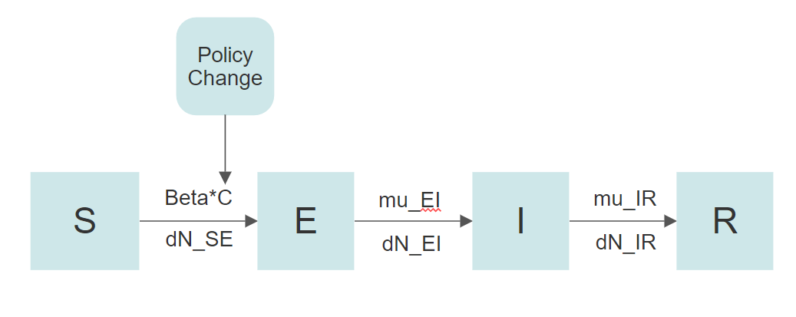
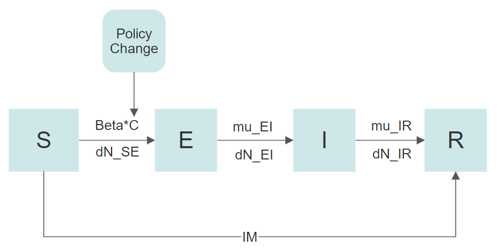

## Introduction

COVID-19 is a respiratory illness caused by the novel coronavirus SARS-CoV-2 that first emerged in Wuhan, China in December 2019 [1]. The introduction of COVID-19 has impacted every part of the globe and has altered the livelihoods of many people in 2020. The World Health Organization (WHO) reports as of 16 April 2021, that there have been over 138.6 million globally confirmed cases and 2.9 million COVID-19 related deaths [2]. Further, the WHO reports that there has been a total of 751 million vaccine doses administered [2]. Most people infected with the COVID-19 virus will experience mild to moderate respiratory illness and recover without requiring special treatment. Older people, however, are more likely to develop serious illness [3]. 

In this study we will use Covid-19 data, vaccinations and government policy implications from the state of Pennsylvania. Currently, The Pennsylvania government has reported 928K confirmed cases and 25K deaths as of 12:00pm CEST, 16 April 2021 [4]. Through our data analysis we will seek to determine a SEIR compartment model that can be used for the Covid-19 data set.  

### Timeline of Government Response in PA

This timeline reflects major events in the handling of the Pandemic in the State of PA.

```{r echo=FALSE, out.width='80%'}

```


### Timeline of Vaccination Progress in PA

Furthermore, this timeline shows the progress of vaccine distribution in the the State of PA.

```{r echo=FALSE, out.width='80%'}

```

The stay-at-home orders do help control the spread of COVID-19, and the new vaccines also bring the hope of a return to normalcy. But how long it will take? In this case study, we will construct a Susceptible-Exposed-Infected-Removed (SEIR) compartment model of COVID-19 spread in Pennsylvania. Our model will add additional compartments to the model to simulate the effect of vaccinations and stay-at-home orders based on the work of Matrajt and Leung 2020 [15]. Furthermore,  Project 6, a case study of COVID-19 Spread in Seattle, Washington from the Winter 2020 Stats 531 class [16] served as guidance for a basic SEIR model of the pandemic and tracking infections.Our analysis introduces more compartments to measure the impact of vaccinations and we are using data for the State of Pennsylvania in place of one major city such as Seattle, WA. Finally, we will make a prediction on the future positive cases Increase considering the same lock-down control and vaccination increase.


## Preliminary Data Exploration

We used data from the "Covid tracking project" [17] which sources the raw data from the PA government website [18]. We obtained the vaccination data from the website of "Our World in Data" [19]. The raw data is collected from the United States Center for Disease Control and Prevention [20]. We use the time series data of daily increasing positive cases and the number of people who received the full vaccine in PA from June 10th, 2020 to March 7th, 2021.

We use the data after June 10th, 2020 when the second peak of Covid-19 occurs. Our reasoning for this step is two-fold: firstly, the testing ability is not sufficient at the beginning of the pandemic raising serious concerns about the data quality. For example, we observe only one peak in new cases but two peaks in the number of deaths. This could cause incorrect inference as our model is very likely to be misspecified. Secondly, the infection rate might change over time due to the relaxation of lock-down restrictions and modeling such behavior might be difficult.

```{r, include=FALSE, warning=FALSE}
library(tidyverse)
library(pomp)
library(foreach)
library(doParallel)
registerDoParallel()

#set seed for reproducibility
library(doRNG)
registerDoRNG(4082879)
require(knitr)

dat_all = tibble(read.csv("https://covidtracking.com/data/download/all-states-history.csv")) %>%
  filter(state=='PA') %>%
  arrange(date)
```

### Filtering data prior to June 20, 2020
```{r, echo=FALSE, warning=FALSE}
dat_all = dat_all %>% 
  mutate(log_test_vs_positive = log(totalTestResultsIncrease / positiveIncrease))

## Filtering inf
for (i in 2:length(dat_all$log_test_vs_positive)){
  if (dat_all$log_test_vs_positive[i] == Inf) {
    dat_all$log_test_vs_positive[i] = dat_all$log_test_vs_positive[i-1]
  }
}

plot(y = dat_all$log_test_vs_positive, x = as.Date(dat_all$date), type = 'l', xlab="Date", ylab="log_test_positive_ratio")
lines(x = as.Date(dat_all$date), y = rep(1.5, length(dat_all$date)), col = 'red')
```

The ratio between the number of tests and positive results reaches a minima at the end of April, which indicates that there might be a lot of infections that have not been counted in the data. Such issues in the data may alter our estimation of the infection rate.

```{r, warning=FALSE}
dats = dat_all %>% 
  select(c('date', 'death', 'deathIncrease', 'positive', 'recovered', 'positiveIncrease')) %>%
  filter(date > '2020-06-20')
```

### Choosing an appropriate time-series data
Given the vast amounts of data, it is also important to choose a time-series that best reflects the dynamics of the epidemic. We analyze correlations in our data to find out one variable that captures most of the information.
```{r, echo=FALSE, warning=FALSE}
ccf(dats$positiveIncrease,dats$deathIncrease)
ccf(dats$positive,dats$recovered)
```

We find the positive test cases are strongly correlated to recovery and death data. This indicates that the death and recovered data may be conditional on the positive test cases. A likely reason could be that medical institutions only track the recovery and mortality for patients who have tested positive for Covid-19. The most reliable source of information on Covid-19 appears to be the number of tests that turn out positive. Thus we will focus on the positiveIncrease column in the data.

The plot below is the new positive cases for each day. We observe that the stay-at-home orders did help in controlling the initial spread of the virus. However, as the state reopened, the number of new cases started increasing from September 2020 and began rapidly increasing by November2020. Because of the additional lock-down policies and vaccinations that went into effect the number of new cases reached its second peak around December 2020 and then rapidly declined.

```{r, echo=FALSE, warning=FALSE}
plot(y = dats$positiveIncrease, x = as.Date(dats$date), type = 'l', xlab="Date", ylab="Positive Increase")
```


### ARMA Model
We fit a baseline ARIMA model for initial analysis.
```{r, echo=FALSE, warning=FALSE}
acf(dats$positiveIncrease)
spectrum(dats$positiveIncrease,method = "ar")
```

We can find the time-series of new positive cases has some seasonality with period of 1 week. There are significant correlations in the data with different lags.

```{r, include=FALSE, warning=FALSE}
log_newcases = log( dats$positiveIncrease + 1)

for (i in 2:length(log_newcases)) {
  if (log_newcases[i] < 1){
    log_newcases[i] = (log_newcases[i-1] + log_newcases[i-1]) / 2
  }
  
}
log_newcases_normalized = log_newcases -mean(log_newcases)
plot(log_newcases_normalized)
aic_table <- function(data,P,Q){
  table <- matrix(NA,(P+1),(Q+1))
  for(p in 0:P) {
    for(q in 0:Q) {
      table[p+1,q+1] <- arima(data,order=c(p,0,q))$aic
    }
  }
  dimnames(table) <- list(paste("AR",0:P, sep=""),paste("MA",0:Q,sep=""))
table
}
```

```{r, warning=FALSE}
newcases_aic_table <- aic_table(log_newcases_normalized,3,3)
kable(newcases_aic_table,digits=3)
```

We use the log transformation to ensure stationarity of the mean for the ARIMA model. We observe no significant evidence that the ARIMA model performs better than white noise. Thus we will use white noise as a benchmark in our project.

## POMP model
It is convenient to think of the Covid-19 epidemic as a partially observed Markov process. We use a SEIR compartment model to represent the progression of the disease in the population. The compartment E indicates people who have been exposed to the virus, but are yet to be infected. This accounts for the incubation period of the virus in the host body.

As E is a state between S and I, almost all patients will move to I (neglecting the asymptomatic patients). The number of people in compartment E will be determined by the incubation period of the virus and also on the number of people currently infected and infectious (compartment I).

```{r echo=FALSE, out.width='80%'}
knitr::include_graphics('SEIR.png')
```

### Simulation Analysis
We perform a simple simulation to see if our assumptions hold true.
```{r, echo=FALSE, warning=FALSE}
dat_all_pa = tibble(read.csv("https://covidtracking.com/data/download/all-states-history.csv")) %>%
  filter(state=='PA') %>%
  filter(date > '2020-06-20') %>% 
  arrange(date)

dat_init_pa = tibble(read.csv("https://covidtracking.com/data/download/all-states-history.csv")) %>%
  filter(state=='PA') %>%
  filter(date >= '2020-06-10') %>%
  filter(date <= '2020-06-20')

remainning_cases_ini = 900
recovered_ini = dat_init_pa$recovered[1] + dat_init_pa$death[1]
positive_increase_ini = round(mean(dat_init_pa$positiveIncrease))

dat = tibble(dat_all_pa$positiveIncrease) %>% mutate(day = 1:length(dat_all_pa$positiveIncrease)) %>%  transmute(day,reports = dat_all_pa$positiveIncrease)

```

The data we use does not hold true starting from the beginning of Covid-19. We do not have the true initial parameters for our model. We address this by using estimates of the initial number of people in each compartment.  We are particularly interested in estimating the number of people in the states E, I and R.

We use the sum of cumulative deaths and recoveries till June 20, 2020 to estimate the initial recovered number of people. For the number of infected people (I), we use the ten-day average and divide it by our estimate of the reporting rate. We believe this represents a more accurate picture of the actual number of infectious people. For E, we use 10-day average of positive cases and multiply it by our initial guess of the ratio of the rates $\frac{\mu_{IR}}{\mu_{EI}}$. This is done to reflect the net rate by which the compartment E is filled.


We now introduce an accumulator variable H in our model, which is equal to the current number of infected people. This is in contrast to the number of new infected people. In presence of widespread testing, such a formulation helps us account for multiple positive tests from the same infected individual. The reports are then a binomial sample from H.

```{r, echo=FALSE, warning=FALSE}
seir_step <- Csnippet("
  double dN_SE = rbinom(S,1-exp(-Beta*I/N*dt));
  double dN_EI = rbinom(E,1-exp(-mu_EI*dt));
  double dN_IR = rbinom(I,1-exp(-mu_IR*dt));
  S -= dN_SE;
  E += dN_SE - dN_EI;
  I += dN_EI - dN_IR;
  R += dN_IR;
  H = I;
  ")

seir_rinit <- Csnippet("
  S = nearbyint(eta*N) - ini_recovered;
  I = nearbyint(ini_positive_remained / rho);
  E = nearbyint(ini_positive_remained * mu_IR / mu_EI);
  R = nearbyint((1-eta)*(N-ini_recovered) + ini_recovered);
  H = 0;
  ")

sir_dmeas <- Csnippet("
  lik = dbinom(reports,H,rho,give_log);
  ")

sir_rmeas <- Csnippet("
  reports = rbinom(H,rho);
  ")

dat %>%
  pomp(times = "day", t0=0,
       rprocess=euler(seir_step,delta.t=1),
       rinit=seir_rinit,
       rmeasure=sir_rmeas,
       dmeasure=sir_dmeas,
       accumvars="H",
       statenames=c("S","E", "I","R","H"),
       paramnames=c("Beta","mu_IR","N","eta","rho","mu_EI", 'ini_positive_remained', 'ini_positive', 'ini_recovered')
       ) -> datSEIR
```

The population in PA is $\sim$ 12.8 million. We make a simplifying assumption that most people are susceptible to COVID-19. Thus $\eta$ is expected to be close to 1.

According to accepted medical literature [20], the average incubation time is 2-14 days. We choose a single number of 8 days, and hence $\mu_{EI}$ = 0.125. Recent data shows that recovery varies for different people, depending on factors such as age and underlying health conditions. Often symptoms like fatigue, headache, and difficulty in breathing are most likely to linger in those at-risk groups [20]. The agreed upon number for $\mu_{IR}$ is $\sim$ 0.07. However, considering most of the people infected will either quarantine or seek medical help once they show the symptoms, the mean period of infection expression is much smaller than the actual period from infection to recovery. Thus for our model, we use a much bigger $\mu_{IR}$.

```{r, warning=FALSE}
params=c(Beta=0.4,mu_EI=0.12,mu_IR=0.45,rho=0.9,eta=0.9,N=12802000, ini_positive_remained =remainning_cases_ini , ini_recovered = recovered_ini, ini_positive = positive_increase_ini)

datSEIR %>%
  simulate(params=params,
    nsim=30,format="data.frame",include.data=TRUE) -> re

re %>%
  ggplot(aes(day,reports,group=.id,color=.id=="data"))+
  geom_line()+
  guides(color=FALSE)
```


We observe that our simulation fits poorly to the actual observed data. Due to the multiple policy changes, a constant infection rate might not be able to fully simulate the spread of Covid-19. We need to introduce covariates to stimulate infection rate changes in the data. 

### Flatten the curve
After the reopening in September 2020, the infection rate is expected to increase. Additionally, on November 16,2020 the city of Philadelphia announced new restrictions due to a surge in cases, which are in place from November 20 until January 1, 2021. The restrictions include no indoor dining at restaurants, capacity limits at retail stores and religious institutions, the closure of gyms, libraries, and certain entertainment businesses, telework for office workers required unless it is not possible, no indoor gatherings, reduced size limits on outdoor gatherings, and no youth or school sports. We account for these changes as a multiplier to the infection rate $\beta$. From September 2020, the infection rate is assumed $\sim$ 1.4 times the actual rate. Starting December 2020, the rate drops to $\sim$ 0.9 times the original rate.

```{r echo=FALSE, out.width='60%'}

```

```{r, warning=FALSE}

dat = dat %>% mutate(C50 = 1)
# Beginning of Class
dat$C50[dat_all_pa$date >= '2020-09-13'] = 1.38
dat$C50[dat_all_pa$date >= '2020-12-01'] = 0.89

covar50 <- covariate_table(
  C=dat$C50,
  t=dat$day,
  times="t"
)


seir_step_mod <- Csnippet("
  double dN_SE = rbinom(S,1-exp(-Beta*I/N*C*dt));
  double dN_EI = rbinom(E,1-exp(-mu_EI*dt));
  double dN_IR = rbinom(I,1-exp(-mu_IR*dt));
  S -= dN_SE;
  E += dN_SE - dN_EI;
  I += dN_EI - dN_IR;
  R += dN_IR;
  H = I;
  ")

datSEIR %>% pomp(
  covar =  covar50,
  rprocess=euler(seir_step_mod,delta.t=1),
  statenames=c("S","E", "I","R","H"),
  paramnames=c("Beta","mu_IR","N","eta","rho","mu_EI", 'ini_positive_remained', 'ini_positive', 'ini_recovered')
  
) -> datSEIR

```
We perform a simulation with a newer model and observe that it better reflects the shape of the data.

```{r,echo=FALSE, warning=FALSE}

params=c(Beta=0.4,mu_EI=0.12,mu_IR=0.45,rho=0.9,eta=0.9,N=12802000, ini_positive_remained =900 , ini_recovered = recovered_ini, ini_positive = positive_increase_ini)

datSEIR %>%
  simulate(params=params,
    nsim=30,format="data.frame",include.data=TRUE) -> re

re %>%
  ggplot(aes(day,reports,group=.id,color=.id=="data"))+
  geom_line()+
  guides(color=FALSE)
```

However, towards the end of time series plot, the simulation results appear to drop off slower than the actual positive cases. While this could be a random stochastic fluctuation, there might be some other mechanism we have not considered in our model. The vaccination could be one of the reasons for the reduction in the number of positive cases.

As an academic exercise, we also explore the effect of vaccinations on the spread of Covid-19.

### Vaccination

```{r echo=FALSE, out.width='60%'}

```

We acquire the data and do some preliminary checks. We interpolate the missing data and use the number of people who are fully vaccinated in our model.

```{r, echo=FALSE, warning=FALSE}
vac_pa = tibble(read.csv("https://raw.githubusercontent.com/owid/covid-19-data/master/public/data/vaccinations/us_state_vaccinations.csv")) %>%
  filter(location=='Pennsylvania') %>%
  filter(date > '2020-06-20') %>% 
  filter(date <= '2021-03-07') %>%
  arrange(date)
plot(vac_pa$total_vaccinations, type = 'l', xlab = 'day')
lines(vac_pa$people_fully_vaccinated, col = 'red')

```

```{r,echo=FALSE, warning=FALSE}

#vac_pa$people_fully_vaccinated
# filling missing value,
vac_pa = vac_pa %>% mutate(people_fully_vaccinated_smoothed = 1)
for (i in 1:length(vac_pa$people_fully_vaccinated)){
  if (!is.na(vac_pa$people_fully_vaccinated[i])) {
    vac_pa$people_fully_vaccinated_smoothed[i] = vac_pa$people_fully_vaccinated[i]
  } else {
    vac_pa$people_fully_vaccinated_smoothed[i] = vac_pa$people_fully_vaccinated_smoothed[i-1]
  }
}

vac_pa$people_fully_vaccinated_smoothed = round(predict(smooth.spline(1:length(vac_pa$people_fully_vaccinated_smoothed), vac_pa$people_fully_vaccinated_smoothed))$y)


vac_pa = vac_pa %>% mutate(people_fully_vaccinated_smoothed_increase = vac_pa$people_fully_vaccinated_smoothed[1])

for (i in 2:length(vac_pa$people_fully_vaccinated)){
  vac_pa$people_fully_vaccinated_smoothed_increase[i] = vac_pa$people_fully_vaccinated_smoothed[i] - vac_pa$people_fully_vaccinated_smoothed[i-1]
}

plot(vac_pa$people_fully_vaccinated_smoothed_increase, type = 'l', xlab='day')

```

With the vaccine, more people are immune to the disease without being infected. Thus people move directly from the susceptible compartment (S) to the recovered compartment (R). We account for this using a new specification of the model. Since the vaccination drive begins at a point after we initialize the model, we add the variable as another covariate.

```{r, echo=TRUE, warning=FALSE}
dat = dat %>% mutate(im = 1)
dat$im[dat_all_pa$date < vac_pa$date[1]] = 0 
offset = length(dat$im) - length(vac_pa$date)

for (i in 1:length(dat$im)) {
  if (dat$im[i] == 1) {
    dat$im[i] = vac_pa$people_fully_vaccinated_smoothed_increase[i-offset]
  }
}

covar50_IM <- covariate_table(
  C=dat$C50,
  t=dat$day,
  IM = dat$im,
  times="t"
)

seir_step_mod_ver2 <- Csnippet("
  double dN_SE = rbinom(S,1-exp(-Beta*I/N*C*dt));
  double dN_EI = rbinom(E,1-exp(-mu_EI*dt));
  double dN_IR = rbinom(I,1-exp(-mu_IR*dt));
  S -= dN_SE + IM;
  E += dN_SE - dN_EI;
  I += dN_EI - dN_IR;
  R += dN_IR + IM;
  H = I;
  ")

datSEIR %>% pomp(
  covar =  covar50_IM,
  rprocess=euler(seir_step_mod_ver2,delta.t=1),
  statenames=c("S","E", "I","R","H"),
  paramnames=c("Beta","mu_IR","N","eta","rho","mu_EI", 'ini_positive_remained', 'ini_positive', 'ini_recovered')
  
) -> datSEIR

```

We observe that the simulations using the modified model fit the data well. While we reasoned and used heuristics to decide the parameters for our model, there is no replacement of a statistical exercise to estimate the parameters. We perform an iterated filtering exercise to find the parameter values that give us the highest likelihood of the observations.

```{r, echo=FALSE, warning=FALSE}

params=c(Beta=0.4,mu_EI=0.12,mu_IR=0.45,rho=0.9,eta=0.9,N=12802000, ini_positive_remained =900 , ini_recovered = recovered_ini, ini_positive = positive_increase_ini)

datSEIR %>%
  simulate(params=params,
    nsim=30,format="data.frame",include.data=TRUE) -> re

re %>%
  ggplot(aes(day,reports,group=.id,color=.id=="data"))+
  geom_line()+
  guides(color=FALSE)
```

### Iterative filtering for MLE parameters

We run a iterative filter using the 'pomp' package in R to find the maximum likelihood estimates. A global search with covariates and vaccinations took over 8 hours to run on a LINUX cluster with 36 cores.

```{r, echo=FALSE, warning=FALSE}
stew(file="./box_eval_covar.rda",{
  m2<-foreach(guess=iter(guesses,"row"),.packages='pomp',.combine=c) %dopar%
    mif2(datSEIR,
         params=c(unlist(guess),fixed_params),
         Np=5000,Nmif=500,
         cooling.fraction.50=0.5,
         rw.sd=rw.sd(Beta=0.02, mu_EI = 0.02,mu_IR=0.02,
			rho=0.02,eta=ivp(0.02)))
  
  lik_m2 <- foreach(i=1:500,.packages='pomp',.combine=rbind) %dopar%
    logmeanexp(
      replicate(200,logLik(
        pfilter(datSEIR,params=coef(m2[[i]]),Np=20000))),
      se=TRUE)
})

r2 <- data.frame(logLik=lik_m2[,1],logLik_se=lik_m2[,2],
                 t(sapply(m2,coef)))
r2 %>%
	filter(is.finite(logLik)) %>%
  filter(logLik>max(logLik)-5e4)%>%
  filter(Beta<5)%>%
  filter(mu_IR<0.2)%>%
  filter(mu_EI>0.2)-> all

#%>%
#  filter(Beta<5)%>%
#  filter(Beta<5)%>%
pairs(~logLik+Beta+eta+rho+mu_IR+mu_EI,data=all,pch=16)

```

We observe that the log-likelihood has large variations even for the same value of the parameters. Such results indicate shortcomings of our model. It is likely that our model is mis-specified and the progression of the Covid-19 pandemic is more complicated than our simple SEIR model. Additionally, our formulation of changes in the $\beta$ and vaccination rates might be inadequate to truly reflect the complications of the real-world scenario.

Additionally, we observe some structures in the likelihood surface. A ridge is evident between $\beta$ and $\mu_{IR}$. We also observe that higher values of likelihood are reached for $\beta>0.14$, $\rho\approx0.2$, and $\mu_{IR}\approx0.14$. The simulations do not help us in predicting the values of $\eta$ or $\mu_{EI}$. The likelihood values are spread over a large range for all the initial guesses of these parameters. 

### Iterative filtering on a smaller dataset

To overcome some of the potential drawbacks of our initial model, we perform an iterated filtering process on a smaller dataset between the months of September and December 2020. During this restricted period, we can disregard any changes in the infection rate. Also, since there were very few vaccinations in this period, we can choose to ignore the effect of increased immunity in the population. We perform a global searcg for a simple SEIR model without any covariates and without vaccination.

```{r, echo=FALSE, warning=FALSE}

stew(file="./box_eval_simple.rda",{
  m2<-foreach(guess=iter(guesses,"row"),.packages='pomp',.combine=c) %dopar%
    mif2(datSEIR,
         params=c(unlist(guess),fixed_params),
         Np=5000,Nmif=500,
         cooling.fraction.50=0.5,
         rw.sd=rw.sd(Beta=0.02, mu_EI = 0.02,mu_IR=0.02,
			rho=0.02,eta=ivp(0.02)))
  
  lik_m2 <- foreach(i=1:500,.packages='pomp',.combine=rbind) %dopar%
    logmeanexp(
      replicate(200,logLik(
        pfilter(datSEIR,params=coef(m2[[i]]),Np=5000))),
      se=TRUE)
})

r2 <- data.frame(logLik=lik_m2[,1],logLik_se=lik_m2[,2],
                 t(sapply(m2,coef)))
r2 %>%
  filter(is.finite(logLik))%>%
  filter(logLik>max(logLik)-1e4)%>%
  filter(Beta<5)%>%
  filter(mu_IR<0.2)%>%
  filter(mu_EI>0.2) -> small

pairs(~logLik+Beta+eta+rho+mu_IR+mu_EI,data=small,pch=16)
```

## Conclusions

In this project we analyzed the spread of Covid-19 in the State of Pennsylvania from June 10th, 2020 to March 7th, 2021. We aimed to analyze the project a year into the pandemic with more data available and consider how government policies and vaccination rates effect the infection rate of Covid-19. After performing the various test here are the conclusions that our team has found:

- Utilizing assumptions for $\beta$, where we account for the PA governor's actions in executive orders for stay home orders and closures of non-essential businesses, we see that changes in $\beta$   have a significant impact in controlling the spread of the virus. 
  
- After performing the iterative MLE parameters we find that the log-likelihood in the global and local searches show that our parameters do not converge well at the maximizations. The simple SEIR model that was used has misspecifications and the progressions of the Covid-19 pandemic appear to be too complex for our simple SEIR model.

- The Covid-19 pandemic has shown variability in infection rates that is affected by stay home orders and vaccination rates. Moving forward more data analysis needs to be performed to get a better fit of the data with the SEIR model. The SEIR compartment model seems sufficient overall to model Covid-19 data, however the additional compartments fell short in our modeling.


## Project contributions

Description of individual contributions removed for anonymity

<!-- All team members participated and contributed equally towards project conceptualization, discussions, drawing inferences, and incremental updates to the SEIR model. SZ contributed to data collection, cleaning, and the initial model formulation in R. XT and KJL contributed to academic readings, background research, and report writing. PB worked on global search using iterated filtering and made minor changes to model specifications. All team members worked collaboratively and took help from others in their respective tasks when needed. -->


## References

[1] Li Q, Guan X, Wu P, Wang X, Zhou L, Tong Y, et al. Early transmission dynamics in Wuhan, China, of novel coronavirus-infected pneumonia. The New England Journal of Medicine. 2020;p.1-9.

[2] WHO Covid-19 Report: https://covid19.who.int/

[3] WHO Covid-19 Overview: https://www.who.int/health-topics/coronavirus#tab=tab_1

[4] PA government Covid-19 report: https://www.health.pa.gov/topics/disease/coronavirus/Pages/Cases.aspx

[5] PA Covid-19 policies: https://www.governor.pa.gov/process-to-reopen-pennsylvania/

[6] Schools ordered to remain closed until end of academic year: https://www.timesleader.com/news/779460/wolf-schools-ordered-to-remain-closed-until-end-of-academic-year

[7] Process to reopen Pennsylvania:  https://www.governor.pa.gov/plan-for-pennsylvania/

[8] Pennsylvania lays out 3-phase COVID-19 vaccine distribution plan: https://6abc.com/health/pennsylvania-lays-out-covid-vaccine-plan-reports-over-7k-new-cases/8093088/

[9] COVID-19 restrictions in Pennsylvania: https://6abc.com/health/new-covid-restrictions-in-pennsylvania-now-in-effect-what-you-need-to-know/8711395/

[10] Pennsylvania restaurants, bars to see some pandemic limits lifted in April: https://6abc.com/health/pa-restaurants-bars-to-see-some-pandemic-limits-lifted-in-april/10419574/

[11] First COVID-19 vaccine in Pennsylvania: https://www.pennlive.com/coronavirus/2020/12/67-year-old-nurse-receives-first-covid-19-vaccine-in-pennsylvania-watch.html?fbclid=IwAR1CproQRY9exsvzKVm0VcjVQC7x1GpVyOxZ8lP0EKqKl0QEdVF_0aoQqak

[12] Pennsylvania and Philadelphia officials expand COVID-19 vaccine distribution: https://6abc.com/health/pa-and-philly-officials-expand-covid-19-vaccine-distribution/9813161/

[13] PA accelerated COVID-19 vaccine timeline: https://6abc.com/health/all-pa-residents-eligible-for-covid-19-vaccine-by-april-19-/10463145/

[14] Pennsylvania residents 16+, outside Philly, eligible for COVID-19 vaccine:  https://6abc.com/health/pa-residents-excluding-philly-eligible-for-covid-vaccine-tuesday/10509761/

[15] Matrajt and Leung: Evaluating the effectiveness of social distancing interventions against COVID-19 (2020): https://www.medrxiv.org/content/10.1101/2020.03.27.20044891v2.full.pdf

[16] https://ionides.github.io/531w20/final_project/Project6/final.html

[17] Covid-19 data source: https://covidtracking.com/data/state/pennsylvania/notes

[18] Covid-19 data source: https://www.health.pa.gov/topics/disease/coronavirus/Pages/Cases.aspx

[19] Vaccination data source: https://github.com/owid/covid-19-data/tree/master/public/data/vaccinations

[20] Vaccination data source: https://covid.cdc.gov/covid-data-tracker/#vaccinations

[21] Covid recovery period: https://www.webmd.com/lung/covid-recovery-overview#2