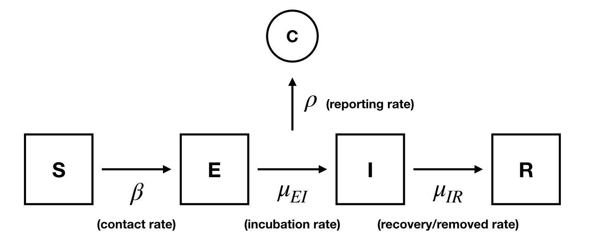
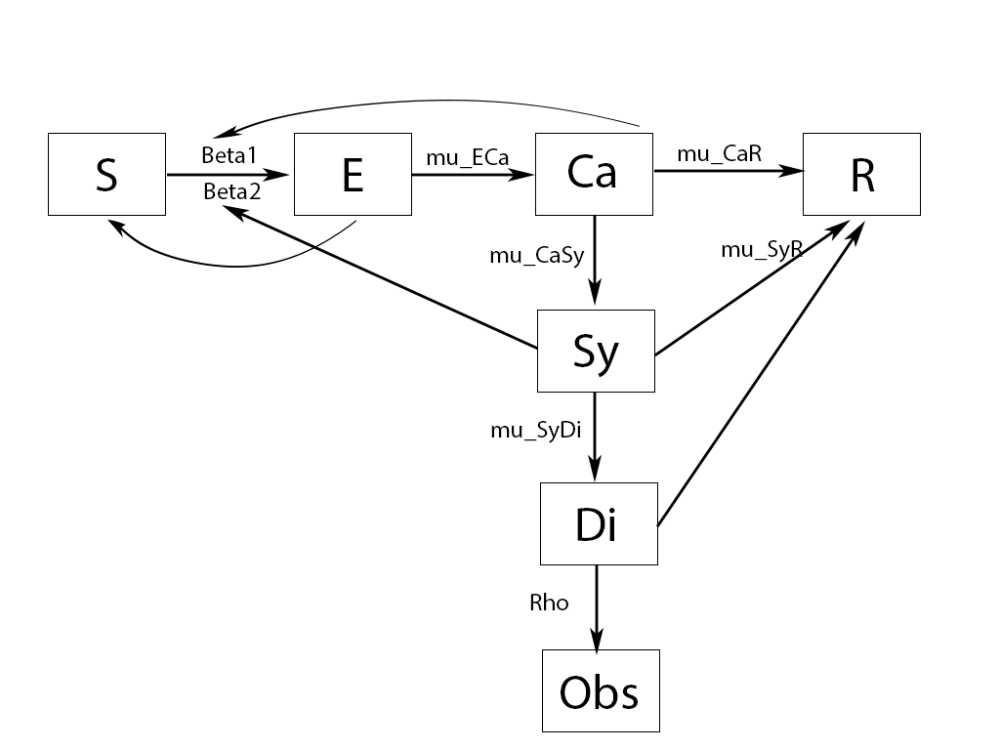
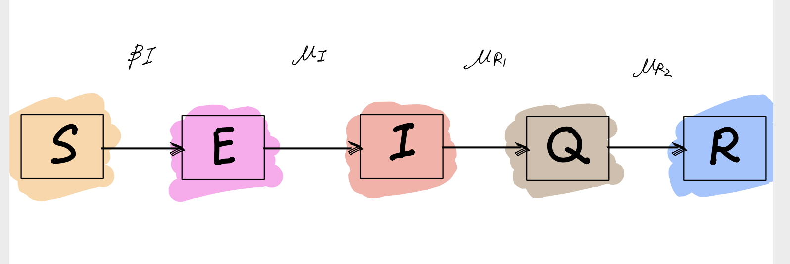

```{r setup, include=FALSE}
knitr::opts_chunk$set(echo = TRUE, fig.align="center")
library(mFilter)
library(dplyr)
library(knitr)
```

## 1.Introduction

A novel coronavirus (CoV) named 2019-nCoV or 2019 novel coronavirus or COVID-19 by the World Health Organization (WHO) is in charge of the current outbreak of pneumonia that began at the beginning of December 2019 near in Wuhan City, Hubei Province, China. COVID-19 is a pathogenic virus. From the phylogenetic analysis carried out with obtainable full genome sequences, bats occur to be the COVID-19 virus reservoir, but the intermediate host(s) has not been detected till now. Right now, there are 141 millions cumulative comfirmed cases (April 19th) over all round world. Especially for United States, the number is more than 31.7 millions now (April 19th). More detailed report cases: {https://www.who.int/emergencies/diseases/novel-coronavirus-2019/situation-reports/} However, as the Covid-19 vaccines are taken by more and more people, the spreading of Covid-19 is reducing. The situation becomes better and better and one day this world will recover from the Covid-19.

In this project, I will analyse COVID-19 data of United States from 01/22/2020 to 04/10/2021. I will try to capture some properties of this disease and describe the process of transmission by deriving and applying different models for daily infected cases. The data set comes from IHME(http://www.healthdata.org/). The model used in this model includes SEIR, SEIQR and SECSDR.


## 2.Data Overview

```{r, echo=FALSE,include=FALSE}
library(pomp)
stopifnot(getRversion() >= "4.0")
stopifnot(packageVersion("pomp")>="3.0")
set.seed(1350254336)

library(tidyverse)
n = read.csv("worse_hospitalization_all_locs.csv",
             fileEncoding="UTF-8-BOM")
n2 = n[which(n$location_name== "United States of America"), ]

```
```{r, echo=FALSE}
n1 = n2
n1$Infected = n1$confirmed_infections
n1$Day = c(1:dim(n1)[1])
n1=n1[,c(52,53)]
n1 <- n1[complete.cases(n1), ]
ggplot(data=n1,aes(x=Day,y=Infected))+geom_line()+geom_point()
dat = n1
```


## 3.SEIR
Learned from lecture note 11, we know that SEIR has an additional Exposed stage on the basis of SIR model. The Exposed statge refers to a period of latency before becoming truly infectious. Since many diseases have a latent phase during which the individual is infected but not yet infectious, so this delay makes the SEIR model more applicable.
<!-- SEIR in lecture note. Source: https://ionides.github.io/531w20/11/notes11.pdf -->

According to what we learned from Lecture note 12, we know that SEIR has an additional exposed stage compared with the basis of SIR model. The exposed stage refers to the period of latency before being truly infected. Since many diseases have a latent phase, I wanna try to use the SEIR model to simulate the daily infected cases happening in US.   

 

This model consists of four distinct stages:  
S: susceptible (all individuals)  
E: exposed (asymptomatic)  
I: infected (symptomatic)  
R: removed (recovered or deceased)  

### 3.1 Constructing SEIR model below:
```{r,warning=FALSE}
seir_step <- Csnippet("
  double dN_SE = rbinom(S,1-exp(-Beta*I/N*dt));
  double dN_EI = rbinom(E,1-exp(-mu_EI*dt));
  double dN_IR = rbinom(I,1-exp(-mu_IR*dt));
  S -= dN_SE;
  E += dN_SE - dN_EI;
  I += dN_EI - dN_IR;
  R += dN_IR;
  H += dN_IR;
")

seir_rinit <- Csnippet("
  S = nearbyint(eta*N);
  E = 0;
  I = 1;
  R = nearbyint((1-eta)*N);
  H = 0;
  ")

dmeas <- Csnippet("
double tol = 1.0e-25;
double mean_cases = rho*H;
double sd_cases = sqrt(mean_cases*mean_cases);

if(Infected > 0.0){
lik = pnorm(Infected,mean_cases,sd_cases,1,0)- pnorm(Infected-0.5,mean_cases,sd_cases,1,0)
+ tol;
} else{
lik = pnorm(Infected+0.5,mean_cases,sd_cases,1,0) +tol;
}
if (give_log) lik = log(lik);

")
rmeas <- Csnippet("

Infected = rnorm(rho*H, sqrt(rho*H ) );
if (Infected > 0.0) {
Infected = nearbyint(Infected);
} else {
Infected = 0.0;
}

")

measSEIR = dat %>%
  pomp(
    times="Day",t0=0,
    rprocess=euler(seir_step,delta.t=1),
    rinit=seir_rinit,
    rmeasure=rmeas,
    dmeasure=dmeas,
    accumvars="H",
    partrans=parameter_trans(
      log=c("Beta","tau","mu_EI","mu_IR"),
      logit=c("rho","eta")
    ),
    paramnames=c("N","Beta","mu_EI","mu_IR","rho","eta","tau"),
    statenames=c("S","E","I","R","H")
  )

```


```{r,echo=FALSE,warning=FALSE,message=FALSE}
library(dplyr, warn.conflicts=FALSE)
library(foreach)
library(doParallel)
registerDoParallel()
library(doRNG)
registerDoRNG(625904618)

params <- c(Beta=12.9,mu_IR=1.15,mu_EI=0.08,rho=0.8,tau=1,eta=0.1,N=300000000)

tic <- Sys.time()
foreach(i=1:10,.combine=c) %dopar% {
  library(pomp)
  measSEIR %>% pfilter(params=params,Np=100)
} -> pf
pf %>% logLik() %>% logmeanexp(se=TRUE) -> L_pf

```

### 3.2 Local Search

```{r,warning=FALSE,echo=FALSE}
library(foreach)
library(doParallel)
registerDoParallel()
library(doRNG)
registerDoRNG(625904618)

toc <- Sys.time()

pf[[1]] %>% coef() %>% bind_rows() %>%
  bind_cols(loglik=L_pf[1],loglik.se=L_pf[2]) %>%
  write_csv("covid_params4.csv")

registerDoRNG(482947940)
bake(file="local_search4.rds",{
  foreach(i=1:20,.combine=c) %dopar% {
    library(pomp)
    library(tidyverse)
    measSEIR %>%
      mif2(
        params=params,
        Np=2000, Nmif=200,
        cooling.fraction.50=0.5,
        rw.sd=rw.sd(Beta=0.002, rho=0.002,eta=ivp(0.002))
      )
  } -> mifs_local
  attr(mifs_local,"ncpu") <- getDoParWorkers()
  mifs_local
}) -> mifs_local

t_loc <- attr(mifs_local,"system.time")
ncpu_loc <- attr(mifs_local,"ncpu")
```
```{r,echo=FALSE}
mifs_local %>%
  traces() %>%
  melt() %>%
  ggplot(aes(x=iteration,y=value,group=L1,color=factor(L1)))+
  geom_line()+
  guides(color=FALSE)+
  facet_wrap(~variable,scales="free_y")
```

```{r, echo=FALSE}
registerDoRNG(900242057)
bake(file="lik_local4.rds",{
  foreach(mf=mifs_local,.combine=rbind) %dopar% {
    library(pomp)
    library(tidyverse)
    evals <- replicate(10, logLik(pfilter(mf,Np=2000)))
    ll <- logmeanexp(evals,se=TRUE)
    mf %>% coef() %>% bind_rows() %>%
      bind_cols(loglik=ll[1],loglik.se=ll[2])
  } -> results
  attr(results,"ncpu") <- getDoParWorkers()
  results
}) -> results
t_local <- attr(results,"system.time")
ncpu_local <- attr(results,"ncpu")

pairs(~loglik+Beta+eta+rho,data=results,pch=16)
```

### 3.3 Global Search

Here I fix N to be 300000000 since it is roughly close to the population size in US. Since N is very large, I decide to choose the starting $\rho$ to be very small. 
To be honest, it is hard to find any pattern from the plot following. 
```{r, echo=FALSE,warning=FALSE,message=FALSE}
read_csv("covid_params4.csv") %>%
  bind_rows(results) %>%
  arrange(-loglik) %>%
  write_csv("covid_params4.csv")

if (file.exists("CLUSTER.R")) {
  source("CLUSTER.R")
}
fixed_params = c(N=300000000)
set.seed(2062379496)


runif_design(
  lower=c(Beta=0.05,rho=0.1,eta=0,mu_IR=0,mu_EI=0,tau=0),
  upper=c(Beta=5,rho=1,eta=0.4,mu_IR=5,mu_EI=2,tau=10),
  nseq=150
) -> guesses

mf1 <- mifs_local[[1]]


bake(file="global_search1.rds",{
  registerDoRNG(1270401374)
  foreach(guess=iter(guesses,"row"), .combine=rbind) %dopar% {
    library(pomp)
    library(tidyverse)
    mf1 %>%
      mif2(params=c(unlist(guess),fixed_params)) %>%
      mif2(Nmif=100) -> mf
    replicate(
      10,
      mf %>% pfilter(Np=20000) %>% logLik()
    ) %>%
      logmeanexp(se=TRUE) -> ll
    mf %>% coef() %>% bind_rows() %>%
      bind_cols(loglik=ll[1],loglik.se=ll[2])
  } -> results
  attr(results,"ncpu") <- getDoParWorkers()
  results
}) %>%
  filter(is.finite(loglik)) -> results
t_global <- attr(results,"system.time")
ncpu_global <- attr(results,"ncpu")
read_csv("covid_params4.csv") %>%
  bind_rows(results) %>%
  filter(is.finite(loglik)) %>%
  arrange(-loglik) %>%
  write_csv("covid_params4.csv")

read_csv("covid_params4.csv") %>%
  filter(loglik>max(loglik)-50) %>%
  bind_rows(guesses) %>%
  mutate(type=if_else(is.na(loglik),"guess","result")) %>%
  arrange(type) -> all

pairs(~loglik+Beta+eta+rho, data=all,
      col=ifelse(all$type=="guess",grey(0.5),"red"),pch=16)


```


I find the parameters with highest loglik. And then use those parameters to simulate the Infected case happening in US. The result is bad although its loglik is relatively highest. I have tried many global search using different parameter ranges many times. But the simulated trend is still not good enough. Simiple SEIR cannot be used to simulate Covid-19 Infected cases in US efficiently.

```{r, echo=FALSE}
results_t=as.numeric(unlist(results[,"loglik"]))
cov_paramnames = c("loglik","N","Beta","mu_EI","mu_IR","rho","eta","tau")
which_global_mle = which.max(results_t)
cov_global_mle = results[which_global_mle,][cov_paramnames]
cov_global_mle


```

### 3.4 Simulated result
```{r,echo=FALSE}
sims <- simulate(measSEIR,params=c(Beta=1.470177,mu_IR=0.009791881,mu_EI=0.6477886,rho=0.9436358,eta=0.3582897,tau=4.609564,N=300000000),nsim=30,format="data.frame",include=TRUE)
ggplot(sims,mapping=aes(x=Day,y=Infected,group=.id,color=.id=="data"))+
  geom_line()+guides(color=FALSE)
```


## 4.SECSDR

  

The SECSDR model designed by the others are shown in the above pictures. There are 6 compartment and 1 measurement:   
The S compartment stands for the susceptible population.  
The E compartment stands for the exposed population.  
The Ca compartment stands for the virus carriers, which means they have already been infected, but there is no symptom yet.  
The Sy compartment stands for the symptomed patients.  
The Di compartment stands for the Diagnosed patients for one specific day.  
The R compartment, as in the SEIR model, stands for the recovered population containing both dead and recovered patients (generally the patients who losed infectiousness).  
The Obs stands for observation.  

### 4.1 Constructing SECSDR model below:
```{r}
covid_rprocess <- "
  double dN_SE = rbinom(S,1-exp((-Beta1*Ca-Beta2*Sy)*dt));
  double dN_ECa = rbinom(dN_SE,1-exp(-dt*mu_ECa));
  double dN_CaR = rbinom(Ca,1-exp(-dt*mu_CaR));
  double dN_CaSy = rbinom(Ca-dN_CaR,1-exp(-dt*mu_CaSy));
  double dN_SyR = rbinom(Sy,1-exp(-dt*mu_SyR));
  double dN_SyDi = rbinom(Sy-dN_SyR,1-exp(-dt*mu_SyDi));
  S -= dN_ECa;
  Ca += dN_ECa - dN_CaSy - dN_CaR;
  Sy += dN_CaSy - dN_SyR-dN_SyDi;
  R += dN_CaR+dN_SyR+dN_SyDi;
  Di = dN_SyDi;
"

covid_dmeasure <- "
  lik = dnorm(Infected,Di,rho*Di+1e-10,give_log);
"
covid_rmeasure <- "
  Infected = rnorm(Di,rho*Di+1e-10);
"
covid_rinit <- "
 S=328000000;
 Ca=10;
 Sy=10;
 Di=1;
 R=0;
"

covid_statenames <- c("S","Ca","Sy","R","Di")
covid_paramnames <- c("Beta1","Beta2","mu_ECa","mu_CaSy","mu_CaR","mu_SyR","mu_SyDi","rho")

covid2 <- pomp(
  data=subset(n1,select=c(Infected,Day)),
  times="Day",
  t0=0,
  rprocess=euler(
    step.fun=Csnippet(covid_rprocess),
    delta.t=1/12),
  rmeasure=Csnippet(covid_rmeasure),
  dmeasure=Csnippet(covid_dmeasure),
  partrans=parameter_trans(
    log=c("Beta1","Beta2","mu_ECa","mu_CaSy","mu_CaR","mu_SyR","mu_SyDi","rho")),
  statenames=covid_statenames,
  paramnames=covid_paramnames,
  rinit=Csnippet(covid_rinit)
)
```

### 4.2 Global search

```{r, echo=FALSE,warning=FALSE,message=FALSE}
run_level <- 1 
switch(run_level, {
  covid_Np=100; covid_Nmif=10; covid_Neval=10; covid_Nglobal=10},{
  covid_Np=2000; covid_Nmif=100; covid_Neval=10; covid_Nglobal=50
},{
  covid_Np=60000; covid_Nmif=300; covid_Neval=10; covid_Nglobal=100}

)

#global

covid_box <- rbind(
  Beta1=c(0,0.001),
  Beta2=c(0,0.001),
  mu_ECa=c(0,0.01),
  mu_CaSy=c(0,0.01),
  mu_CaR=c(0,0.01),
  mu_SyR=c(0,0.01),
  mu_SyDi = c(0.0,0.01),
  rho = c(0.0,0.5)
)

covid_cooling.fraction.50=0.00005
covid_rw.sd=0.000000002
mcopts <- list(set.seed=TRUE)

stew(file=sprintf("box_eval_COVID19_j.3.2.3.rda",run_level),{ t_global <- system.time({
  mifs_global <- foreach(i=1:covid_Nglobal,.combine=c,.options.multicore=mcopts) %dopar% { mif2(
    covid2,
    params=c(
      apply(covid_box,1,function(x)runif(1,x[1],x[2]))),
    Np=covid_Np,
    Nmif=covid_Nmif,
    cooling.fraction.50=covid_cooling.fraction.50,
    rw.sd=rw.sd(Beta1=covid_rw.sd,Beta2=covid_rw.sd,mu_ECa=covid_rw.sd,mu_CaSy=covid_rw.sd,mu_CaR=covid_rw.sd,mu_SyR=covid_rw.sd,mu_SyDi=covid_rw.sd,rho=covid_rw.sd)
 )}
}) },seed=1270401374,kind="L'Ecuyer")

stew(file=sprintf("lik_global_eval_j.3.2.3.rda",run_level),{ t_global_eval <- system.time({
  liks_global <- foreach(i=1:covid_Nglobal, .combine=rbind) %dopar% {
    evals <- replicate(covid_Neval,
                       logLik(pfilter(covid2,
                                      params=coef(mifs_global[[i]]),Np=covid_Np)))
    logmeanexp(evals, se=TRUE)
  } })
},seed=442141592,kind="L'Ecuyer")

results_global <- data.frame(
  logLik=liks_global[,1],
  logLik_se=liks_global[,2],t(sapply(mifs_global,coef)))

para=coef(mifs_global[order(liks_global[,1],decreasing = T)[2]])
cat("The top five log likelihood:")
sort(liks_global[,1],decreasing = T)[1:5]

cat("The corresponding optimized parameters:")
coef(mifs_global[order(liks_global[,1],decreasing = T)[1:5]])
```


```{r,echo=FALSE}
plot(mifs_global)
```

### 4.3 Simulated result

```{r,echo=FALSE}

sims <- simulate(covid2,params=para,
                 nsim=1,format="data.frame",include=TRUE,seed = 13336333)

ggplot(sims,mapping=aes(x=Day,y=Infected,group=.id,color=.id=="data"))+
  geom_line()+scale_color_hue("",breaks=c("FALSE","TRUE"),labels=c("estimated","observed"))+labs(x="day",y="infected populations",title ="One specific simulation from the model")

```

## 5.SEIQR

SEIQR model: Susceptible-Exposed-Infectious-Quarantine-Removed and/or Recovered.
S,I,R are defined like the above SIR model, E refers to the state that individuals are infected but not infectious and Q refers to quarantine state. The plot is shown below:  

  

Most definitions of parameters are similar as before:  
SI(t)= $\beta$ * I(t): transmiting rate from S to E, where $\beta$ is the contact rate.  
I: transmiting rate from E to I.  
R1: transmiting rate from I to Q.  
R2: transmiting rate from Q to R.  
Á: reporting rate.  
N is population size with N = S + E + I + Q + R and we consider it is fixed.  


### 5.1 Constructing SEIQR model below:


```{r}
covid_rprocess <- "
  double t1 = rbinom(S,1-exp(-Beta*I*dt));
  double t2 = rbinom(E,1-exp(-dt*mu_I));
  double t3 = rbinom(I,1-exp(-dt*mu_R1));
  double t4 = rbinom(Q,1-exp(-dt*mu_R2));
  S -= t1;
  E += t1 - t2;
  I += t2 - t3;
  Q += t3 - t4;
  R += t4;
"

covid_dmeasure <- "
  lik = dnorm(Infected,Q,rho*Q+1e-10,give_log);
"
covid_rmeasure <- "
  Infected= rnorm(Q,rho*Q+1e-10);
"
covid_rinit <- "
  S=N-2;
  E=1;
  I=1;
  Q=0;
  R=0;
"

covid_statenames <- c("S","E","I","Q","R")
covid_paramnames <- c("Beta","rho","mu_I","mu_R1","mu_R2","N")
fixed <- c(N=32000000)
covid2 <- pomp(
  data=subset(n1,select=c(Infected,Day)),
  times="Day",
  t0=0,
  rprocess=euler(
    step.fun=Csnippet(covid_rprocess),
    delta.t=1/12),
  rmeasure=Csnippet(covid_rmeasure),
  dmeasure=Csnippet(covid_dmeasure),
  partrans=parameter_trans(
    log=c("Beta","mu_I","mu_R1","mu_R2","rho")),
  statenames=covid_statenames,
  paramnames=covid_paramnames,
  rinit=Csnippet(covid_rinit)
)
```

I tried to simulate the Infected case by myself. It is hard to simulate the trend after many times experiments.

```{r,echo=FALSE}

sims <- simulate(covid2,params=c(Beta=2,mu_I=0.004,mu_R1=0.001,rho=0.1,mu_R2=0.1,N=32000000),
                 nsim=1,format="data.frame",include=TRUE,seed = 13336333)

ggplot(sims,mapping=aes(x=Day,y=Infected,group=.id,color=.id=="data"))+
  geom_line()+scale_color_hue("",breaks=c("FALSE","TRUE"),labels=c("estimated","observed"))+labs(x="day",y="infected populations",title ="One specific simulation from the model")
```

### 5.2 Global search

After global search results, we cannot still build a good model with appropriate parameter to simulate the US Infected cases number.

```{r, echo=FALSE}
run_level <- 2 
switch(run_level, {
  covid_Np=100; covid_Nmif=10; covid_Neval=10; covid_Nglobal=10},{
  covid_Np=2000; covid_Nmif=100; covid_Neval=10; covid_Nglobal=50
},{
  covid_Np=60000; covid_Nmif=300; covid_Neval=10; covid_Nglobal=100}

)


#global

covid_box <- rbind(
  Beta=c(0.0000001,10),
  mu_I=c(0,0.1),
  mu_R1=c(0,0.1),
  rho = c(0,0.3),
  mu_R2 =c(0,0.3)
)

covid_cooling.fraction.50=0.00005
covid_rw.sd=0.000000002
mcopts <- list(set.seed=TRUE)

stew(file=sprintf("box_eval_COVID19_j.3.2.5.rda",run_level),{ t_global <- system.time({
  mifs_global <- foreach(i=1:covid_Nglobal,.combine=c,.options.multicore=mcopts) %dopar% { mif2(
    covid2,
    params=c(
      apply(covid_box,1,function(x)runif(1,x[1],x[2])),fixed),
    Np=covid_Np,
    Nmif=covid_Nmif,
    cooling.fraction.50=covid_cooling.fraction.50,
    rw.sd=rw.sd(
          Beta=covid_rw.sd,
          mu_I = covid_rw.sd,
          mu_R1=covid_rw.sd,
          rho=covid_rw.sd,
          mu_R2=covid_rw.sd)
 )}
}) },seed=1270401374,kind="L'Ecuyer")

stew(file=sprintf("lik_global_eval_j.3.2.5.rda",run_level),{ t_global_eval <- system.time({
  liks_global <- foreach(i=1:covid_Nglobal, .combine=rbind) %dopar% {
    evals <- replicate(covid_Neval,
                       logLik(pfilter(covid2,
                                      params=coef(mifs_global[[i]]),Np=covid_Np)))
    logmeanexp(evals, se=TRUE)
  } })
},seed=442141592,kind="L'Ecuyer")

results_global <- data.frame(
  logLik=liks_global[,1],
  logLik_se=liks_global[,2],t(sapply(mifs_global,coef)))

para=coef(mifs_global[order(liks_global[,1],decreasing = T)[2]])
cat("The top five log likelihood:")
sort(liks_global[,1],decreasing = T)[1:5]

cat("The corresponding optimized parameters:")
coef(mifs_global[order(liks_global[,1],decreasing = T)[1:5]])
```

### 5.3 MIF2 convergence diagnostics

```{r,echo=FALSE}
plot(mifs_global,ylim=10)
```

### 5.4 Simulated result

```{r,echo=FALSE}

sims <- simulate(covid2,params=para,
                 nsim=1,format="data.frame",include=TRUE,seed = 13336333)

ggplot(sims,mapping=aes(x=Day,y=Infected,group=.id,color=.id=="data"))+
  geom_line()+scale_color_hue("",breaks=c("FALSE","TRUE"),labels=c("estimated","observed"))+labs(x="day",y="infected populations",title ="One specific simulation from the model")

```

## 6.Conclusion
From the analysis above we can see that the original data plot of Covid-19 Infected cases have unstable trend. It is impossible to use SEIR, SEIQR and SECSDR to simulate the daily Infected case no matter how to change the parameters. The simulated Infected populations from three models all did not show a similar trend as the real situation and the likelihood analysis seems unreasonable. I think there are three main reasons:  
1. Daily confirmed coronavirus cases number in US over long time not only depends on so-called parameters. We cannot simulate a long term unstable situation using unstable parameters, like susceptible population, exposed population, symptomed patients, etc. They may change over the time. So, in the future, I hope to include the temporal condition into model. The first phase is first 70th day. The second phase is from 70th to 100th day. The third is from 100th to 200th day. The last phase is from 200th to 400th day. Maybe from the 400th day to now, there exits another phase.   
2. The US is too large, different states has different restriction rules during pandemic. It is hard to simulate the Infected cases number in the whole country directly. If we wanna study the Infected cases in US, we can begin simulate the Covid-19 Infected cases in different states and then ensemble the models.  
3. The Covid-19 has a extreme long incubation period. So only one or two parameters about incubation rate included in these three models cannot simulate the real situation.   

Future works: I need to figure out how to imcorperate temporal parameter into the models. Then in this ways, I can divide the whole period into different phases.

## Reference  
[1] Theory basis: STATS531 lecture notes from https://ionides.github.io/531w21/.  
[2] When developing SEIQR, I refer to SEICR model in this project https://ionides.github.io/531w20/final_project/Project37/final.html  
[3] When developing SECSDR, I refer to SECSDR model in this project https://ionides.github.io/531w20/final_project/Project22/final.html  


