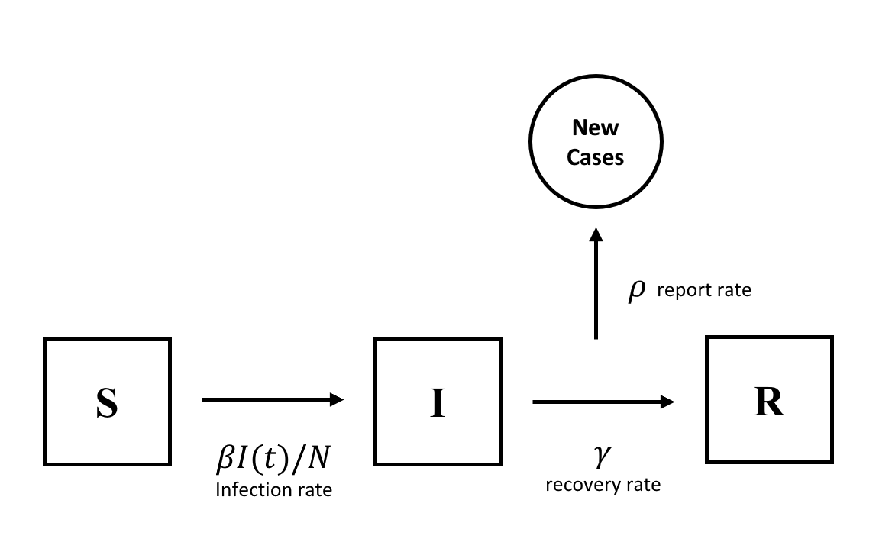
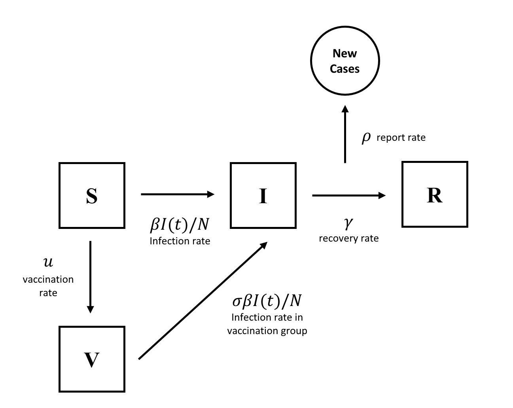
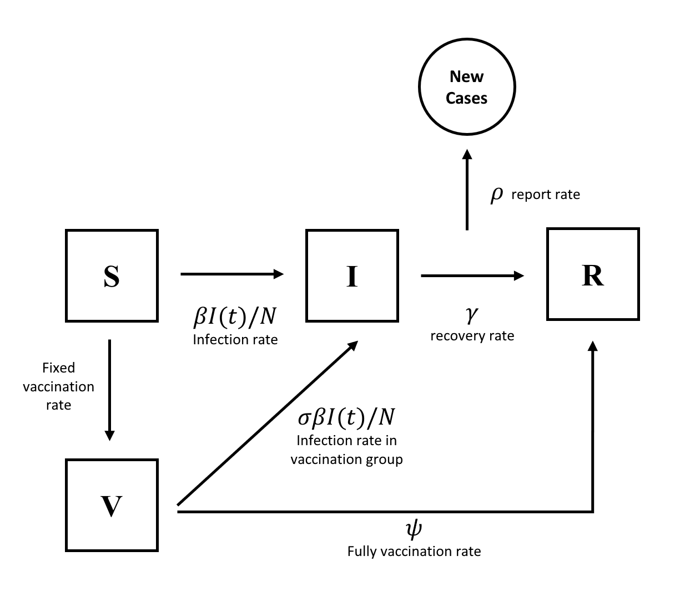

```{r setup, include=FALSE}
knitr::opts_chunk$set(echo = TRUE)
library(ggplot2)
library(pomp)
library(tidyverse)
library(doRNG)
library(doParallel)
registerDoParallel()
# Run level set up
# Run level: -------------------------------------------------------------------
run_level = 1
options_Np =      switch(run_level, 100,  1000,  5000)
options_Nmif =    switch(run_level,  10,   100,   200)
options_Neval =   switch(run_level,   2,    10,    20)
options_Nglobal = switch(run_level,  10,    20,   100)
options_Nlocal =  switch(run_level,  10,    20,    40)
options_Nsim =    switch(run_level,  50,   100,   500)
```

# Motivation and Background Information:

It has been more than one year since the first case of COVID-19 was found at the end of 2019. Up to now, the total cases of COVID-19 in United States is over 30 million, and the death population is over 0.5 million. In order to control this dramatic spread of COVID-19, vaccination is needed, as it's one of the critical and efficient way to control the wide spread of infectious disease. In United States, the first vaccine was administrated at the end of 2020, and an increasing amount of people started to take vaccination. According to the Google News, the population that receive full vaccination is around 76 million. The introduce of the vaccination is expected to decrease the spreading rate of COVID-19. Whether the vaccination affect the infection of COVID-19 motivate us to start this project.

There are two data sets we use to explore:

- COVID-19 daily report data in US from [COVID-19 Data Repository by the Center for Systems Science and Engineering (CSSE) at Johns Hopkins University](https://github.com/CSSEGISandData/COVID-19/tree/master/csse_covid_19_data).

- Vaccination daily data in US from  [Our World in Data](https://ourworldindata.org/coronavirus).

As the data about vaccination rate we could get is from January 12, 2021, we will also only use the data about COVID-19 cases from January 12, 2021. And we will use the data from California only.

## Research Questions

We have two primary aims to explore in this project:

- Is the vaccine effective? Does vaccination slow down the spread of virus?

- When will the pandemic end given current vaccination rate?


# Exploratory Data Analysis

Because of the large population in CA, the unit we use in this project is thousand. For example, the total population in CA is [39368078](https://en.wikipedia.org/wiki/California), we will take 39368 thousand here, and the new cases will be 20 thousand instead of 20000. Also, as we use the data from `2021-01-11` to `2021-04-07`, there are totally 87 observations. 

```{r, message=F, warning=F}
dat <- read_csv("Data/covid_data.csv")
plot(1:(dim(dat)[1]-1),diff(dat$Confirmed)/1000,type="l", ylab="New Reports(thousand)", xlab="Days", main="California")
dat %>% select(Date,Confirmed,Deaths,People_Fully_Vaccinated,Active) %>% mutate(New_Report = c(NA,diff(dat$Confirmed))) %>% filter(Date > as.Date("2021-01-10")) %>% mutate(Day=1:87) -> df
N = 39368 # 39368078
I0 = round(df$Active[1]/1000) # 2727541 
df = df %>% mutate(New_Report = round(New_Report/1000),People_Fully_Vaccinated = round(People_Fully_Vaccinated/1000))
```

According to the plot above, we could find that the new report cases in California is decreasing. And the variation is obvious at the beginning but becomes smaller as days increase.    

## Model the Vaccination Rate

To model current vaccination rate in CA, we fitted a linear regression model with linear and quadratic terms of `Days` and we found that the changing pattern of this variable is very similar to the quadratic function of the `Days`.

```{r}
df$Day2 = df$Day^2
fit = lm(People_Fully_Vaccinated~Day+Day2,data = df)
na_idxs = which(is.na(df$People_Fully_Vaccinated))
df$People_Fully_Vaccinated[na_idxs] = predict(fit,data.frame(Day = df$Day[na_idxs],Day2 = df$Day[na_idxs]^2))

plot(df$People_Fully_Vaccinated, ylab="People Fully Vaccinated(thousand)", xlab="Days")
points(sapply(df$Day, function(d) sum(coef(fit)*c(1,d,d^2))),col="red")
legend("topleft",fill=c("black","red"),c("data","fitted"))
V0 = round(df$People_Fully_Vaccinated[1])
```

The fitted model was shown below,
$$
CumulativeNumberVaccinations_i = 85.79 + 2.88 Day_i + 0.95 Day_i^2
$$
with $R^2=0.999$, so in the following analysis, we will model the total number of people get fully vaccinated using the fitted linear model above. 


# SIR Model

We first consider the basic SIR model without isolation and vaccination effect, as we want to see whether the model without considering the effect of vaccination will do a good job in fitting the data. This SIR model is consist of three stages:

+ S: susceptible (all individuals)

+ I: infected (symptomatic)

+ R: removed (recovered or deceased)

```{r fig1, out.width = '100%', echo=F}

```
And the model is given by following expression:

\[\begin{eqnarray}
\frac{dS(t)}{dt} &=& \frac{-\beta I(t) S(t)}{N}, \\
\frac{dI(t)}{dt} &=& \frac{\beta I(t) S(t)}{N} - \gamma I(t),\\
\frac{dR(t)}{dt} &=& \gamma I(t),\\
S(t) + &I(t)& + R(t) = N, \ \ \forall t
\end{eqnarray}\]

The `S(t)` represent the susceptible population at time t, `I(t)` represents the infected population at time t, `R(t)` represents the recovered population at time t, and `N` represents the total population in this area. The transmission rate is $\beta$, the recover rate is $\gamma$, or said $\mu_{IR}$.

Also, the initial value of `I` will be the active population on the first day given in the data set, as this active population represents the confirmed cases that have not been resolved, which also means infectious population. Thus, `I(0)` will be 2728 thousand people here. Again, the population of CA, or we said `N` here, is 39368 thousand. For the initial value of `S`, as we do not know the true value, we will use the fraction of total population, which is represented by $\eta$, to predict the `S(0)`. Besides, there is an accumulator variable `H`, which is not shown in the expression above, used to tally only the daily confirmed cases, such that $\text{reports}_t \sim \text{Binomial}(H(t), \rho)$, $\rho$ is the reporting rate, and it will be reset to zero at the beginning of each day. 

As the data about the death and recover populations in this time period are not clear, we will not consider death rate and how the population of recover will be effected in this project.

## Simulation and Guess the parameter

```{r}
sir_step <- function (S, I, R, H, N, Beta, mu_IR, delta.t, ...) {
  dN_SI <- rbinom(n=1,size=S,prob=1-exp(-Beta*I/N*delta.t))
  dN_IR <- rbinom(n=1,size=I,prob=1-exp(-mu_IR*delta.t))
  S <- S - dN_SI
  I <- I + dN_SI - dN_IR
  R <- R + dN_IR
  H <- H + dN_IR;
  c(S = S, I = I, R = R, H = H)
}
sir_rinit <- function (N, eta,rho, ...) {
  c(S = round(N*eta), I = I0, R = round(N*(1-eta)-I0), H = 0)
}
sir_dmeas <- function (New_Report, H, rho, log, ...) { dbinom(x=New_Report, size=H, prob=rho, log=log)}
sir_rmeas <- function (H, rho, ...) { c(New_Report=rbinom(n=1, size=H, prob=rho))}
df %>%
  pomp(times="Day",t0=0, rprocess=euler(sir_step,delta.t=1),rinit=sir_rinit,accumvars = "H",
       rmeasure = sir_rmeas,dmeasure = sir_dmeas,
       partrans = parameter_trans(log=c("Beta","mu_IR"),logit=c("rho","eta")),
       statenames=c("S","I","R","H"),
       paramnames=c("Beta","mu_IR","eta","rho","N")) -> covidSIR
```


```{r}
params = c(Beta=0.01,mu_IR = 0.06,rho = 0.3,eta = 0.9,N=N)
covidSIR %>%
  simulate(
    params=params,
    nsim=10,format="data.frame",include.data=TRUE
  ) -> sims
sims %>%
  ggplot(aes(x=Day,y=New_Report,group=.id,color=.id=="data"))+
  geom_line()+
  guides(color=FALSE)+labs(title="SIR Simulation for data")
```

We first use the simulation and try some combinations of estimators to see which combination of estimator will provide a simulation close to the true data. On the plot above, green line represents the true data, red lines represent the 10 simulated results. These simulations are generated by $\beta = 0.01, \mu_{IR} = 0.06, \rho = 0.3, \eta = 0.9$. We could see the $\eta$ is pretty large, this is because new report cases in our data starts from a large number and then decreases. Then we apply the IF2 algorithm to perform likelihood optimization, with only fixing the `N`. 

## local search

```{r}
fixed_params <- c(N=N)
stew(file = sprintf("results/sir_lik_local_eval-%d.rda",run_level),{
  t_local_eval = system.time({
    foreach(i=1:options_Nlocal,.combine=c) %dopar% {
      covidSIR %>% mif2(params=params,
                        Np=options_Np, 
                        Nmif=options_Nmif,
                        cooling.fraction.50=0.5,
                        rw.sd=rw.sd(Beta=0.02, 
                                    rho=0.02, 
                                    eta=ivp(0.02),
                                    mu_IR=0.02)
                        )} -> mifs_local
    foreach(i=1:options_Nlocal,.combine=rbind) %dopar% {
      mifs_local[[i]] %>% pfilter(Np = options_Np) %>% logLik() %>% logmeanexp() -> ll
      mifs_local[[i]] %>% coef() %>% bind_rows() %>% bind_cols(loglik=ll[1])
    } -> results_local
    })
})
mifs_local %>%
  traces() %>%
  melt() %>%
  ggplot(aes(x=iteration,y=value,group=L1,color=factor(L1)))+
  geom_line()+
  guides(color=FALSE)+
  facet_wrap(~variable,scales="free_y")
pairs(~loglik+Beta+rho+eta+mu_IR,data = results_local %>% na.omit %>% filter(loglik > max(loglik)-20))
```

In the diagnostic plot, the likelihood looks stable, waving between -195 and -190, as the iteration process, while other parameters have large variability. In the plot of the likelihood surface, the loglik plots look so sparse that it does not give us a clear picture or hint of the ridge in likelihood surface. Thus, we move on to do global search.

## global search

According to the simulation results, we could give each parameter a reasonable range:
$\beta \in [0.001, 0.06], \rho \in [0.1,0.6], \eta \in [0.85, 0.95], \mu_{IR} \in [0.02, 0.1]$. 

```{r}
set.seed(2062379496)
runif_design(lower=c(Beta=0.001,rho=0.1,eta=0.85,mu_IR=0.02),
             upper=c(Beta=0.060,rho=0.6,eta=0.95,mu_IR=0.1),
             nseq=100) -> guesses
mf1 <- mifs_local[[1]]
registerDoRNG(1270401374)

stew(file = sprintf("results/sir_lik_global_eval-%d.rda",run_level),{
  t_global_eval = system.time({
    foreach(guess=iter(guesses,"row"), .combine=rbind) %dopar% {
      mf1 %>%
        mif2(params=c(unlist(guess),fixed_params)) %>%
        mif2(Nmif=options_Nmif) -> mf
      replicate(options_Neval,
                mf %>% pfilter(Np=options_Np) %>% logLik()) %>% logmeanexp(se=TRUE) -> ll
      mf %>% coef() %>% bind_rows() %>% bind_cols(loglik=ll[1],loglik.se=ll[2])
      } -> results
  })
})

pairs(~loglik+Beta+rho+eta+mu_IR,data = results %>% na.omit %>% filter(loglik > max(loglik)-20))
```

And when the log-likelihood is maximized, the corresponding parameters are:

```{r}
results[which.max(results$loglik),]
```

According to the plot above, we could not see the diverse points converge on a particular region in any parameter space, meaning that the likelihood maximization procedure does not work well in this model, and we are unable to find the optimal parameters based on the maximum likelihood. As result, we think the basic SIR model is not efficient enough to explain the data. 

# SIRV Model

As the SIR model does not work well, we try to use alternative model SIRV, which introduce the vaccination effect, to see whether vaccination effect could help us understand the data better. As we found that there are different ways to add the vaccination effects in the model, we are going to try 2 different ways to add and control the vaccination effect. 


## First SIRV model

Referring to Masaaki's paper "Optimal Strategies for Vaccination
using the Stochastic SIRV Model" in 2021, we construct the SIRV model below.
Similar to the SIR model describe above, we add the vaccination effect by adding parameters: vaccination rate($u$), and the vaccination efficacy, which is denoted by $1-\sigma, \sigma \in [0,1]$, meaning that the vaccination
is totally useless when $\sigma = 1$ while the vaccine is perfect when $\sigma = 0$.
For the initial value of `V`, we will use the number of people fully vaccinated on the first day, so $V(0) = 90$ thousand people.

```{r fig2, out.width = '100%', echo=F}

```

And the model is given by following expression:

$$
\begin{align}
\frac{dS(t)}{dt} &= -\frac{\beta}{N}S(t)I(t) - \frac{u}{N}S(t) \\
\frac{dI(t)}{dt} &= \frac{\beta}{N}S(t)I(t) + \frac{\sigma \beta}{N}V(t)I(t) - \gamma I(t)\\
\frac{dR(t)}{dt} &= \gamma I(t)\\
\frac{dV(t)}{dt} &= \frac{u}{N}S(t) - \frac{\sigma \beta}{N}V(t)I(t)
\end{align}
$$
```{r}
sirv1_step <- function (S, I, R, V, H, N, Beta, u, Sigma, mu_IR, delta.t, ...) {
  dN_SI <- rbinom(n=1,size=S,prob=1-exp(-Beta*I/N*delta.t))
  dN_SV <- rbinom(n=1,size=S,prob=1-exp(-u*S/N*delta.t))
  dN_VI <- rbinom(n=1,size=V,prob = 1-exp(-Sigma*Beta*V/N*delta.t))
  dN_IR <- rbinom(n=1,size=I,prob=1-exp(-mu_IR*delta.t))
  
  S <- S - dN_SI - dN_SV
  I <- I + dN_SI - dN_IR + dN_VI
  R <- R + dN_IR
  V <- V + dN_SV - dN_VI
  H <- H + dN_IR;
  c(S = S, I = I, R = R, V = V, H = H)
}
sirv1_rinit <- function (N, eta, ...) {
  c(S = round(N*eta), I = I0, R = round(N*(1-eta)-I0-V0), V = V0, H = 0)
}
sirv1_dmeas <- function (New_Report, H, rho, log, ...) { dbinom(x=New_Report, size=H, prob=rho, log=log)}
sirv1_rmeas <- function (H, rho, ...) { c(New_Report=rbinom(n=1, size=H, prob=rho))}
df %>%
  pomp(times="Day",t0=0, rprocess=euler(sirv1_step,delta.t=1),rinit=sirv1_rinit,accumvars = "H",
       rmeasure = sirv1_rmeas,dmeasure = sirv1_dmeas,
       partrans = parameter_trans(log=c("Beta","u","Sigma","mu_IR"),logit=c("rho","eta")),
       statenames=c("S","I","R","V","H"),
       paramnames=c("Beta","u","Sigma","mu_IR","eta","rho","N")) -> covidSIRV1
```

### simulation and guess the parameters

```{r}
params = c(Beta=0.02, u = 0.2, Sigma = 0.01,mu_IR = 0.06,rho = 0.3,eta = 0.9,N=N)
covidSIRV1 %>%
  simulate(
    params=params,
    nsim=10,format="data.frame",include.data=TRUE
  ) -> sims
sims %>%
  ggplot(aes(x=Day,y=New_Report,group=.id,color=.id=="data"))+
  geom_line()+
  guides(color=FALSE) + labs(title="SIRV Similation for data")
```

Again, we use the simulation to approach the best guess of the combination of parameters. On the plot above shows the best simulation, green line represents the true data, red lines represent the 10 simulated results. These simulations are generated by $\beta = 0.02,u = 0.2, \sigma = 0.01, \mu_{IR} = 0.06, \rho = 0.3, \eta = 0.9$. We could see the $\sigma$ is small, which means the vaccinations do have effect, but it is not small enough to say vaccine is perfect. In order to see how well this SIRV model does, we again start doing likelihood optimization.


### local search

```{r}
fixed_params <- c(N=N)
stew(file = sprintf("results/sirv1_lik_local_eval-%d.rda",run_level),{
  t_local_eval = system.time({
    foreach(i=1:options_Nlocal,.combine=c) %dopar% {
      covidSIRV1 %>% mif2(params=params,
                        Np=options_Np, 
                        Nmif=options_Nmif,
                        cooling.fraction.50=0.5,
                        rw.sd=rw.sd(Beta=0.02, 
                                    u = 0.01,
                                    Sigma = 0.01,
                                    rho=0.02, 
                                    eta=ivp(0.02),
                                    mu_IR=0.02)
                        )} -> mifs_local
    foreach(i=1:options_Nlocal,.combine=rbind) %dopar% {
      mifs_local[[i]] %>% pfilter(Np = options_Np) %>% logLik() %>% logmeanexp() -> ll
      mifs_local[[i]] %>% coef() %>% bind_rows() %>% bind_cols(loglik=ll[1])
    } -> results_local
    })
})
mifs_local %>%
  traces() %>%
  melt() %>%
  ggplot(aes(x=iteration,y=value,group=L1,color=factor(L1)))+
  geom_line()+
  guides(color=FALSE)+
  facet_wrap(~variable,scales="free_y")
pairs(~loglik+Beta+rho+eta+mu_IR+u+Sigma,data = results_local %>% filter(loglik > max(loglik)-20))
```

From the diagnostic plot, we could see that the log-likelihood will increase as iteration proceed, and its variability is quite small comparing with the one in SIR model. Also, the variability of $\beta$ looks smaller than that in SIR model. However, the considerable variability of other parameters remains. In the plot of the likelihood surface, it still does not give any useful information about the ridge in the likelihood surface, as the points look too sparse. Thus, we move to global search.

### global search

Similar to the global search above, we first define the range for each parameter based on the knowledge from simulation and local search: $\beta \in [0.008, 0.03], u \in [0.005, 0.03], \sigma \in [0.005, 0.03], \rho \in [0.1,0.4], \eta \in [0.85, 0.95], \mu_{IR} \in [0.0008, 0.03]$.

```{r}
set.seed(2062379496)
runif_design(lower=c(Beta=0.008,u=0.005,Sigma=0.005,rho=0.1,eta=0.85,mu_IR=0.008),
             upper=c(Beta=0.030,u=0.03,Sigma=0.03,rho=0.4,eta=0.95,mu_IR=0.03),
             nseq=100) -> guesses
mf1 <- mifs_local[[1]]
registerDoRNG(1270401374)

stew(file = sprintf("results/sirv1_lik_global_eval-%d.rda",run_level),{
  t_global_eval = system.time({
    foreach(guess=iter(guesses,"row"), .combine=rbind) %dopar% {
      mf1 %>%
        mif2(params=c(unlist(guess),fixed_params)) %>%
        mif2(Nmif=options_Nmif) -> mf
      replicate(options_Neval,
                mf %>% pfilter(Np=options_Np) %>% logLik()) %>% logmeanexp(se=TRUE) -> ll
      mf %>% coef() %>% bind_rows() %>% bind_cols(loglik=ll[1],loglik.se=ll[2])
      } -> results
  })
})

pairs(~loglik+Beta+rho+eta+mu_IR+u+Sigma,data = results %>% filter(loglik > max(loglik)-1000))
```

And when the log-likelihood is maximized, the corresponding parameters are:

```{r}
results[which.max(results$loglik),]
```

Comparing to the result from SIR model, the global search from SIRV model looks better, as it gives a condense picture of points, and the log-likelihood from SIRV model is higher than that from SIR model. However, log-likelihood seems to have no changing pattern but a horizontal line, no matter how other parameters change. This is not what we expect as we what to know find out the parameters that explain the data best. 

## Second SIRV model

### SIRV model with known vaccination rate

First SIRV model was fitted without using the vaccination information from the dataset, therefore we constructed another SIRV model, which integrated the vaccination information into the model. The model assumes fixed vaccination rate, which means for unit time interval `dt`, the number of people from the susceptible compartment `S` to the vaccinated compartment `V` was determined by linear model we used to model the total number of people fully vaccinated. To be more specific, the number of people received vaccination between time $t$ and time $t+dt$ would be $2.88dt+1.89tdt+0.95dt^2$. Also, inspired by Isam's paper "A time-delayed SVEIR model for imperfect vaccine with a generalized nonmonotone incidence and application to measles" in 2021, we added another connection between 
compartment `V` to compartment `R` to denote the people who got full immunity per unit time.

The graphical representation of SIRV model with fixed vaccination was shown below,

```{r fig3, out.width = '100%', echo=F}

```

And the model is given by following expression:

$$
\begin{align}
dS(t) &= -\frac{\beta}{N}S(t)I(t)dt - (2.88dt+1.89tdt+0.95dt^2) \\
dI(t) &= \frac{\beta}{N}S(t)I(t)dt + \frac{\sigma \beta}{N}V(t)I(t)dt - \gamma I(t)dt\\
dR(t) &= \gamma I(t)dt + \psi V(t)dt \\
dV(t) &= (2.88dt+1.89tdt+0.95dt^2) - \frac{\sigma \beta}{N}V(t)I(t)dt - \psi V(t)dt
\end{align}
$$

```{r}
sirv2_step <- function (S, I, R, V, H, D, N, Beta, Sigma, mu_IR,mu_VR, delta.t,...) {
  dN_SI <- rbinom(n=1,size = S,prob=1-exp(-Beta*I/N*delta.t))
  dN_SV <- round(sum(coef(fit)[c(2,3)] * c(delta.t,2*D*delta.t+delta.t^2)))
  dN_VI <- rbinom(n=1,size=V,prob = 1-exp(-Sigma*Beta*I/N*delta.t))
  dN_IR <- rbinom(n=1,size=I,prob=1-exp(-mu_IR*delta.t))
  dN_VR <- rbinom(n=1,size = V,prob = 1-exp(-mu_VR*delta.t))
  
  S <- S - dN_SI - dN_SV
  I <- I + dN_SI - dN_IR + dN_VI 
  R <- R + dN_IR + dN_VR
  V <- V - dN_VI  + dN_SV - dN_VR
  H <- H + dN_IR
  D <- D + delta.t
  c(S = S, I = I, R = R, H = H, V = V,D = D)
}
sirv2_rinit <- function (N, eta, ...) {
  c(S = round(N*eta), I = I0, R = round(N*(1-eta)-I0-V0), V = V0, H = 0, D = 0)
}
sirv2_dmeas <- function (New_Report, H, rho, log, ...) { dbinom(x=New_Report, size=H, prob=rho, log=log)}
sirv2_rmeas <- function (H, rho, ...) { c(New_Report=rbinom(n=1, size=H, prob=rho))}
df %>%
  pomp(times="Day",t0=0, rprocess=euler(sirv2_step,delta.t=1),rinit=sirv2_rinit,accumvars = "H",
       rmeasure = sirv2_rmeas,dmeasure = sirv2_dmeas,
       partrans = parameter_trans(log=c("Beta","mu_IR","mu_VR"),logit=c("rho","eta","Sigma")),
       statenames=c("S","I","R","V","H","D"),
       paramnames=c("Beta","Sigma","mu_IR","mu_VR","eta","rho","N")) -> covidSIRV2
```


### simulation and guess the parameters

```{r}
params = c(Beta=0.01,Sigma = 0.01, mu_IR = 0.04,mu_VR = 0.9, rho = 0.3,eta = 0.9,N=N)
covidSIRV2 %>%
  simulate(
    params=params,
    nsim=10,format="data.frame",include.data=TRUE
  ) -> sims
sims %>%
  ggplot(aes(x=Day,y=New_Report,group=.id,color=.id=="data"))+
  geom_line()+
  guides(color=FALSE) + labs(title="Second SIRV Similation for data")
```

Again, we use the simulation to find out the appropriate range of  guess of the combination of parameters. On the plot above shows the best simulation, green line represents the true data, red lines represent the 10 simulated results. These simulations are generated by $\beta = 0.01, \sigma = 0.01, \mu_{IR} = 0.04,\mu_{VR} = 0.9, \rho = 0.3, \eta = 0.9$. We could see the $\sigma$ is small, which means the vaccinations do have effect, but it is not small enough to say vaccine is perfect. In order to see how well this SIRV model does, we again start doing likelihood optimization.


### local search

```{r}
fixed_params <- c(N=N)
stew(file = sprintf("results/sirv2_lik_local_eval-%d.rda",run_level),{
  t_local_eval = system.time({
    foreach(i=1:options_Nlocal,.combine=c) %dopar% {
      covidSIRV2 %>% mif2(params=params,
                        Np=options_Np, 
                        Nmif=options_Nmif,
                        cooling.fraction.50=0.3,
                        rw.sd=rw.sd(Beta=0.02, 
                                    Sigma=0.02,
                                    rho=0.02, 
                                    eta=ivp(0.02),
                                    mu_IR=0.02,
                                    mu_VR=0.02)
                        )} -> mifs_local
    foreach(i=1:options_Nlocal,.combine=rbind) %dopar% {
      mifs_local[[i]] %>% pfilter(Np = options_Np) %>% logLik() %>% logmeanexp() -> ll
      mifs_local[[i]] %>% coef() %>% bind_rows() %>% bind_cols(loglik=ll[1])
    } -> results_local
    })
})
mifs_local %>%
  traces() %>%
  melt() %>%
  ggplot(aes(x=iteration,y=value,group=L1,color=factor(L1)))+
  geom_line()+
  guides(color=FALSE)+
  facet_wrap(~variable,scales="free_y")
pairs(~loglik+Beta+Sigma+rho+eta+mu_IR+mu_VR,data = results_local %>% filter(loglik > max(loglik)-20))
```

From the diagnostic plots above, we could see that the log-likelihood converged quite well and oscillate around -191. Most of the variables converged to a certain area of parameter space, but some variables such as $\mu_{VR}$ had trend to divergence. To fully explore the likelihood surface of the second SIRV model, we moved to global serach.


### global search

The box of initial values of the parameters for the global search was set as: $\beta \in [0.001, 0.05], \sigma \in [0, 0.5], \rho \in [0.1,0.6], \eta \in [0.85, 0.95], \mu_{IR} \in [0.02, 0.1], \mu_{VR} \in [0,10]$. The pairwise relationships between parameters and log-likelihood were shown below.

```{r}
set.seed(2062396)
runif_design(lower=c(Beta=0.001,Sigma = 0, rho=0.1, eta=0.85,mu_IR=0.02,mu_VR=0),
             upper=c(Beta=0.040,Sigma = 0.5, rho=0.6, eta=0.95,mu_IR=0.1,mu_VR=10),
             nseq=100) -> guesses
mf1 <- mifs_local[[1]]
registerDoRNG(1270401374)

stew(file = sprintf("results/sirv2_lik_global_eval-%d.rda",run_level),{
  t_global_eval = system.time({
    foreach(guess=iter(guesses,"row"), .combine=rbind) %dopar% {
      mf1 %>%
        mif2(params=c(unlist(guess),fixed_params),cooling.fraction.50=0.3) %>%
        mif2(Nmif=options_Nmif) -> mf
      replicate(options_Neval,
                mf %>% pfilter(Np=options_Np) %>% logLik()) %>% logmeanexp(se=TRUE) -> ll
      mf %>% coef() %>% bind_rows() %>% bind_cols(loglik=ll[1],loglik.se=ll[2])
      } -> results_global
  })
})

pairs(~loglik+Beta+Sigma+rho+eta+mu_IR+mu_VR,data = results_global %>% filter(loglik > max(loglik)-20))
```

And the corresponding values the parameters took when the log-likelihood was maximized were:

```{r}
results_global[which.max(results_global$loglik),]
```

From the results above, we could see that $\hat{\sigma}_{MLE}$ is `r results_global[which.max(results_global$loglik),"Sigma"]` and the value was quite small, which means that the vaccine was protective against the virus. Also $\hat{\mu}_{VR,MLE}$ was quite large, which means lots of people received full immunity after vaccination. 


### profile likelihood for $\sigma$

To explore how the log-likelihood changes over different values of $\sigma$, we calculated the profile likelihood of $\sigma$. We chose 20 evenly spaced values between $0.001$ and $0.5$ as the initial values for $\sigma$. Also for each $\sigma$, we uniformly sample a point from the box $\beta \in [0.0001,0.03], \rho \in [0.1,0.6], \eta \in [0.85,0.95], \mu_{IR} \in [0.02,0.1], \mu_{VR} \in [0.1,10]$ as initial value for other parameters. 


```{r, echo=FALSE}
profile_design(
  Sigma = seq(0.001,0.5,length=20),
  lower = c(Beta=0.0001,rho = 0.1, eta = 0.85, mu_IR = 0.02,mu_VR = 0.1),
  upper = c(Beta=0.03,rho=0.6,eta=0.95,mu_IR=0.1,mu_VR=10),
  nprof = 10,type = "runif"
) -> guesses

stew(file=sprintf("results/sirv2_profile_sigma-%d.rda",run_level),{
  t_sigma_profile<- system.time({
    profile.llh <- foreach(guess=iter(guesses,"row"), .combine=rbind) %dopar%{
      mf1 %>%
        mif2(params=c(unlist(guess),fixed_params),cooling.fraction.50=0.3) %>%
        mif2(Nmif=options_Nmif,rw.sd = rw.sd(Beta=0.01,rho=0.02,eta=0.02,mu_IR=0.02,mu_VR=0.02 )) -> mf
      replicate(options_Neval,
                mf %>% pfilter(Np=options_Np) %>% logLik()) %>% logmeanexp(se=TRUE) -> ll
      mf %>% coef() %>% bind_rows() %>% bind_cols(loglik=ll[1],loglik.se=ll[2])
      } -> results_sigma
  })
},seed=5556129)
```

The profile log-likelihood for $\sigma$ was shown below

```{r,warning=FALSE,message=FALSE}
maxloglik <- max(results_sigma$loglik,na.rm = TRUE)
ci.cutoff <- maxloglik-0.5*qchisq(df=1,p=0.95)
results_sigma %>% 
  group_by(round(Sigma,1)) %>%
  filter(rank(-loglik)<3) %>%
  ungroup() %>%
  filter(loglik>max(loglik)-20) %>%
  ggplot(aes(x=Sigma,y=loglik)) + geom_point() +geom_smooth(span=2) #+ geom_hline(color="red",yintercept = ci.cutoff)
```

From the plot above, we could see that the maximizer for $\sigma$ was around $0.1$, which was consistent with result from global search. However, we found some flaws in the profile likelihood plot. By Wilk's theorem, we can calculate the $95\%$ confidence interval for log-likelihood, which will be $-190.7 - 0.5 \chi^2_{1,0.95}=-192.62$, which means that as long as the log-liklihood of the models with different values of $\sigma$ are greater than $-192.62$, they will be comparable with the model that has maximum log-likelihood. This fact indicated that maybe parameter $\sigma$ in SIRV model above is weakly identifiable given only the daily new reported cases data.


### prediction

Finally, we used the second SIRV model with maximum likelihood to predict when will the pandemic end. The simulation results were shown below. The first figure showed simulated daily new report from January 12, 2021 to July 30, 2021. And second figure showed the number of people inside each compartment changing over time. All the simulations were repeated 10 times.

```{r,warning=FALSE,message=FALSE}
params_maxlik = unlist(results_global[which.max(results_global$loglik),])
n=210
df %>% bind_rows(data.frame(Day=88:n)) %>% 
  pomp(times="Day",t0=0, rprocess=euler(sirv2_step,delta.t=1),rinit=sirv2_rinit,accumvars = "H",
       rmeasure = sirv2_rmeas,dmeasure = sirv2_dmeas,
       partrans = parameter_trans(log=c("Beta","mu_IR","mu_VR"),logit=c("rho","eta","Sigma")),
       statenames=c("S","I","R","V","H","D"),
       paramnames=c("Beta","Sigma","mu_IR","mu_VR","eta","rho","N")) %>%
  simulate(
    params=params,
    nsim=5,format="data.frame",include.data=TRUE
  ) -> sims
sims %>% select(-c("Date")) %>% inner_join( data.frame(Date= seq(as.Date("2021-01-12"),as.Date("2021-01-12")+n-1,1),Day=1:n)) -> sims
sims %>%
  ggplot(aes(x=Date,y=New_Report,group=.id,color=.id=="data"))+
  geom_line() + labs(title="Simulation using second SIRV model") +
  scale_color_discrete(name="",labels=c("simulation","data")) +
  ylab("New Report(*1000)")+
  scale_x_date(date_breaks = "months",date_labels = "%b")
```

```{r,warning=FALSE}
tmp = reshape2::melt(sims %>% filter(.id!="data") %>% select(Date,S,I,R,V),"Date")
tmp %>% 
  ggplot(aes(x=Date,y=value,group=variable,color=variable))+
  geom_line()+ labs(title="Simulation using second SIRV model") + scale_y_continuous(trans = 'log10') +
  scale_color_discrete(name="Conpartment") + ylab("1000 people")+
  scale_x_date(date_breaks = "months",date_labels = "%b")
```

The simulation plots above, we can conclude that the pandemic in California will probably end before the end of July,2021 if the growth rate of total number of vaccination over time does not change. EXISTING!


# Conclusions

In this project, we used three different compartment models, SIR model, SIRV model and SIRV model with known vaccination rate, to fit the COVID-19 dataset in California. There are two major conclusions:

+ The vaccine is effective and protective agasinst COVID-19. The vaccine efficacy is over $80\%$ according to our analysis.

+ Given the simulation results, we conclude that the COVID-19 pandemic will end before the end of July, 2021 in California if the total number of people received vaccine continues to grow quadratically over time.

# Future works

There are some problems we encountered during this project, which can be done in the future:

+ The dynamics of COVID-19 cases is very complicated, so the simple SIR/SIRV model can not fit the data very well. Therefore in the future, we can add more compartments into the model, i.e. people who are exposed to the virus, people who got quarantined, people who only got one shot of vaccine, to best fit the data.

+ We found that the vaccine efficacy $\sigma$ was weakly identifiable in our model, and we think other sources of data will help us to identify this parameter. Recently California government is tracking the cases of COVID among the people who already fully vaccinated, which is called ["breakthrough" cases](https://www.sacbee.com/news/politics-government/capitol-alert/article250705069.html). If we can integrate this information to the model, it will help us to identify the vaccine efficacy $\sigma$.


# References:

1. Course lecture note12-14 https://ionides.github.io/531w21/#class-notes-and-lectures

2. Covid-19 data from COVID-19 Data Repository by the Center for Systems Science and Engineering (CSSE) at Johns Hopkins University https://github.com/CSSEGISandData/COVID-19/tree/master/csse_covid_19_data

3. Vaccine data from Our World in Data https://ourworldindata.org/coronavirus

4. Masaaki, Ishikawa. “Optimal Strategies for Vaccination Using the Stochastic SIRV Model.” 2012 The Institute of Systems, Control and Information Engineers, 2012, www.jstage.jst.go.jp/article/iscie/25/12/25_343/_article/-char/en.

5. Isam Al-Darabsah, "A time-delayed SVEIR model for imperfect vaccine with a generalized nonmonotone incidence and application to measles", Applied Mathematical Modelling,2021, https://doi.org/10.1016/j.apm.2020.08.084.

6. Sophia Bollag, "California works to track cases of COVID among the vaccinated", https://www.sacbee.com/news/politics-government/capitol-alert/article250705069.html

7. W. K. Wong and Filbert H. Juwono and Tock H. Chua, "SIR Simulation of COVID-19 Pandemic in Malaysia: Will the Vaccination Program be Effective?", arXiv, 2021, https://arxiv.org/abs/2101.07494

8. Ghostine R, Gharamti M, Hassrouny S, Hoteit I. "An Extended SEIR Model with Vaccination for Forecasting the COVID-19 Pandemic in Saudi Arabia Using an Ensemble Kalman Filter." Mathematics. 2021; 9(6):636. https://doi.org/10.3390/math9060636
