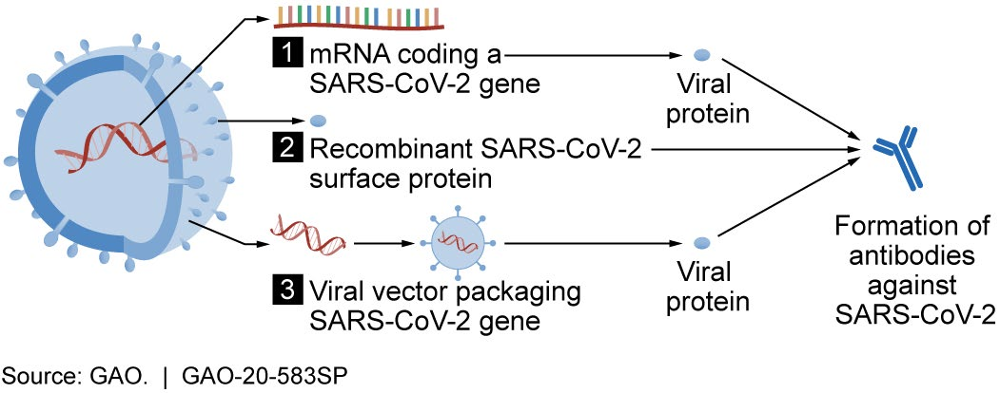
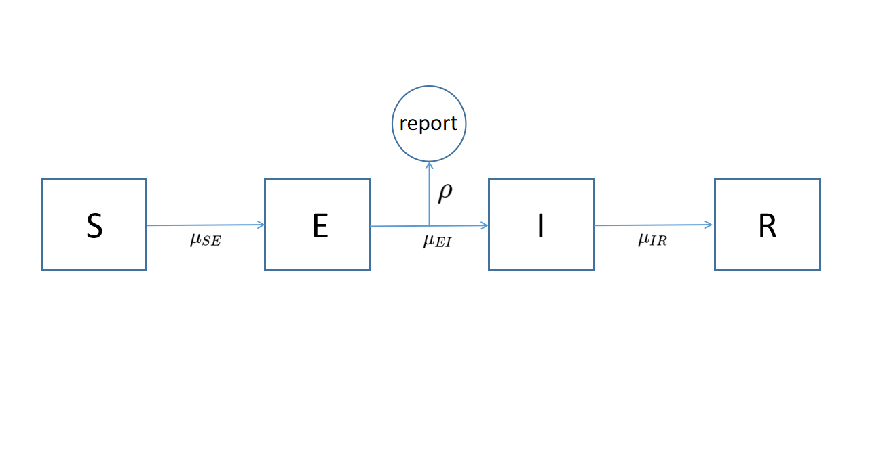
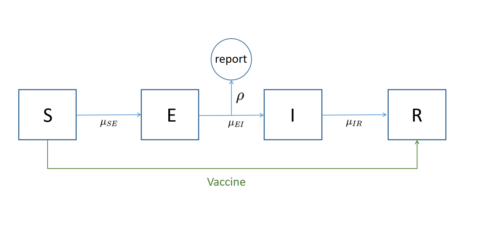

## 1. Introduction

About one year ago, the coronavirus disease of 2019 (COVID-19) had been declared a global pandemic, as it infected and spread around people quite easily. This virus caused many deaths, and forced people to work virtually, and properly protect themselves by wearing face masks when out in public.

After over a year, several companies and researchers actively worked on developing a vaccine to help people develop immunity against this contagious virus [1], and help people get their lives back to normal. Vaccines have been offered since the start of the 2021, and have been made available to certain age groups over periods of time. They have primarily been manufactured by Moderna, Pfizer, and Johnson and Johnson. Demand for vaccines has been overwhelming as people are trying to get back to normal.


For our project, we decided to investigate COVID-19 data since there are many time series based datasets on the pandemic. As vaccines have been distributed in recent times, we decided to examine vaccinations in the US by state, from a dataset provided at the links [2,3].

Our primary focus was people vaccinated and people fully vaccinated, and we considered fitting a POMP model and an ARMA model to look for trends and evaluate results.The data for this project comes from two principal sources: The New York Times, and Our World in Data. The former was utilized for Covid case data, and the latter for vaccination counts. 


The NYT dataset provides information at both the state and county level. To control for state-level confounding variables while maintaining a reasonably-sized dataset, we opted to limit data to a single state. We selected Georgia based on the relative smoothness of its time series data. Our principal variable of interest is the total number of cumulative covid cases by state, including both lab-confirmed and probable. Due to recommendations of the Council of State and Territorial Epidemiologists, the CDC adopted inclusion of both lab-confirmed and probable cases on April 5th, 2020. Therefore, we will use this definition for our case count. 

The cleaned and merged dataset for Georgia contains 413 observations, but only 97 of these have non-zero vaccination data, due to the relatively recent approval of vaccines. 

## 2. Exploratory Data Analysis
### 2.1.Data description

The data for this project comes from two principal sources: The New York Times, and Our World in Data. The former was utilized for Covid case data, and the latter for vaccination counts. 

The NYT dataset provides information at both the state and county level. To control for state-level confounding variables while maintaining a reasonably-sized dataset, we opted to limit data to a single state. We selected Georgia based on the relative smoothness of its time series data. Our principal variable of interest is the total number of cumulative covid cases by state, including both lab-confirmed and probable. Due to recommendations of the Council of State and Territorial Epidemiologists, the CDC adopted inclusion of both lab-confirmed and probable cases on April 5th, 2020. Therefore, we will use this definition for our case count. 

The cleaned and merged dataset for Georgia contains 413 observations, but only 97 of these have non-zero vaccination data, due to the relatively recent approval of vaccines. 

### 2.2.Exploratory Analysis
```{r include=FALSE}
library(tidyverse)
library(forecast)
library(knitr)
```
First, we examine some univariate time series plots for vaccinations and covid cases. 

```{r,echo=FALSE,include=FALSE}
covid = read_csv("us-states.csv") %>% filter(state == "Georgia")
vacc = read_csv("us_state_vaccinations.csv") %>% filter(location == "Georgia")
```

```{r,echo=FALSE}
ggplot(data = covid, aes(x = date, y = cases)) +
  geom_line() +
  labs(title = "Covid case count")

ggplot(data = vacc, aes(x = date, y = daily_vaccinations)) +
  geom_line() + 
  labs(title = "Daily number of vaccinated people", ylab = "# vaccinated")
 
ggplot(data = vacc, aes(x= date, y = people_vaccinated)) + 
  geom_line() +
  labs(title = "Total number of vaccinated people", ylab = "# vaccinated")

ggplot(data = vacc, aes(x= date, y = people_fully_vaccinated)) + 
  geom_line() +
  labs(title = "Total number of fully vaccinated people", ylab = "# fully vaccinated")
```

Then, we try to model the susceptable population.

```{r,echo=FALSE}
combined <- merge(covid, vacc, by="date", all = TRUE)

combined[is.na(combined$people_fully_vaccinated),]$people_fully_vaccinated = rep(0, length.out = sum(is.na(combined$people_fully_vaccinated)))

combined[is.na(combined$people_vaccinated),]$people_vaccinated = rep(0, length.out = sum(is.na(combined$people_vaccinated)))
combined[is.na(combined$daily_vaccinations),]$daily_vaccinations = rep(0, length.out = sum(is.na(combined$daily_vaccinations)))

combined %>% 
  mutate(susceptible = 10620000 - people_fully_vaccinated - deaths - cases) -> combined

```

```{r,echo=FALSE}
df <- combined %>%
  select(date, people_fully_vaccinated, cases, susceptible) %>%
  gather(key = "variable", value = "value", -date)
```


To get a clearer idea of the trajectory of the COVID-19 pandemic in Georgia, we can estimate the remaining susceptible population and plot this in tandem with case and vaccination counts.

In estimating the susceptible population, the following simplifications have been made: 
1. We use the 2019 census estimate of 10.62 million for the population of Georgia
2. We assume that the vaccine is "perfect", i.e. a fully vaccinated person is completely removed from the susceptible population
3. We assume that anyone who has recovered from the Coronavirus has maintained their antibodies and will not be reinfected

The calculation is given by
$$X_{susceptible} = X_{population} - X_{fully~vaccinated} - X_{previous~covid} - X_{deaths}$$

Note that we account for only deaths from COVID-19, since the very high number of Covid deaths in the U.S. may disproportionately affect the expected yearly population dynamics. 

```{r,echo=FALSE}
ggplot(data = df, aes(x = date, y = value)) + 
  geom_line(aes(color = variable, linetype = variable)) +
  labs(y = "counts", title = "Cumulative cases, vaccinations, and susceptible population in Georgia")
```

While the number of fully vaccinated people has surpassed the number of cumulative COVID-19 cases, the large proportion of the population that remains susceptible might have implications for the future of the pandemic in Georgia. More specifically, it is reasonable to assume that Georgia has not reached the vaccination threshold for herd immunity, and the large proportion of susceptible individuals may indicate that the spread of COVID-19 in Georgia could continue for some time. However, since the vaccination curve is increasing quite rapidly, the susceptible population is dwindling at a similar rate, providing evidence that Georgia may reach herd immunity fairly soon. The plot does not provide strong enough evidence for either scenario, but such a visualization remains helpful for understanding the basic viral dynamics at play. 

## 3. ARMA Model
```{r include=FALSE}
library(tidyverse)
library(forecast)
library(knitr)
```
We begin by analyzing the rate of vaccinations in Georgia. From the plots, we see that the trend of people who are fully vaccinated increases at a roughly quadratic rate with little noise, while the number of daily vaccinations increases linearly or quadratically with much more noise in the data. Due to the lack of noise in the fully vaccinated counts, we can simply fit a quadratic model depending on the number of days since the first fully vaccinated individual to explain the rate of vaccination.


```{r, echo=FALSE}
covid_data <- read.csv("https://raw.githubusercontent.com/nytimes/covid-19-data/master/us-states.csv")
vaccine_data <- read.csv("https://raw.githubusercontent.com/owid/covid-19-data/master/public/data/vaccinations/us_state_vaccinations.csv")

covid_data <- covid_data[covid_data$state=="Georgia",c("date","cases")]
vaccine_data <- vaccine_data[vaccine_data$location=="Georgia",c("date","people_fully_vaccinated","daily_vaccinations")]

covid_data$date <- as.Date(covid_data$date)
vaccine_data$date <- as.Date(vaccine_data$date)

vaccine_data$day <- seq(1,nrow(vaccine_data))

# ggplot(vaccine_data, aes(x=date, y=daily_vaccinations)) +
#   geom_line() + 
#   xlab("")
# 
# ggplot(vaccine_data, aes(x=date, y=people_fully_vaccinated)) +
#   geom_line() + 
#   xlab("")

vac_mod <- lm(people_fully_vaccinated ~ day + I(day^2),data=vaccine_data)
kable(summary(vac_mod)$coefficients)
# vac_rate_mod <- lm(daily_vaccinations ~ poly(day,2), data=vaccine_data)

vaccine_data <- vaccine_data[!is.na(vaccine_data$people_fully_vaccinated),]
vaccine_data$fitted <- fitted(vac_mod)

ggplot(vaccine_data, aes(x=date,y=people_fully_vaccinated)) +
  geom_point() +
  geom_line(aes(date,fitted,col="fitted")) +
  theme(legend.position = "none") +
  labs(title="People fully vaccinated (approximated by quadratic model)") +
  xlab("Date") +
  ylab("# People Fully Vaccinated")
  
# plot(fitted(vac_mod)~vaccine_data[!is.na(vaccine_data$people_fully_vaccinated),"day"], type="l", col="red") + points(vaccine_data$people_fully_vaccinated)
```

We conclude from this model that in Georgia, the number of people vaccinated per day is, on average, approximately 12,500 and accelerating by 80 each day. For a more comprehensive analysis of the vaccination rates, we can fit an ARMA model to the number of daily vaccinations in Georgia. We start by fitting an ARMA model with 1 degree of differentiation, considering several values for AR and MA coefficients, and selecting a model by comparing their AICs. Our results are summarized in the table below.

```{r, echo=FALSE, warning=FALSE}
aic_table <- function(data,P,Q,d,xreg=NULL){
  table <- matrix(NA,(P+1),(Q+1))
  for(p in 0:P) {
    for(q in 0:Q) {
      table[p+1,q+1] <- arima(data,order=c(p,d,q),xreg=xreg,method="ML")$aic
    }
  }
  dimnames(table) <- list(paste("AR",0:P, sep=""),
                          paste("MA",0:Q,sep=""))
  table
}

# people fully vaccinated (already well approximated by linear model)
tab1 <- aic_table(vaccine_data$people_fully_vaccinated,5,5,1) 
kable(tab1)
#AR4 MA2 AIC=2071.607 
#AR1 MA1 AIC=2082.257
```

The most complicated model we fit (AR5, MA5) has the lowest AIC, but since this is both a highly complex model and at the upper bound of the coefficients we tested, we disregard this result, searching instead for well-performing models with smaller coefficients. We see that both models with coefficients (1) AR4, MA4 and (0) AR1 MA1 are viable candidates. We perform a likelihood ratio test to choose between them, where the test statistic:

\[
X = 2(l_1 - l_0)
\]

follows a $\chi^2_2$ distribution, and $l_1,\,l_0$ are the log-likelihoods of model 1 and 0 respectively.


```{r, echo=FALSE}
# LRT comparison
model0<-arima(vaccine_data$daily_vaccinations,order=c(1,1,1))
model1<-arima(vaccine_data$daily_vaccinations,order=c(4,1,4))

delta_ll = 2*(model1$loglik - model0$loglik)
print(pchisq(delta_ll, 2, lower.tail = F))
# AR4 MA2 performs better
```

The p-value is less than 0.05, so we conclude that model (1) is a significant improvement over model (0). Now let's consider the plot


```{r, echo=FALSE, warning=FALSE}
# arma11_mod <- Arima(vaccine_data$daily_vaccinations,order=c(1,1,1))
# plot(arma11_mod$x,col="red")
# lines(fitted(arma11_mod),col="blue")
arma11_mod <- Arima(vaccine_data$daily_vaccinations,order=c(1,1,1),include.drift = T)
arma44_mod <- Arima(vaccine_data$daily_vaccinations,order=c(4,1,4),include.drift = T)

vaccine_data$fitted_arma11 <- fitted(arma11_mod)
vaccine_data$fitted_arma44 <- fitted(arma44_mod)
par(mfrow=c(1,2))

p1 = ggplot(vaccine_data, aes(x=date,y=daily_vaccinations)) +
  geom_point() +
  geom_line(aes(date,fitted_arma11,col="fitted11")) +
  theme(legend.position = "none") +
  labs(title="Daily vaccinations (approximated by ARIMA(1,1,1) model)") +
  xlab("Date") +
  ylab("# Daily vaccinations")

p2 = ggplot(vaccine_data, aes(x=date,y=daily_vaccinations)) +
  geom_point() +
  geom_line(aes(date,fitted_arma44,col="fitted44")) +
  theme(legend.position = "none") +
  labs(title="Daily vaccinations (approximated by ARIMA(4,1,4) model)") +
  xlab("Date") +
  ylab("# Daily vaccinations")

# require(gridExtra)
# grid.arrange(p1, p2, ncol=2)
print(p1)
print(p2)

plot(forecast(arma11_mod,50), main="Forecasts from ARMA(1,1,1)")
plot(forecast(arma44_mod,50), main="Forecasts from ARMA(4,1,4)")

# plot(arma42_mod$x,col="red")
# lines(fitted(arma42_mod),col="blue")
# AR1 MA1 seems less biased, also less complicated
```

What we can see from the plots tells us that the more complicated ARMA(4,1,4) model is more sensitive to the slight fluctuations in the daily vaccinations data, hence improving its model fit over ARMA(1,1,1). However, the forecasted daily vaccinations from the ARMA(4,1,4) model have memory of the noisy data which aren't useful for projections, whereas the forecasted daily vaccinations from the ARMA(1,1,1) model simply provide an upward trend with confidence bounds that anticipate differening rates of vaccine administration. Therefore, the additional complexity of the ARMA(4,1,4) model doesn't provide additional value to our analysis, since we are interested in using a general model for vaccinations. The coefficients of the AMRA(1,1,1) model are:

```{r, echo=FALSE}
kable(model0$coef)
```


Next, we examine the effect that introducing vaccinations as a covariate has on the covid cases. We do this by first fitting an ARMA model for covid cases prior to the first fully vaccinated person in Georgia, then we fit a linear regression with ARMA errors and daily vaccinations as a covariate. We begin by searching for a degree of differencing until the covid cases are roughly zero-centered. 

```{r, echo=FALSE, warning=FALSE}
# merging datasets
missing_dates <- covid_data$date[!(covid_data$date %in% vaccine_data$date)]
# missing_dates <- seq(from=missing_dates[1],to=missing_dates[2],by=1)

vaccine_data <- subset(vaccine_data, select=c("date","people_fully_vaccinated","daily_vaccinations"))
vaccine_data_tomerge <- list(date=missing_dates,
                                people_fully_vaccinated=rep(0,length(missing_dates)),
                                daily_vaccinations=rep(0,length(missing_dates)))

vaccine_data_merged <- rbind(vaccine_data_tomerge,vaccine_data) %>% as.data.frame()

data_merged <- merge(covid_data, vaccine_data_merged, by="date")
data_merged[is.na(data_merged)] <- 0

first_vac_idx <- which(data_merged$people_fully_vaccinated != 0) %>% min()

pre_vac_data <- data_merged[1:(first_vac_idx-1),]
post_vac_data <- data_merged[first_vac_idx:nrow(data_merged),]


ggplot(data_merged, aes(x=date, y=cases)) +
  geom_line() +
  labs(title="Covid cases (raw)") +
  xlab("Date") +
  ylab("# Cases")

first_diff <- diff(data_merged$cases) %>% as.data.frame()
first_diff$date <- data_merged[-1,"date"]

ggplot(first_diff, aes(x=date, y=.)) +
  geom_line()  +
  labs(title="Covid cases (first difference)") +
  xlab("Date") +
  ylab("# Cases")

second_diff <- diff(first_diff$.) %>% as.data.frame()
second_diff$date <- first_diff[-1,"date"]

ggplot(second_diff, aes(x=date, y=.)) +
  geom_line() +
  labs(title="Covid cases (second difference)") +
  xlab("Date") +
  ylab("# Cases")
```

We settle for a 2nd degree differencing. Then we proceed to searching for ARMA coefficients using the pre-vaccination data. 

```{r, echo=FALSE, warning=FALSE}
tab <- aic_table(pre_vac_data$cases, 5, 5, 2)
kable(tab)
# tab3 <- aic_table(data_merged$cases, 5, 5, 1, data_merged$daily_vaccinations)
```

We move forward with the ARIMA(2,2,4) model:

```{r, echo=FALSE}
mod <- arima(pre_vac_data$cases, c(2,2,4), method="ML")
kable(mod$coef)
```

Next, we fit a linear regression model with the number of people fully vaccinated as a covariate and ARIMA(2,2,4) errors.

```{r, echo=FALSE}
mod_xreg <- Arima(post_vac_data$cases, c(2,2,4), xreg = post_vac_data$people_fully_vaccinated, method = "ML")

post_vac_data$fitted <- fitted(mod_xreg)

ggplot(post_vac_data, aes(x=date,y=cases)) +
  geom_point() +
  geom_line(aes(date,fitted,col="fitted")) +
  theme(legend.position = "none") +
  labs(title="Post-Vaccination Cases (approximated by ARMA regression)") +
  xlab("Date") +
  ylab("# Covid Cases")

kable(mod_xreg$coef)

# mod <- arima(pre_vac_data$cases, c(3,2,2), method="ML")
# mod2 <- arima(data_merged$cases, c(3,2,2), xreg = data_merged$people_fully_vaccinated, method = "ML")
```

As we can see from the plot, the model fits the data very well, but the estimated coefficient for the number of people fully vaccinated is very small. This is not the behavior we expected, as we are looking for evidence that vaccinations are decreasing covid cases. We run into the limiations of ARMA methods of modeling, so we move forward to other approaches to find trends of covid cases and vaccinations.


## 4. POMP Model
### 4.1. Model Description
```{r setup, include=FALSE}
library(tidyverse)
library(zoo)
library(pomp)
```
Lecture 12 shows that SEIR model has an additional exposed compartment on the basis of SIR model [4]. The exposed compartment means a latent period before the true infection (shown in Figure below). 

COVID-19 has an obvious 1-14 days latent period [5], which makes the SEIR model more applicable in our COVID-19 case. Different from the classic SEIR model, we also consider the vaccine information into our model. We directly deduct the vaccinated population from the susceptible population to simplify our model. Correspondingly, we add up the same number in the Recovery state (R) to make the system closed in number of people. (shown in Figure below).


```{r model13, echo=FALSE}
covid_data <- read.csv("https://raw.githubusercontent.com/nytimes/covid-19-data/master/us-states.csv")
vaccine_data <- read.csv("https://raw.githubusercontent.com/owid/covid-19-data/master/public/data/vaccinations/us_state_vaccinations.csv")
ny_vaccine <- vaccine_data[vaccine_data$location=="Georgia",]

nyc = covid_data[covid_data$state=="Georgia",] %>% select(date,reports=cases)
nyc_daily<-vector()
for (i in 1:(nrow(nyc)-1)) {
  delta<-nyc[i+1,2]-nyc[i,2]
  nyc_daily<-rbind(nyc_daily,delta)
}
nyc_daily_update<-c(1,nyc_daily)
nyc_new<-as.data.frame(cbind(c(1:nrow(nyc)),nyc_daily_update))
colnames(nyc_new)<-c("day","reports")
dat<-nyc_new[299:409,]
window3<-rollmean(dat[,2], 7)
dat<-as.data.frame(window3)
colnames(dat)<-c("reports")
dat$day<-c(1:105)
```


### 4.2.1  Model 1: SEIR with Constant Vaccine Number
In this part, we first regard our vaccine speed to be a constant number $V$. In each step of the SEIR process, we have the following relationship:
\begin{align*}
& N_{SE} = binomial(S,1-exp(-Beta*I/N*dt)) \\
& N_{EI} = binomial(E,1-exp(-\mu_{EI}*dt))    \\
& N_{IR} = binomial(I,1-exp(-\mu_{IR}*dt))    \\
& S = S - (N_{SE} + V)                        \\
& E = E + N_{SE} - N_{EI}                       \\
& I = I + N_{EI} - N_{IR}                       \\
& R = R + N_{IR} + V                          \\
& H = H + N_{IR}
\end{align*}

Additionally, we formulate our report number to be:
\begin{align*}
 reports = binomial(H,\rho) \\
\end{align*}

#### Model 1 Implementation & Parameter Selection
```{r read data1, warning=FALSE,message=FALSE}
library(pomp)

seir_step <- Csnippet("
  double dN_SE = rbinom(S,1-exp(-Beta*I/N*dt));
  double dN_EI = rbinom(E,1-exp(-mu_EI*dt));
  double dN_IR = rbinom(I,1-exp(-mu_IR*dt));
  S -= (dN_SE + 2500);
  E += dN_SE - dN_EI;
  I += dN_EI - dN_IR;
  R += dN_IR + 2500;
  H += dN_IR;
")

seir_init <- Csnippet("
  S = nearbyint(eta*N);
  E = 110000;
  I = 17000;
  R = nearbyint((1-eta)*N);
  H = 0;
")

dmeas <- Csnippet("
  lik = dbinom(reports,H,rho,give_log);
  ")

rmeas <- Csnippet("
  reports = rbinom(H,rho);
  ")

dat %>%
  pomp(
    times="day",t0=0,
    rprocess=euler(seir_step,delta.t=1/8),
    rinit=seir_init,
    rmeasure=rmeas,
    dmeasure=dmeas,
    accumvars="H",
    partrans=parameter_trans(
      log=c("Beta","mu_EI"),
      logit=c("rho","eta")
    ),
    paramnames=c("N","Beta","mu_EI","mu_IR","rho","eta"),
    statenames=c("S","E","I","R","H")
  ) -> measSEIR
```

There are many important parameters we need to define before the model implementation including the initial value of exposed population (E) and infectious population (I), delta time, the value of constant vaccinated population per delta time, contact rate $\beta$, the latent period $\mu_{EI}$, infectious period $\mu_{IR}$, reporting rate $\rho$, susceptible rate $\eta$. In our report, we firstly use a large reporting rate $\rho$ which equals 0.7 as the pandemic is in the peak period and most of people focus on the pandemic, delta time equals 1/8 (3 hours),infectious rate equals 0.09 (1/11 days), latent period $\mu_{EI}$ equals 13 days, $\beta$ equals 0.32 ($\mu_{IR}$ equals 0.9 and R0 equals 3.5 [6]), susceptible rate $\eta$ equals 0.35, and N equals 10610000 which is the total population of Georgia state [7]. We assume the infected people are identified in two days which means the initial value of infectious population (I) equals 17000 given the fact the average daily confirmed case is 6000 and the reporting rate is 0.7 during the study period. We also assume the latent period is 13 days which means the initial value of exposed population (E) equals 110000 given the fact the average daily confirmed case is 6000 and the reporting rate is 0.7 during the study period. According to the true vaccine data, we set $V$ to be 2500 in order to make the product $2500*8$ close to the true vaccine mean level.

#### Result of Model 1: Constant Vaccine
The simulated figure shows that the initial reported case and the peak of the pandemic in Georgia could be perfectly simulated using our SEIR model. Specifically, the initial reported cases equals 6616 and the simulated case is very close to 6600, and the peak of reported cases equals 9604 and the the simulated case is very close to 9600. Our model could also simulate the basic trend of the pandemic period. However, specific time could not be perfectly simulated which maybe due to our constant vaccine assumption.

```{r read data2, warning=FALSE,message=FALSE}
set.seed(10000)
measSEIR %>%
  simulate(params=c(Beta=0.32,mu_EI=13,mu_IR=0.09,rho=0.7,eta=0.34,N=10610000),
    nsim=20,format="data.frame",include.data=TRUE) %>%
  ggplot(aes(x=day,y=reports,group=.id,color=.id=="data"))+
  geom_line()+ylab("daily reports in Georgia state") + xlab("day (start in January 3rd 2021)")+
  guides(color=FALSE) 
```


### 4.2.2  Model 2: SEIR with Constant Vaccine Number + An Increasing Term
In this part, we regard our vaccine speed to be a constant number $V$ plus a linear increasing term according to the increasing trend in the real vaccine data by making use of the iteration term $index$. In each step of the SEIR process, we have the following relationship:

\begin{align*}
& N_{SE} = binomial(S,1-exp(-Beta*I/N*dt)) \\
& N_{EI} = binomial(E,1-exp(-\mu_{EI}*dt))   \\
& N_{IR} = binomial(I,1-exp(-\mu_{IR}*dt))   \\
& S = S - (N_{SE} + V + index*c)              \\
& E = E + N_{SE} - N_{EI}                       \\
& I = I + N_{EI} - N_{IR}                       \\
& R = R + N_{IR} + V + index*c                 \\
& H = H + N_{IR}
\end{align*}

Additionally, we formulate our report number to be:
\begin{align*}
 reports = binomial(H,\rho) \\
\end{align*}


#### Model 2 Implementation & Parameter Selection
```{r model 15, warning=FALSE,message=FALSE}
library(pomp)

seir_step <- Csnippet("
  double dN_SE = rbinom(S,1-exp(-Beta*I/N*dt));
  double dN_EI = rbinom(E,1-exp(-mu_EI*dt));
  double dN_IR = rbinom(I,1-exp(-mu_IR*dt));
  index += 1;
  S -= (dN_SE + 2200 + index*4);
  E += dN_SE - dN_EI;
  I += dN_EI - dN_IR;
  R += dN_IR + 2200 + index*4;
  H += dN_IR;
")

seir_init <- Csnippet("
  S = nearbyint(eta*N);
  E = 115000;
  I = 13500;
  R = nearbyint((1-eta)*N);
  H = 0;
  index = 1;
")

dmeas <- Csnippet("
  lik = dbinom(reports,H,rho,give_log);
  ")

rmeas <- Csnippet("
  reports = rbinom(H,rho);
  ")

dat %>%
  pomp(
    times="day",t0=0,
    rprocess=euler(seir_step,delta.t=1/8),
    rinit=seir_init,
    rmeasure=rmeas,
    dmeasure=dmeas,
    accumvars="H",
    partrans=parameter_trans(
      log=c("Beta","mu_EI"),
      logit=c("rho","eta")
    ),
    paramnames=c("N","Beta","mu_EI","mu_IR","rho","eta"),
    statenames=c("S","E","I","R","H","index")
  ) -> measSEIR
```

Parameters we need to define before the model implementation are the initial value of exposed population (E) and infectious population (I), delta time, the value of constant vaccinated population per delta time, iteration $index$, vaccination slope $c$, slope contact rate $\beta$, the latent period $\mu_{EI}$, infectious period $\mu_{IR}$, reporting rate $\rho$, susceptible rate $\eta$. We  use a large reporting rate $\rho$ which equals 0.7 as the pandemic is in the peak period and most of people focus on the pandemic, delta time equals 1/8 (3 hours),infectious rate equals 0.089 (1/11 days), latent period $\mu_{EI}$ equals 15 days, $\beta$ equals 0.33 ($\mu_{IR}$ equals 0.9 and R0 equals 3.5 [6]), susceptible rate $\eta$ equals 0.33, and N equals 10610000 which is the total population of Georgia state [7]. We assume the infected people are identified in two days which means the initial value of infectious population (I) equals 13500 given the fact the average daily confirmed case is 6000 and the reporting rate is 0.7 during the study period. We also assume the initial value of exposed population (E) equals 115000. For the vaccine part, we first set a smaller $V$ to be 2200 with an increasing term index*4 in each step. We initialize our iteration term $index$ to be 1, and an increment of 1 in each step.

#### Results of Model 2: Constant Vaccine + Increasing Term

According to the result, we perfectly simulate the trend and the peak of new COVID-19 cases in our data. For the second half part, there is still a little gap between the true data and our simulated curve. Also, this approach might lead to an "early stop" in the curve among the last few points.

```{r model16, warning=FALSE,message=FALSE}
set.seed(10000)
measSEIR %>%
  simulate(params=c(Beta=0.33,mu_EI=15,mu_IR=0.089,rho=0.7,eta=0.33,N=10610000),
    nsim=20,format="data.frame",include.data=TRUE) %>%
  ggplot(aes(x=day,y=reports,group=.id,color=.id=="data"))+
  geom_line()+
  guides(color=FALSE)
```


### 4.2.3 Model 3: SEIR with Vaccine Formulated as a Vaccination Rate
Different from the two previous approaches of regarding vaccination as a constant number, here we use a rate $\mu_{SV}$ in modeling the vaccination process. In each step of the SEIR process, we have the following relationship:

\begin{align*}
& N_{SE} = binomial(S,1-exp(-Beta*I/N*dt)) \\
& N_{EI} = binomial(E,1-exp(-\mu_{EI}*dt))   \\
& N_{IR} = binomial(I,1-exp(-\mu_{IR}*dt))   \\
& N_{SV} = binomial(I,1-exp(-\mu_{SV}*dt))   \\
& S = S - (N_{SE} + N_{SV})              \\
& E = E + N_{SE} - N_{EI}                    \\
& I = I + N_{EI} - N_{IR}                 \\
& R = R + N_{IR} + N_{SV}                 \\
& H = H + N_{IR}
\end{align*}

#### Model 3 Implementation & Parameter Selection
```{r model17, warning=FALSE,message=FALSE}
library(pomp)

seir_step <- Csnippet("
  double dN_SE = rbinom(S,1-exp(-Beta*I/N*dt));
  double dN_EI = rbinom(E,1-exp(-mu_EI*dt));
  double dN_IR = rbinom(I,1-exp(-mu_IR*dt));
  double dN_SV = rbinom(S,1-exp(-mu_SV*dt));
  S -= (dN_SE + dN_SV);
  E += dN_SE - dN_EI;
  I += dN_EI - dN_IR;
  R += dN_IR + dN_SV;
  H += dN_IR;
")

seir_init <- Csnippet("
  S = nearbyint(eta*N);
  E = 115000;
  I = 13500;
  R = nearbyint((1-eta)*N);
  H = 0;
")

dmeas <- Csnippet("
  lik = dbinom(reports,H,rho,give_log);
  ")

rmeas <- Csnippet("
  reports = rbinom(H,rho);
  ")

dat %>%
  pomp(
    times="day",t0=0,
    rprocess=euler(seir_step,delta.t=1/8),
    rinit=seir_init,
    rmeasure=rmeas,
    dmeasure=dmeas,
    accumvars="H",
    partrans=parameter_trans(
      log=c("Beta","mu_EI"),
      logit=c("rho","eta")
    ),
    paramnames=c("N","Beta","mu_SV","mu_EI","mu_IR","rho","eta"),
    statenames=c("S","E","I","R","H")
  ) -> measSEIR
```

After the parameter selection, we choose to use the vaccination rate $\mu_{SV}$ to be 0.008 while keeping all other parameters the same as before.

#### Results of Model 3: Using Vaccination Rate

This curve looks more natural in the curvature of modeling the trend. The "early stop" phenomenon in the curve among the last few points also disappeared.

```{r model18, warning=FALSE,message=FALSE}
set.seed(10000)
measSEIR %>%
  simulate(params=c(Beta=0.33,mu_SV=0.008,mu_EI=15,mu_IR=0.089,rho=0.7,eta=0.33,N=10620000),
    nsim=20,format="data.frame",include.data=TRUE) %>%
  ggplot(aes(x=day,y=reports,group=.id,color=.id=="data"))+
  geom_line()+
  guides(color=FALSE)
```


## 5. Conclusion and Future Work
For the SEIR model with constant vaccine model, we could observe that the initial reported case, the peak of the pandemic and the basic pandemic trend in Georgia could be perfectly simulated, but the exact curves and values could not be perfectly simulated using our SEIR model.

The possible reason for the imperfect simulation maybe due to the constant contact rate we use. In our future study, we may need to divide our study period into different sub-period and use different contact rate. 

Another reason for the imperfect simulation might be the lack of successful local & global search. If we can overcome the unsolved obstacles in the future analysis, local & global search may lead to better estimations of the parameters. Our current attempts on local & global search can be find in the Appendix part.


## 6. Reference
[1] https://en.wikipedia.org/wiki/COVID-19_vaccine#/media/File:Vaccine_candidate_mechanisms_for_SARS-CoV-2_(49948301838).jpg \
[2] Data Source 1 (covid data): https://raw.githubusercontent.com/nytimes/covid-19-data/master/us-states.csv \
[3] Data Source 2 (vaccine data):https://raw.githubusercontent.com/owid/covid-19-data/master/public/data/vaccinations/us_state_vaccinations.csv \
[4] https://ionides.github.io/531w21/ \
[5] https://www.ncbi.nlm.nih.gov/pmc/articles/PMC7186134/ \
[6] https://clinmedjournals.org/articles/jide/journal-of-infectious-diseases-and-epidemiology-jide-6-144.php?jid=jide \
[7] https://en.wikipedia.org/wiki/Demographics_of_Georgia_(U.S._state)  \


## 7. Specification of Individual Role
Description of individual contributions removed for anonymity

## 8. Appendix
#### Result of attempt for the naive local search
We also tried to conduct the local search, however, we found that most of the conditional logliklihood is -inf, which maybe due to the binomial distribution and the higher reporting rate we use according to the notes. 

```{r read data19, eval=FALSE, message=FALSE, warning=FALSE, include=TRUE}
library(pomp)
seir_step <- Csnippet("
  double dN_SE = rbinom(S,1-exp(-Beta*I/N*dt));
  double dN_EI = rbinom(E,1-exp(-mu_EI*dt));
  double dN_IR = rbinom(I,1-exp(-mu_IR*dt));
  S -= (dN_SE + 2500);
  E += dN_SE - dN_EI;
  I += dN_EI - dN_IR;
  R += dN_IR + 2500;
  H += dN_IR;
")

seir_init <- Csnippet("
  S = nearbyint(eta*N);
  E = 110000;
  I = 17000;
  R = nearbyint((1-eta)*N);
  H = 0;
")

dmeas <- Csnippet("
  lik = dbinom(reports,H,rho,give_log);
  ")

rmeas <- Csnippet("
  reports = rbinom(H,rho);
  ")

dat %>%
  pomp(
    times="day",t0=0,
    rprocess=euler(seir_step,delta.t=1/8),
    rinit=seir_init,
    rmeasure=rmeas,
    dmeasure=dmeas,
    accumvars="H",
    partrans=parameter_trans(
      log=c("Beta","mu_EI"),
      logit=c("rho","eta")
    ),
    paramnames=c("N","Beta","mu_EI","mu_IR","rho","eta"),
    statenames=c("S","E","I","R","H")
  ) -> measSEIR

library(tidyverse)
params=c(Beta=0.32,mu_EI=13,mu_IR=0.09,rho=0.7,eta=0.34,N=10610000)
measSEIR %>%
  simulate(params=params,nsim=10,format="data.frame") -> y
measSEIR %>%
  pfilter(Np=1000,params=params) -> pf
fixed_params <- c(N=10610000)
plot(pf)
```

#### Result of local search using negative binomial distribution and lower reporting rate
However, after using the negative binomial distribution and lower reporting rate(decrease from 0.7 to 0.2), we still get the -inf logliklihood. 
```{r read data20, eval=FALSE, message=FALSE, warning=FALSE, include=TRUE}
library(pomp)

seir_step <- Csnippet("
  double dN_SE = rbinom(S,1-exp(-Beta*I/N*dt));
  double dN_EI = rbinom(E,1-exp(-mu_EI*dt));
  double dN_IR = rbinom(I,1-exp(-mu_IR*dt));
  S -= (dN_SE + 1000);
  E += dN_SE - dN_EI;
  I += dN_EI - dN_IR;
  R += dN_IR + 1000;
  H += dN_IR;
")

seir_init <- Csnippet("
  S = nearbyint(eta*N);
  E = 100000;
  I = 17000;
  R = nearbyint((1-eta)*N);
  H = 0;
")

dmeas <- Csnippet("
  lik = dnbinom(reports,H,rho,give_log);
  ")

rmeas <- Csnippet("
  reports = rnbinom(H,rho);
  ")

dat %>%
  pomp(
    times="day",t0=0,
    rprocess=euler(seir_step,delta.t=1/8),
    rinit=seir_init,
    rmeasure=rmeas,
    dmeasure=dmeas,
    accumvars="H",
    partrans=parameter_trans(
      log=c("Beta","mu_EI"),
      logit=c("rho","eta")
    ),
    paramnames=c("N","Beta","mu_EI","mu_IR","rho","eta"),
    statenames=c("S","E","I","R","H")
  ) -> measSEIR

library(tidyverse)
params=c(Beta=0.31,mu_EI=15,mu_IR=0.088,rho=0.2,eta=0.35,N=10610000)
measSEIR %>%
  simulate(params=params,nsim=10,format="data.frame") -> y
measSEIR %>%
  pfilter(Np=1000,params=params) -> pf
fixed_params <- c(N=10610000)
plot(pf)
```


