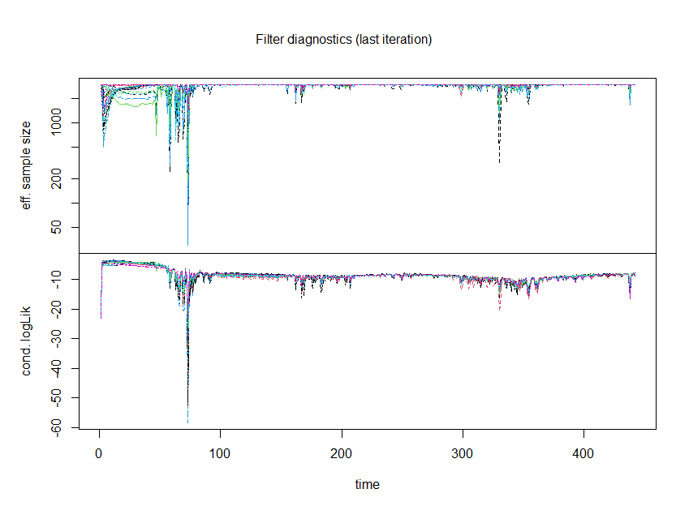
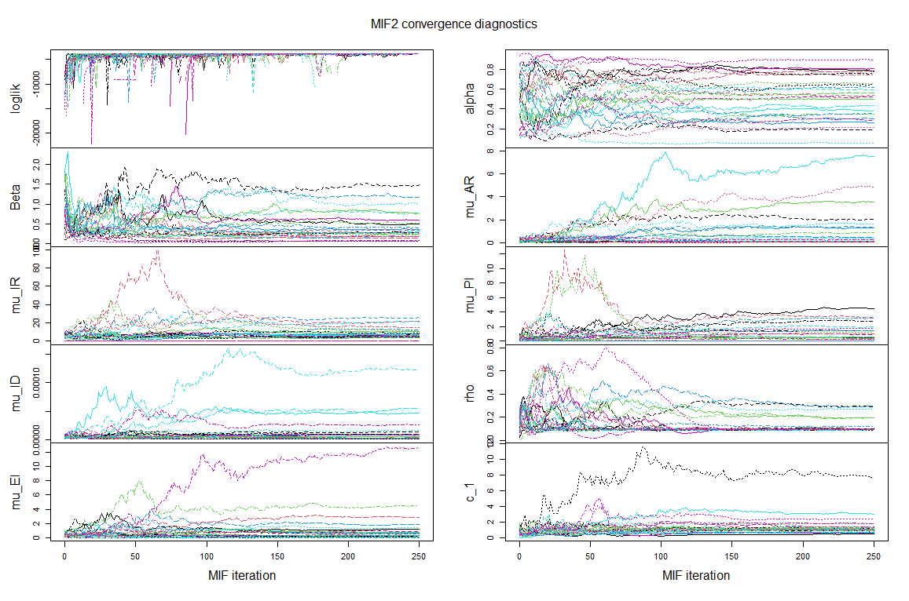
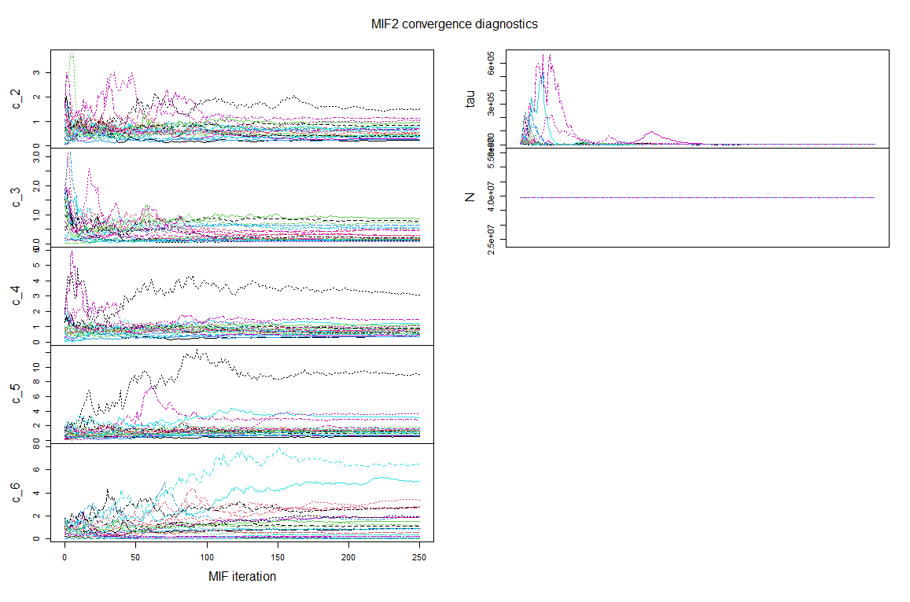

```{r, echo=FALSE, include=FALSE}
library(fpp2)
library(lubridate)
library(scales)
library(tidyr)
library(dplyr)
```


# Background 

## What is COVID-19
The Coronavirus disease 2019 (COVID-19) is an infectious disease caused by a newly discovered coronavirus--severe acute respiratory syndrome coronavirus 2 (SARS-CoV-2). Covid-19 was first identified in Wuhan, China, in December 2019 and continues to cause infectious cases around the world. Although most people who have COVID-19 have mild symptoms, COVID-19 can cause severe illness and even death. According to WHO, this disease has caused 140,322,903 confirmed cases of COVID-19, including 3,003,794 deaths as of 2:35pm CEST, 18 April 2021. Compared with the notorious outbreaks of Ebola or SARS, COVID-19 has relatively low mortality rate but faster spread rate via mildly symptomatic cases. In order to lower the risk for disease transmission, the public health and governmental officials have implemented social distancing requirements, masks requirements stay-at-home orders and travel restrictions to limit or prevent person-to-person interactions. The availability of vaccines further 'flatten the curve' and help people get back to normal life.

## COVID-19 in California
We choose California as our study area. There are two reasons that make this state an interesting study area. First, California ranked the second out of 51 states (including the District of Columbia) in percent living in urbanized areas and urban clusters, which could speed up the virus transmission due to high population density.  Second, California enacted stay-at-home orders early, relative to the spread of COVID-19 in the state. The COVID-19 growth rate in California is low compared to other states that implemented stay-at-hone orders at an early stage. Here are a brief summary of important stay-at-home restrictions:  

* March 19, 2020 (still in effect): an Executive Order and a Public Health Order directed all Californians to stay home except to go to an essential job or to shop for essential needs.  
* August 28, 2020 (still in effect): the State released the Blueprint for a Safer Economy to permit gradual reopening of certain businesses and activities.  
* December 3, 2020 - January 25, 2021: prohibited private gatherings of any size, closed sector operations except for critical infrastructure and retail, and required 100% masking and physical distancing. It is triggered after a region was announced to have less than 15% ICU availability.  
* November 21, 2020 - December 22, 2020: In counties in the Widespread tier, Californians stay home between 10:00pm and 5:00am, with some exceptions.   

Below is a plot of daily new confirmed cases and death cases from 01/22/2020 to 04/07/2021. This dataset comes from The United States Centers for Disease Control and Prevention, which is published on the website :https://data.cdc.gov/Case-Surveillance/United-States-COVID-19-Cases-and-Deaths-by-State-o/9mfq-cb36. It includes daily number of confirmed and probable case and deaths reported to CDC by states over time. During July-20 to Sep-20 and Dec-21 to Feb-21, there are spikes in the number of confirmed cases and death cases. 


```{r, echo=FALSE}
ca_covid <- read.csv("ca_daily_data.csv")
ca_covid$day <- as.Date(ca_covid$day)
ca_covid$new_case <- as.numeric(ca_covid$new_case)
ca_covid$new_death <- as.numeric(ca_covid$new_death)
start <- ca_covid$day[1]
ca_covid <- ca_covid[, c(-1)]
colnames(ca_covid) <- c("day", "cases", "deaths")
ca_covid_melt <- gather(ca_covid, "type", "count", -day)
ggplot(ca_covid_melt, aes(x=day, y=count)) + 
  geom_line(lwd=2) + facet_grid(type~., scales="free_y") +
  ylab("Number of Cases and Deaths") + xlab("") +  
  scale_x_date(breaks = "2 month", minor_breaks = "1 week", labels = date_format("%b-%y"),expand = c(0.01,0.01)) +
  scale_y_continuous(labels = scales::comma) +
  theme_classic() + ggtitle("California Covid Cases & Deaths")
```
 
## Analysis Aim

We will build both an ARIMA model and a POMP model for analysis of COVID cases in California. We choose ARIMA model since we assumed new cases at the current time point would depend on number of cases occured at previous points. Also we believe there exists combination effects of previous noises to the current error term. We think this data is appropriate to be analyzed by POMP model since the spread of a disease is a dynamic system which is appropriate to be analyzed by a stochastic model. We will start with an overview of the ARIMA model and end with an overview of the POMP model. Comparisions of the two models will be made using their likelihoods.

# Model
## Arima Model
### Exploratory Data Analysis

We will focus our ARIMA model analysis for new cases. We can see the data for daily new cases is non-stationary, with a small peak at around Aug 2020 and the largest peak at around Jan 2021.

```{r}
acf(ca_covid$cases, xlab="Lag(days)", main="ACF Plot CA COVID Cases")
```

We can see that acfs are outside the band and the value decreases as lag increases. Thus modeling differenced data may be preferable.

### Model Selection

The stationary ARIMA(p,0,q) model with parameter vector $\theta = (\phi_{1:p}, \psi_{1:q}, \mu, \sigma^2)$ is given by
$$\phi(B)(Y_n - \mu) = \psi(B)\epsilon_n$$
where
$$\mu = E[Y_n]$$
$$\phi(x) = 1 - \phi_1x - \cdots - \phi_px^p$$
$$\psi(x) = 1 + \psi_1x + \cdots + \psi_qx^q$$
$$\epsilon_n \sim iidN[0,\sigma^2]$$

We first  model the original data of new cases. We will choose the ARIMA model by AIC criterion. As there appears to be trend in the series we will model the differenced number of cases. 

```{r}
aic_table <- function(data,P,Q,D){
  table <- matrix(NA,(P+1),(Q+1))
  for(p in 0:P) {
    for(q in 0:Q) {
       table[p+1,q+1] <- arima(data,order=c(p,D,q))$aic
    }
  }
  dimnames(table) <- list(paste("AR",0:P, sep=""),paste("MA",0:Q,sep=""))
  table
}
aic_table_newcases <- aic_table(ca_covid$cases,4,5,1)
aic_table_newcases
```

We choose model ARIMA(4,1,3) since it has the smallest AIC value. 

```{r}
arima413 <- arima(ca_covid$cases,order=c(4,1,3))
arima413
```

### Model diagnostic

```{r}
t(confint(arima413))
```

All coefficients do not contain zero suggesting at the 95% confidence level they are significant. 

```{r, fig.align='center',out.width = '100%'}
library(forecast)
arma413 = Arima(ca_covid$cases,order = c(4,1,3))
autoplot(arma413, main = "Plotting the ARIMA(4,1,3) characteristic roots")
```

All inverse roots lie within the unit circle implying the model is both causal and invertible. However, we need to concern that one of the inverse AR roots and as few of inverse MA and AR roots are at the edge of the circle. This suggest a smaller model may be more appropriate. 

```{r}
par(mfrow=c(1,2))
acf(arima413$residuals, main = "ARIMA(4,1,3) Autocorelation Plot")
qqnorm(arima413$residuals, main = "ARIMA(4,1,3) Q Q Plot")
qqline(arima413$residuals)
```

We observe that the autocorrelation is high at lags 6 and 22. Since less than 95% of lags fall outside the band, we would not reject the null hypothesis that residuals are IID. Also the oscillatory component of residuals suggest some seasonality in data. As for the QQ-plot, the residuals do not appear to be normally distributed. A model that assumes a different distribution on the residuals may be more appropriate. 

### Spectrum analysis

Since there exists fluctuations in the original data for new cases, we next analyze if there exists seasonality in the data.

```{r}
spec = spectrum(ca_covid$cases,spans=c(3,5,3),main = "Smoothed periodogram")
spec$freq[which.max(spec$spec)]
```

We can see the dominant frequency is 0.006666667, which corresponds to a 150 days cycle. This result roughly corresponds to the period of fluctuations shown in the plot of the original data for new cases. However since we only have data of 442 days, we decide that the data size is not long enough to confirm the seasonality exists. Therefore, we choose ARIMA(4,1,3) model, modeled as $(1 - 0.1572B-0.3071B^2+0.7014B^3+0.2303B^4)(Y_n - Y_{n-1}) = (1-0.4948B-0.4926B^2+0.8347B^3)\epsilon_n$.

## POMP: SEAPIRD Model 

SEIR (Susceptible-Exposed-Infectious-Recovered) model is a relatively simple framework to model infectious diseases. In our work, we modify the SEIR model by adding A (Asymptomatic individuals), P(Presymptomatic individuals) and D (Deceased individuals) compartments as used in [3]. The SARS-COV-2 virus has a relatively long period between an individual's exposure and the presence of symptoms, usually estimated to be about 6 days with variations from 2 to 27 days. Both asymptomatic and presymptomatic refer to individuals that do not show any symptoms. The differences lie in asymptomatic individuals never develop any symptoms, and pre-symptomatic individuals have not yet developed symptoms but will develop symptoms later. Our SEAPIRD model can be described as follows: 

- $S_t$ - the number of susceptible people at time $t$ not infected. 
- $E_t$ - the number of people at time $t$, that have been exposed to the virus, but are not showing any symptoms. 
- $A_t$ - the number of people at time $t$ that have been exposed to the virus, may infect others, but will never present any symptoms.
- $P_t$ - the number of people at time $t$ have contracted the virus, are able to infect others, and have not yet, but will soon develop symptoms.
- $I_t$ - the number of infected people who show symptoms at time $t$. 
- $R_t$ - the number of recovered at time $t$. 
- $D_t$ - the number of deaths at time $t$.
- $N_t$ - the total number of people at time $t$. 

```{r, echo=F}
# install.packages("DiagrammeR")
library(DiagrammeR)
grViz("digraph {

graph [layout = dot, rankdir = LR]

# define the global styles of the nodes. We can override these in box if we wish
node [shape = rectangle, style = filled, fillcolor = lightblue, color = steelblue, fontcolor = gray35]
edge [color = gray, arrowhead = vee]

S [label = 'S']
E [label = 'E']
A [label = 'A']
P [label = 'P']
I [label = 'I']
R [label = 'R']
D [label = 'D']


# edge definitions with the node IDs
S -> E -> P -> I -> R
E -> A -> R
I -> D
}")
```

Together with the initial conditions $S_0 = N$, $E_0 = 0$, $A_0=0$, $P_0 = 0$, $I_0 = 250$, $R_0 = 0$, and $D_0 = 0$, the SEAPIRD model can be modeled according to the following 5 differential equations:

- $\frac{N_{SE}}{dt} = \frac{\beta I}{N} S_t$
- $\frac{N_{EA}}{dt} = \alpha * \lambda E_t$
- $\frac{N_{EP}}{dt} = (1 - \alpha) * \lambda E_t$
- $\frac{N_{PI}}{dt} = \mu_{PI}R_t$
- $\frac{N_{IR}}{dt} = \mu_{IR}R_t$
- $\frac{N_{ID}}{dt} = \mu_{ID}D_t$
- $\frac{N_{AR}}{dt} = \mu_{AR}R_t$

The model parameters can be described as follows:

- $\beta$ - The transmission rate.  
- $\alpha$ -: Presymptomatic case portion.
- $\mu_{EAP}$ - The rate of individual transfer from E to A or P. (noted we used $\mu_{EI}$ as $\mu_{EAP}$ in our following code)
- $\mu_{PI}$ -  The rate of individual transfer from P to I.
- $\mu_{AR}$ - The rate of individual transfer from A to R.
- $\mu_{IR}$ - The rate of individual transfer from I to R.
- $\mu_{ID}$ - The rate of individual transfer from I to D.

To have a plausible parameter guessing, we searched for some used values in recent studies. Past studies used the transmission rate $\beta$ from 0.08 to 3.77 and the presymptomatic case portion $\alpha$ from 14% to 20%. For $\mu_{EAP}$, it is usually calculated as the reciprocal of the latent period length (estimated to range from 2 to 14 days). For $\mu_{PI}$,it is usually calculated as the reciprocal of presymptomatic period length (estimated to be 2 days). For $\mu_{AR}$, it is usually calculated as the reciprocal of asymptomatic transmission length(estimated to be 12 days). For $\mu_{IR}$, it is usually calculated as the reciprocal of infectious period length (estimated to range from 10 to 20 days). For $\mu_{ID}$, it is usually calculated as fatality rate multiply by the reciprocal of infectious period length. 

We let $S$, $E$, $A$, $P$, $I$, $R$, $D$, and $H$ be our state variables. Where $H$ is the tally of the COVID-19 incidence over the week. We model the number of change in state variables in the unobserved state process as: 

$$
\begin{aligned}
\Delta_{N_{SE}} &= Binomial(S, 1-e^{-\beta \frac{I+A+P}{N}\Delta t}) \\
\Delta_{N_{EA}} &= \alpha * Binomial(E, 1-e^{-\mu_{EAP}\Delta t}) \\
\Delta_{N_{EP}} &= (1 - \alpha) * Binomial(E, 1-e^{-\mu_{EAP}\Delta t}) \\
\Delta_{N_{PI}} &= Binomial(P, 1-e^{-\mu_{PI}\Delta t}) \\
\Delta_{N_{IR}} &= Binomial(I, 1-e^{-\mu_{IR}\Delta t}) \\
\Delta_{N_{ID}} &= Binomial(I, 1-e^{-\mu_{ID}\Delta t}) \\
\Delta_{N_{AR}} &= Binomial(A, 1-e^{-\mu_{AR}\Delta t}) 
\end{aligned}
$$
, where $\Delta t = 1\text{day}$. For intuition probability $1-e^{\mu_x\Delta t}$, can be viewed as the CDF of an exponential random variable with rate $x\cdot \Delta t$.  

### Model Assumptions

We make the following four assumptions: 

 1. We assume lockdown measures across California from x-x and x-x scales the force of the invention coefficient from $\beta$ to the form $\beta*c_i~~ i \in [1,2]$. The scaling parameter, $c_i$, over the time frames x-x and x-x is estimated by the POMP model. 
 
 2. We assume the number of COVID-19 deaths are always reported. This assumption is based on the belief that people who had severe COVID-19 symptoms which led to death, will had reported to hospital for care. Therefore, there COVID-19 infection is always reported to authorities (e.g. Center for Disease Control). This assumption implies the number of deaths is always counted in the number of reported infections. Also,it appears from the data as the number of cases increases the variance of the cases also increases. We account for this by scaling the standard deviation. As the mean number of cases increases the variance will also increase. We use a normal approximation of the binomial distribution. The distribution of the reported cases is as as follows:
 
$$
\begin{aligned}
X_{weekly~reported~recovered~cases} \sim Normal(H_R , \tau\sqrt{H_r\rho (1-\rho)} )
\end{aligned}
$$

where $\rho$ represents the reporting rate for those who recovered from COVID-19,  $H_R$ is an accumulator variable representing the number of people who recovered from COVID-19 in a given day, and $\tau$ scales the standard deviation; This ensures as the mean number of cases increases the standard deviation increases at a faster rate. This was done to account for over-dispersion when previously modeling it using a binomial random variable. See the POMP functions rmeasure and dmeasure for more details.  

 3. We assume at time 0 the entire California population is susceptible to COVID infection, as COVID-19 vaccines were not introduced until the end of 2020, and and there were a total of 250 already infected people. We believe these are reasonable assumptions given the uncertainty of the disease in early 2020. 
 
 4. We account for COVID interventions in California using scaled, $\beta$, coefficients, $c_i~ i \in~[1,...,6]$. The coefficients $c_i$, represent interventions (or lack thereof), taken in California throughout our modeling timeframe. Interventions include various levels of stay at home orders, the relaxing of stay at home orders, and the introduction of COVID vaccines. 


### POMP Model Code

The POMP model's defined in R code below:

```{r, include=F}
library(pomp)
```

```{r, echo=T, eval=T}
# create COVID intervention vector
# the purpose of the intervention vector is to scale beta as differient intervention measures
# are taken throughout California.

intervention_indicator <- rep(0, nrow(ca_covid))
for(i in 1:length(ca_covid$day)){
    if(i < 100){
        intervention_indicator[i] = 1
    }
    else if(i >= 100 & i < 200){
        intervention_indicator[i] = 2
    }
    else if(i >= 200 & i < 250){
    intervention_indicator[i] = 3
    }
    else if(i >= 250 & i < 300){
        intervention_indicator[i] = 4
    } 
    else if(i >= 300 & i < 400){
      intervention_indicator[i] = 5
    }
  else{
    intervention_indicator[i] = 6
  }
}


ca_covid$dummyWeek <- 1:nrow(ca_covid)
ca_covid_pomp <- subset(ca_covid, select=c("dummyWeek", "cases", "deaths"))
colnames(ca_covid_pomp) <- c("day", "cases", "deaths")

# Covariate table
covid_covar <- covariate_table(
    day=ca_covid_pomp$day,
    intervention = intervention_indicator, 
    # should we also do a weather indicator
    times="day"
)

seapird_step <- Csnippet("
    double beta_intervention;
    
    if (intervention == 1){
        beta_intervention = Beta*c_1;
    }
    else if (intervention == 2){
        beta_intervention = Beta*c_2;
    }
    else if (intervention == 3){
       beta_intervention = Beta*c_3;
    }
    else if (intervention == 4){
       beta_intervention = Beta*c_4;
    }
    else if (intervention == 5){
       beta_intervention = Beta*c_5;
       
    }
    else if (intervention == 6){
       beta_intervention = Beta*c_6;
    }
    else beta_intervention = Beta;
    
  double dN_SE = rbinom(S,1-exp(-beta_intervention*(I+P+A)/N*dt));
  double dN_EI = rbinom(E,1-exp(-mu_EI*dt));
  double dN_PI = rbinom(P,1-exp(-mu_PI*dt));
  double dN_IR = rbinom(I,1-exp(-mu_IR*dt));
  double dN_ID = rbinom(I - dN_IR,1-exp(-mu_ID*dt));
  double dN_AR = rbinom(A,1-exp(-mu_AR*dt));
  
  S -= dN_SE;
  E += dN_SE - dN_EI;
  P += nearbyint((1 - alpha) * dN_EI) - dN_PI;
  A += nearbyint(alpha * dN_EI) - dN_AR;
  I += dN_PI - dN_IR - dN_ID;
  R += dN_IR + dN_AR;
  D += dN_ID;
  H += dN_IR + dN_AR;
")


seapird_init <- Csnippet("
  S = N;
  E = 0;
  P = 0;
  A = 0;
  I = 250;
  R = 0;
  D = 0;
  H = 0;
")

# We assume all COVID deaths are reported

rmeas <- Csnippet("
    double mean_cases = rho*H;
    double sd_cases = sqrt(tau*rho*H*(1-rho)) ;
    cases =  rnorm(mean_cases,sd_cases) + D;
    deaths = D;
    if (cases > 0.0) {
        cases = nearbyint(cases);
      } else {
    cases = 0.0;
    
    if(sd_cases == 0){
    cases = 0.0;
    }
}
")

dmeas <- Csnippet("
  double tol = 1.0e-10;
  double mean_cases = rho*H;
  double sd_cases = sqrt(tau*rho*H*(1-rho));
  
  if(sd_cases == 0){
    lik = tol;
  }
  else{
    lik = dnorm(cases-deaths, mean_cases, sd_cases, 0);
  }
  
  if (give_log) lik = log(lik);
  ")


covidSEAPIRD <- pomp(
    data = ca_covid_pomp, 
    times = "day",
    t0 = 1,
    rprocess=euler(seapird_step, delta.t=1/12),
    rinit=seapird_init,
    rmeasure=rmeas,
    dmeasure=dmeas,
    accumvars="H",
    partrans=parameter_trans(
        log=c("Beta","c_1", "c_2", "c_3", "c_4", "c_5", "c_6", "mu_AR",
              "mu_IR", "mu_ID", "mu_PI", "mu_EI", "tau"),
        logit=c("rho", "alpha")
    ),
    covar=covid_covar,
    obsnames = c("cases", "deaths"),
    paramnames=c("N","Beta","mu_IR", "mu_ID", "mu_EI", "alpha",
                 "mu_AR", "mu_PI", "c_1", "c_2", "c_3","c_4", "c_5","c_6", "rho",
                 "tau"),
    statenames=c("S","E","P", "A", "I","R","D","H"),
    cdir=".", cfile="covidSEAPIRD"
)
```

The simulated results from our intial parameter guess is below. 

```{r, echo=T, eval=T}

# N=39512223 :https://www.census.gov/quickfacts/fact/table/CA/PST045219
# parameter guess
parameters_guess = c(Beta=.135,mu_IR=0.25,mu_ID = 0.000002,mu_EI=0.36,alpha=0.65,
                     mu_AR=0.1,mu_PI=0.2,c_1=1.12,c_2=1.2,c_3=.7,c_4=1.1, c_5=1.82 ,c_6 = 1,
                     rho=.10,N=39512223, tau=2000)
covidSEAPIRD %>%
  simulate(
    params=parameters_guess,
    nsim=5,format="data.frame",include.data=TRUE
  ) -> sims

sims %>%
  ggplot(aes(x=day,y=cases,group=.id,color=.id=="data"))+
  geom_line(alpha = ifelse(sims$.id == 'data', 1, .3), lwd = 1)+
  guides(color=FALSE) + theme_bw()
```

The POMP maximum likelihood local search optimization code is defined below:

```{r, include=F}
library(foreach)
library(doParallel)
```

```{r, echo=T, eval=T}
registerDoParallel(cores=detectCores()-2)

# set the random walk parameters
covid_cooling.fraction.50 <- 0.5
covid_rw.sd <- rw.sd(
    Beta=0.01,
    mu_IR=0.01,
    mu_ID=0.01,
    mu_EI=0.01,
    alpha=0.01,
    mu_AR=0.01,
    mu_PI=0.01,
    c_1=0.01,
    c_2=0.01,
    c_3=0.01,
    c_4=0.01,
    c_5=0.01,
    c_6=0.01,
    rho=0.01,
    tau=0.01
)

bake(file="lik_local.rds",{
  foreach(i=1:8,.combine=c) %dopar% {
    library(pomp)
    library(tidyverse)
    mif2(covidSEAPIRD,
         params = parameters_guess,
         Np=1000,
         Nmif=200,
         cooling.fraction.50=covid_cooling.fraction.50,
         rw.sd=covid_rw.sd)	
  } -> mifs_local 
  mifs_local
}) -> mifs_local

coefs_local <- coef(mifs_local)
max_coefs_local <- coefs_local[,which.max(logLik(mifs_local))]

bake(file="local_results.rds",{
  foreach(mf=mifs_local, .combine=rbind) %dopar% {
    library(pomp)
    library(tidyverse)
    evals <- replicate(5,logLik(pfilter(mf,Np=3000)))
    ll <- logmeanexp(evals,se=TRUE)
    mf %>% coef() %>% bind_rows() %>%
      bind_cols(loglik=ll[1],loglik.se=ll[2])
  } -> local_results
  
  local_results
}) -> local_results
```

The paris plot results from the local search is below:
```{r, echo=F}
mifs_local %>%
  traces() %>%
  melt() %>%
  ggplot(aes(x=iteration,y=value,group=L1,color=factor(L1)))+
  geom_line()+
  guides(color=FALSE)+
  facet_wrap(~variable,scales="free_y")
```


The best local search had the following coefficients, log likelihood and simulated results:

```{r, echo=T, eval=T}
read.csv("local_results_greaklakes.csv") %>%
bind_rows(read.csv("local_results_greatlakes2.csv")) %>%
bind_rows(local_results) %>%
  filter(is.finite(loglik)) %>%
  filter(loglik.se < .5) %>%
  arrange(-loglik) -> best_local_searches
head(best_local_searches,5)
```

```{r, echo=T}
covidSEAPIRD %>%
  simulate(
    params=unlist(best_local_searches[1,]),
    nsim=5,format="data.frame",include.data=TRUE
  ) -> sims

sims %>%
  ggplot(aes(x=day,y=cases,group=.id,color=.id=="data"))+
  geom_line(alpha = ifelse(sims$.id == 'data', 1, .3), lwd = 1)+
  guides(color=FALSE) + theme_bw()
```

Compared to the initial parameter guess, the best local search appears to simulate the data quite well. The best local search has a likelihood of -3810 with a standard deviation of 0.368. The pairs plot for the local search for selected parameters is as follows:

```{r, echo=T, eval=T}
read.csv("local_results_greaklakes.csv") %>%
bind_rows(read.csv("local_results_greatlakes2.csv")) %>%
bind_rows(local_results) %>%
  filter(is.finite(loglik)) %>%
  filter(loglik.se < .5) %>%
  filter(loglik>max(loglik)-20) -> temp
pairs(~loglik+Beta+rho+mu_IR+mu_ID+mu_EI+alpha,data=temp,pch=16, col="red")
```

Next, we move on to the global search. The likelihood code for the global search is below. 

```{r, echo=T, eval=T}
covid_box <- rbind(
  Beta=c(0.0,2),
  mu_IR=c(0.01,10),
  mu_ID=c(0.00000001,.00001),
  mu_EI=c(0.01,1),
  alpha=c(0.1,1),
  mu_AR=c(0.01,.5),
  mu_PI=c(0.01,1),
  rho=c(0,2),
  c_1=c(0,2),
  c_2=c(0,2),
  c_3=c(0,2),
  c_4=c(0,2),
  c_5=c(0,2),
  c_6=c(0,2),
  tau=c(500,4000)
)

bake(file="mifs_global.rds",{
    foreach(i=1:8,.combine=c) %dopar% {
        library(pomp)
        library(tidyverse)
        mif2(covidSEAPIRD,
             params = c(apply(covid_box,1,function(x)runif(1,x[1],x[2]))),
             Np=2500,
             Nmif=250,
             cooling.fraction.50=covid_cooling.fraction.50,
             rw.sd=covid_rw.sd)	
    } -> mifs_global 
    mifs_global
}) -> mifs_global

bake(file="global_search.rds",{
    foreach(mf=mifs_global, .combine=rbind) %dopar% {
        library(pomp)
        library(tidyverse)
        evals <- replicate(10,logLik(pfilter(mf,Np=50000)))
        ll <- logmeanexp(evals,se=TRUE)
        mf %>% coef() %>% bind_rows() %>%
            bind_cols(loglik=ll[1],loglik.se=ll[2])
    } -> global_results
    
    global_results
}) -> global_results
```

The best global search had the following coefficients and log likelihood and simulated results:

```{r}
bind_rows(global_results) %>%
  filter(is.finite(loglik)) %>%
  filter(loglik.se < .5 ) %>%
  arrange(-loglik) -> best_global_results
head(as.data.frame(best_global_results),5)

```

```{r, echo=T, eval=T}
covidSEAPIRD %>%
  simulate(
    params=unlist(best_global_results[1,]),
    nsim=5,format="data.frame",include.data=TRUE
  ) -> sims

sims %>%
  ggplot(aes(x=day,y=cases,group=.id,color=.id=="data"))+
  geom_line(alpha = ifelse(sims$.id == 'data', 1, .3), lwd = 1)+
  guides(color=FALSE) + theme_bw()
```

The best global search has a likelihood of -3791 and a standard deviation of 0.00773. This is signifcantly better than the likelihood from the local search. The pairs plot for the global search is below. 

```{r, echo=T}
bind_rows(global_results) %>% 
bind_rows(local_results) %>%
  filter(is.finite(loglik)) %>%
  filter(loglik.se < .5) %>%
  filter(loglik>max(loglik)-30) -> temp
pairs(~loglik+Beta+rho+mu_IR+mu_ID+mu_EI+alpha,data=temp,pch=16, col="red")
```


### SEAPIRD Fit Analysis

The diagnostic plots of the SEAPIRD model are as follows: 






From the diagnostic plots it appears the POMP model has converged. 

## Comparision between ARIMA and POMP Models

The arima model had a log likelihood of -4091 using 7 parameters. The POMP model had a likelihood of -3792. It appears modeling the data by incorporating additional features (e.g. intervention features) improves  the fit. 

# Conclusion

We have investigated the use of ARIMA and POMP to model COVID cases in CA. We found the POMP model to performed better than the ARIMA model as indicated by the log likelihoods estimates. This implies the additional parameters in the POMP model improved it's performance. It also highlights the POMP model ability to model complicated data. In the future work, the impact from vaccines should also be included since there has been 20.2% people has been partially vaccinated and 32.2% people has been fully vaccinated in California (as of 04/19/2021). Besides, the age differences are worth investigating because the symptom development can be different across different ages. By adding age differences into the POMP model, it might further improve the results.  


# Group Roles

Description of individual contributions removed for anonymity

# References

[1] Byambasuren, O., Cardona, M., Bell, K., Clark, J., McLaws, M. L., & Glasziou, P. (2020). Estimating the extent of asymptomatic COVID-19 and its potential for community transmission: systematic review and meta-analysis. Official Journal of the Association of Medical Microbiology and Infectious Disease Canada, 5(4), 223-234.

[2] Friedson, A. I., McNichols, D., Sabia, J. J., & Dave, D. (2021). Shelter‐in‐place orders and public health: evidence from California during the COVID‐19 pandemic. Journal of Policy Analysis and Management, 40(1), 258-283.

[3] Radulescu, A., Williams, C., & Cavanagh, K. (2020). Management strategies in a SEIR model of COVID 19 community spread. arXiv preprint arXiv:2003.11150.

[4] Sun, P., Lu, X., Xu, C., Sun, W., & Pan, B. (2020). Understanding of COVID‐19 based on current evidence. Journal of medical virology, 92(6), 548-551.

[5] Wang, H., Wang, Z., Dong, Y., Chang, R., Xu, C., Yu, X., ... & Cai, Y. (2020). Phase-adjusted estimation of the number of coronavirus disease 2019 cases in Wuhan, China. Cell discovery, 6(1), 1-8.

[6] [Disease Spread Modeling With The “SEIRD” Model](https://bit.ly/3fVvkP5).

[7] [Coronavirus disease (COVID-19): How is it transmitted?](https://www.who.int/news-room/q-a-detail/coronavirus-disease-covid-19-how-is-it-transmitted)

[8] [About COVID-19](https://www.cdc.gov/coronavirus/2019-ncov/cdcresponse/about-COVID-19.html). 

[9] [Overview of vaccine administration in California](https://covid19.ca.gov/vaccination-progress-data/). Accessed on April 19, 2021.

[10] [WHO Coronavirus (COVID-19) Dashboard](https://covid19.who.int/). Accessed on April 18, 2021.

[11] [Risk for COVID-19 Infection, Hospitalization, and Death By Age Group](https://www.cdc.gov/coronavirus/2019-ncov/covid-data/investigations-discovery/hospitalization-death-by-age.html)

[12] [Analysis of Time Series lecture notes](https://ionides.github.io/531w21/)(Ionides, Edward).


