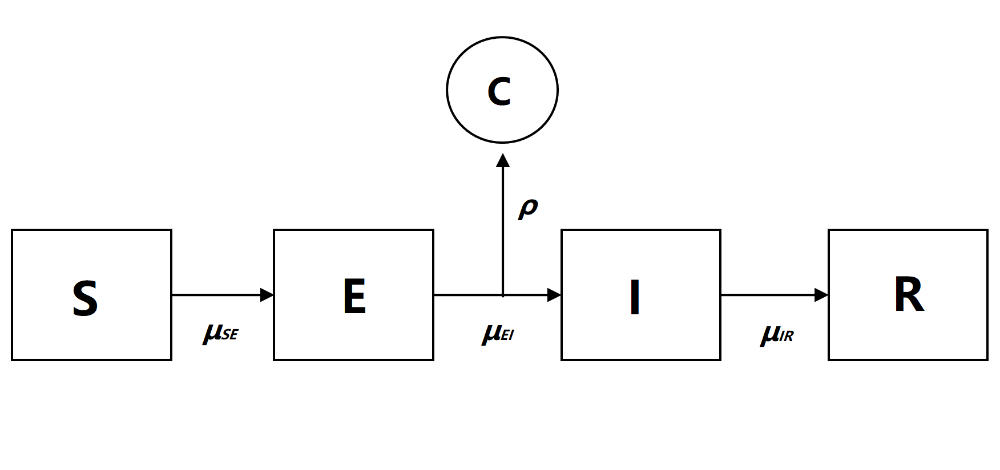

```{r setup, include=FALSE}
knitr::opts_chunk$set(
  echo = FALSE,
  warning = FALSE,
	message = FALSE,
	include = TRUE,
  comment = '',
  fig.align = "center"
)
library(tidyverse)
plot_simulation = function(sim_dat) {
  sim_dat %>%
    ggplot() +
    theme_bw() +
    geom_line(aes(Time, Cases, group = .id, 
                  color = (.id == "data"), alpha = (.id == "data"), 
                  linetype = (.id == "data"))) +
    scale_color_manual(values = c("#18bc9c", "#c61919")) +
    scale_alpha_manual(values = c(0.5, 1)) +
    scale_linetype_manual(values = c(5, 1)) +
    guides(color = FALSE, linetype = FALSE, alpha = FALSE)
} # plot_simulation()
# rm(list = ls()); rmarkdown::render("main.Rmd")
```

```{css, include = TRUE, echo = FALSE}
pre { /* Scrollable code block */
  max-height: 230px;
  overflow-y: auto;
}
span.math{ /* Formulas */
  font-size: 14px;
}
table{
  margin-left: auto; /* center the tables */
  margin-right: auto; /* center the tables */
  margin-bottom: 10px; /* add vertical space after table */
}
tr td {
  min-width: 70px;
  height: 35px;
}
tr:nth-child(odd) td {
  background-color: #f9f9f9; /* create the striped effect */
}
.center {
  display: block;
  margin-left: auto;
  margin-right: auto;
}
```


---

## Introduction

Since late 2019, the pandemic caused by the novel coronavirus COVID-19 has taken over the world and become the main focus for any concerned citizen. COVID-19 is extremely infectious, thought to spread from person to person mainly through close contact between individuals. This virus is commonly transmitted through droplets, which humans produce whenever they cough, sneeze, or exhale. Most infected patients have mild symptoms while some suffer from severe illness and even death. According to the statistics from JHU [[1]](https://gisanddata.maps.arcgis.com/apps/opsdashboard/index.html#/bda7594740fd40299423467b48e9ecf6), by far, the global cumulative cases are 141,819,360, including 3,027,353 death and 81,118,986 recovery. 

The objective of this project is to conduct an analysis of Washtenaw County, Michigan reported COVID-19 cases with a Susceptible-Exposed-Infection-Recovered (SEIR) compartment model. Through model simulation and analysis, we want to gain understanding and stem the spread of COVID-19. We also set up a baseline ARMA model, using log-likelihood as the selection criterion, to see if our SEIR model can explain additional features of the data that the ARMA model is unable to capture.

---

## Data

The data consist of confirmed COVID-19 cases by county and by date in the State of Michigan from March 2020 to April 2021, and were collected by the Michigan Disease Surveillance System (MDSS)[[2]](https://www.michigan.gov/coronavirus/0,9753,7-406-98163_98173---,00.html). We focus specifically on Washtenaw County cases.

---

## Exploratory Data Analysis


```{r}
cases = read.csv("cases_deaths_by_county_date.csv",
                 colClasses = list(Date = "Date")) %>%
  filter(!is.na(Date), CASE_STATUS == "Confirmed") %>%
  select(-Updated, -CASE_STATUS, -ends_with("Cumulative"))
```

```{r, fig.height = 4.5, fig.width = 8}
cases %>% 
  mutate(Cases_Washtenaw = ifelse(COUNTY == "Washtenaw", Cases, 0)) %>% 
  group_by(Date) %>%
  summarise(Cases_Michigan = sum(Cases), Cases_Washtenaw = sum(Cases_Washtenaw),
            .groups = "drop") %>%
  pivot_longer(-Date, names_to = "County", names_pattern = "Cases_(.*)", values_to = "Cases") %>%
  ggplot() +
    facet_wrap(~County, nrow = 2, scales = "free_y") +
    theme_bw() +
    geom_line(aes(Date, Cases, color = County), size = .6) +
    scale_color_manual(
      name = "Cases by Date", values = c("#69b3a2", "#a55b6c")
    ) +
    scale_x_date(date_labels = "%m-%Y") +
    guides(color = FALSE)
```


Above, we see a plot of the daily COVID-19 cases throughout Michigan, as well as the plot of Washtenaw County cases. We see that while the Washtenaw plot has more variation over small time periods, the overall shape is similar between the two.

The time series of our data is rather complex, with multiple peaks in 2020 and a large number of daily cases throughout late 2020 and early 2021. These peaks are caused by a variety of societal[[3]](https://www.cdc.gov/coronavirus/2019-ncov/prevent-getting-sick/social-distancing.html), political[[4]](https://www.michigan.gov/coronavirus/0,9753,7-406-98158---Y,00.html), and behavioral[[5]](https://www.hopkinsmedicine.org/health/conditions-and-diseases/coronavirus/first-and-second-waves-of-coronavirus) factors that are too complex to model individually, but it is clear that the rate at which Coronavirus spread throughout Washtenaw County was extremely variable in 2020.

By late 2020, significant progress had been made in developing a vaccine for COVID-19, and by early 2021, vaccine distribution had begun in Michigan[[6]](https://www.uofmhealth.org/coronavirus/covid19-vaccine-phases-progress). While this is a great step forward in combating and eventually defeating COVID-19, it causes additional complications to the model, complications which we will not be studying. To fit the data into our SEIR model framework, we drop the 2021 data that could be affected by vaccinations, and focus on the 2020 case reports. This leaves us with 306 data points.

---

```{r, echo = FALSE}
NCORES = 1L
CACHE_DIR = "pomp_cache/"
run_level = 2
NP = switch(run_level, 50, 1e3, 3e3) # number of particles
NMIF_S = switch(run_level, 5, 50, 100) # number of filtering iterations - small
NMIF_L = switch(run_level, 10, 100, 200) # - large
NREPS_EVAL = switch(run_level, 5, 20, 40) # number of replications in likelihood evaluation
NREPS_LOCAL = switch(run_level, 10, 20, 30) # number of replications in local search
NSTART = switch(run_level, 50, 500, 800) # number of starting points in the global search
NSIM = switch(run_level, 50, 100, 500) # number of simulations

PARAMS_FILE = "pomp_cache/writeup_params.csv"

suppressPackageStartupMessages({
  library(foreach)
  library(doParallel)
  library(doRNG)
  library(tidyverse)
  library(pomp)
})
cl = makeCluster(NCORES)
registerDoParallel(cl)
registerDoRNG(625904618)
```

## SEIR Model

### Model specification

We choose to use an SEIR model to simulate the COVID-19 epidemic as it is recognized that COVID-19 has a incubation period. Compared to the SIR model, the SEIR model adds a stage "E" which means infected individuals must pass a period of latency before becoming infectious. In practice, SEIR model is more adaptable than SIR model.




We suppose that each arrow in figure has an associated rate. The four stages represent: S:susceptible population; E: incubation population; I: infectious population; R: recovered and removed population. $\beta$ is the contact rate and $\mu_{SI}=\beta I(t)$ denotes the rate at which individuals in S transition to E, $\mu_{EI}$ is the rate at which individuals in E transition to I and $\mu_{IR}$ denotes the transition rate from I to R. The probability of a case being reported is $\rho$.

Then the number of people in each compartment can be computed by
\[
\begin{split}
S(t)&=S(0)-N_{SE}(t)\\
E(t)&=E(0)+N_{SE}(t)-N_{EI}(t)\\
I(t)&=I(0)+N_{EI}(t)-N_{IR}(t)\\
R(t)&=R(0)+N_{IR}(t)
\end{split}
\]

where
\[
\begin{split}
\Delta N_{SE}&\sim \mathrm{Binomial}(S,1-e^{\beta\frac{1}{N}\Delta t})\\
\Delta N_{EI}&\sim \mathrm{Binomial}(E,1-e^{-\mu_{EI}\Delta t})\\
\Delta N_{IR}&\sim \mathrm{Binomial}(I,1-e^{^{-\mu_{IR}\Delta t}})
\end{split}
\]

As for the measurement model, we use a discretized normal distribution truncated at 0: 

$$\mathrm{Cases}=\max\{\mathrm{round}(C_n),0\},\ \ \ C_n\sim \mathrm{N}(\rho H_n,(\tau H_n)^2+\rho H_n)$$

where $H$ tracks the number of individuals transferred from I to R. 

```{r}
cases = read.csv("cases_deaths_by_county_date.csv",
                 colClasses = list(Date = "Date")) %>%
  # select records of confirmed cases in Washtenaw County
  filter(!is.na(Date), CASE_STATUS == "Confirmed", COUNTY == "Washtenaw") %>%
  select(-Updated, -CASE_STATUS, -COUNTY, -ends_with("Cumulative")) %>%
  # select records in 2020 only
  filter(Date < as.Date("2021-01-01")) %>%
  # transform `Date` to numeric form
  mutate(Time = 1:n())
covid_t0 = min(cases$Time)
```

### Model assumption

To account for demography, for simplicity, we set birth rate, death rate and movement of population as 0, and consider the total population $N=S+E+I+R$ as fixed. Besides, there are several outbreak in our data, and traditional SEIR model can only explain situations with one peak, just like the figure shown below. 

```{r, fig.width = 5, fig.height = 3}
load(file = "pomp_cache/writeup_constant_beta_simulation.rds")
dat_simulated %>% plot_simulation()
```

Therefore, we let $\beta$ vary from time to time, and set a step function, just like we mentioned in EDA that the contact rate changes with the development of epidemic. 

\[
  \beta = \begin{cases}
    b_1, & \text{01/03 - 23/03/2020}.\\
    b_2, & \text{24/03 - 08/06/2020}. \\
    b_3, & \text{09/06 - 28/06/2020}. \\
    b_4, & \text{29/06 - 11/09/2020}. \\
    b_5, & \text{12/09 - 31/12/2020}.
  \end{cases}
\]

Moreover, we can see there is a small breakout in the early time, and then slow down. The report of first case in Washternaw County [[7]](https://www.washtenaw.org/DocumentCenter/View/15635/Washtenaw-County-Health-Department-Reports-First-COVID-19-Cases) mentioned that the patient had traveled to other areas. Thus we suppose that the first peak in our data is caused by external population, and set intial value $E=100$ and $I=200$. 

```{r, echo = TRUE}
seir_step = Csnippet("
  double Beta;
  if(intervention == 1) Beta = b1;
  else if(intervention == 2) Beta = b2;
  else if(intervention == 3) Beta = b3;
  else if(intervention == 4) Beta = b4;
  else Beta = b5;
  
  double dN_SE = rbinom(S, 1 - exp(-Beta * I / N * dt));
  double dN_EI = rbinom(E, 1 - exp(-mu_EI * dt));
  double dN_IR = rbinom(I, 1 - exp(-mu_IR * dt));
  S -= dN_SE;
  E += dN_SE - dN_EI;
  I += dN_EI - dN_IR;
  H += dN_IR;
")

seir_rinit = Csnippet("
  S = nearbyint(eta * N);
  E = 100;
  I = 200;
  H = 0;
")

dmeas <- Csnippet("
  double tol=1.0e-25;
  double mean =rho*H;
  double sd =sqrt(pow(tau*H,2)+rho*H);
  if(Cases>0.0){
    lik=pnorm(Cases+0.5,mean,sd,1,0)-pnorm(Cases-0.5,mean,sd,1,0)+tol;
  } else {
    lik=pnorm(Cases+0.5,mean,sd,1,0)+tol;
  }
  if(give_log) lik=log(lik);
")

rmeas <- Csnippet("
  Cases = rnorm(rho*H, sqrt(pow(tau*H,2)+rho*H));
  if(Cases>0.0){
    Cases=nearbyint(Cases);
  } else {
    Cases=0.0;
  }
")

seir_covar <- covariate_table(
  t = cases$Time,
  intervention = c(rep(1, 23),
                   rep(2, 77),
                   rep(3, 20),
                   rep(4, 75),
                   rep(5, 111)),
  times = "t")

covidSEIR = cases %>% select(Time, Cases) %>%
  pomp(
    times = "Time", t0 = covid_t0,
    rprocess = euler(seir_step, delta.t = 1), # delta.t set to 1 day
    rinit = seir_rinit,
    rmeasure = rmeas,
    dmeasure = dmeas,
    accumvars = "H",
    partrans=parameter_trans(
      log = c("mu_EI", "mu_IR", "tau", "b1", "b2", "b3", "b4", "b5"),
      logit = c("rho", "eta")
    ),
    statenames = c("S", "E", "I", "H"),
    paramnames = c("b1", "b2", "b3", "b4", "b5", "mu_EI", "mu_IR", 
                   "eta", "rho", "N", "tau"),
    covar = seir_covar
  )
```

### Choosing starting points

As of the 2019 census[[8]](https://fred.stlouisfed.org/series/MIWASH1POP), the resident population in Washtenaw County was 367,601. We will use this value as an approximation for the population in March 2020. In the following analysis, we will fix the population $N$ to 367,601.  

According to the Centers for Disease Control and Prevention (CDC), the incubation period (the time from exposure to development of symptoms) of coronaviruses ranges from 2–14 days. [[9]](https://www.cdc.gov/coronavirus/2019-ncov/hcp/faq.html#Transmission)
So we expect $\mu_{EI}$ to fall into the range of $\frac{1}{2\text{ wk} = 14\text{ da}} = 0.071\text{ da}^{-1}$ to $\frac{1}{2\text{ day}} = 0.5\text{ da}^{-1}$.
It can take at least two weeks for people to recover from COVID-19 infection, but research suggests that most adults with mild to moderate COVID-19 are no longer able to infect others 10 days after coronavirus symptoms first appeared. [[10]](https://www.cdc.gov/coronavirus/2019-ncov/hcp/duration-isolation.html#assessment) So we can expect $\mu_{IR}$ to be around $0.1\text{ da}^{-1}$. We will set both $\mu_{EI}$ and $\mu_{IR}$ to 0.1 and fix them during the local and global search. 

Based on the above information, we conduct several simulation with different parameters and the following set of parameters seem to be a good starting points of the local search: 

\[
\begin{cases}
b_1 = 3,\ b_2 = 0.5,\ b_3= 4,\ b_4 = 1.5,\ b_5 = 3.2 \\
\mu_{EI} = 0.1 \text{  (fixed)}\\
\mu_{IR} = 0.1 \text{  (fixed)}\\
\rho = 0.5 \\
\eta = 0.09 \\
\tau = 0.001 \\
N = 367,601 \text{  (fixed)}
\end{cases}
\]

```{r, echo = TRUE}
pop_washtenaw = 367601
params = c(b1 = 3, b2 = 0.5, b3 = 4, b4 = 1.5, b5 = 3.2, 
            mu_EI = 0.1, mu_IR = 0.1, rho = 0.5, eta = 0.09, 
            tau = 0.001, N = pop_washtenaw)
fixed_params = params[c("N", "mu_EI", "mu_IR")]
params_rw.sd = rw.sd(b1 = 0.02, b2 = 0.02, b3 = 0.02, b4 = 0.02, b5 = 0.02, 
                     rho = 0.02, tau = 0.0001, eta = ivp(0.02))
```

The likelihood estimate of the initial guess is -1,351.26 with a Monte Carlo standard error of 25.50. 

```{r, echo = TRUE}
registerDoRNG(1235252)
bake(file = "pomp_cache/writeup_lik_starting_values.rds", {
  foreach(i=1:10, .combine = c) %dopar% {
    library(pomp)
    covidSEIR %>% pfilter(params=params,  Np=500)
  }
}) -> pf
pf %>% logLik() %>% logmeanexp(se = TRUE)
```

The simulations based on the starting values are able to capture general trend of the data, but still depart from the data at the major outbreak. Next, we will use iterative filtering to search for the maximum likelihood estimates (MLE). 

```{r, echo = FALSE, fig.width = 6, fig.height = 3}
plot_simulation = function(sim_dat) {
  sim_dat %>%
    ggplot() +
    theme_bw() +
    geom_line(aes(Time, Cases, group = .id, 
                  color = (.id == "data"), alpha = (.id == "data"), 
                  linetype = (.id == "data"))) +
    scale_color_manual(values = c("#18bc9c", "#c61919")) +
    scale_alpha_manual(values = c(0.5, 1)) +
    scale_linetype_manual(values = c(5, 1)) +
    guides(color = FALSE, linetype = FALSE, alpha = FALSE)
} # plot_simulation()

set.seed(132628339)
covidSEIR %>%
  simulate(params = params, nsim = 20, format = "data.frame", include.data = TRUE) %>% 
  plot_simulation()
```

### Local Search

We first run a local search that starts from our initial guess using iterated filtering with 50 iterations. From the trace plot we can see that the likelihood is increasing for some of the runs, while others are stuck in the local maxima and have trouble climbing up the likelihood surface. The reporting rate $\rho$ presents a downward trend in most runs, and the contact rate parameters $b_1$ and $b_5$ are increasing in some of the runs. It is unclear at this point where the other parameters are moving toward. 

```{r, fig.height = 5, fig.width = 8, echo = TRUE}
run_id = 1
registerDoRNG(482947940)
bake(file = "pomp_cache/writeup_local_search.rds", {
  foreach(i = 1:NREPS_LOCAL, .combine = c) %dopar% {
    suppressPackageStartupMessages({
      library(tidyverse)
      library(pomp)
    })
    covidSEIR %>%
      mif2(
        params = params,
        Np = NP, Nmif = NMIF_S,
        cooling.fraction.50 = 0.5,
        rw.sd = params_rw.sd
      )
  } -> mifs_local
  attr(mifs_local,"ncpu") <- getDoParWorkers()
  mifs_local
}) -> mifs_local

mifs_local %>%
  traces() %>%
  melt() %>%
  ggplot(aes(x = iteration, y = value, group = L1, color = factor(L1))) +
  theme_bw() +
  geom_line() +
  guides(color = FALSE) +
  facet_wrap(~variable, scales = "free_y")
```


```{r, echo = TRUE}
# likelihood est. for local search results
registerDoRNG(900242057)
bake(file = "pomp_cache/writeup_lik_local.rds", {
  foreach(mf = mifs_local, .combine = rbind) %dopar% {
    suppressPackageStartupMessages({
      library(tidyverse)
      library(pomp)
    })
    ll = replicate(NREPS_EVAL, logLik(pfilter(mf, Np = NP))) %>% 
         logmeanexp(se = TRUE)
    coef(mf) %>% bind_rows() %>% bind_cols(loglik = ll[1], loglik.se = ll[2])
  } -> results
  attr(results,"ncpu") <- getDoParWorkers()
  results
}) -> results
```

```{r, eval = FALSE}
results %>% arrange(-loglik) %>% head %>% 
  knitr::kable(digits = 3, caption = "Local search results (in decreasing order of likelihood)")
```

```{r, eval = FALSE, fig.height = 7, fig.width = 7}
pairs(~loglik + b1 + b2 + b3 + b4 + b5, data = results, pch = 16)
pairs(~loglik + mu_EI + mu_IR + eta + rho + tau, data = results, pch = 16)
```

### Global Search

Next, we will perform a global search from multiple starting points, using multiple stages of iterated filtering process with longer iterations and a gradually decreasing magnitude of perturbations. We randomly draw 500 sets of starting values from a multivariate uniform distribution where $b_j \in [0, 10],\ j \in \{1, \ldots, 5\}$, $\rho \in [0, 1]$, $\eta \in [0, 0.3]$, and $\tau \in [0, 0.1]$. 

```{r, echo = TRUE}
run_id = 2

# create a box of starting values (for parameters)
set.seed(2062379496)
guesses = runif_design(
  lower = c(b1 = 0, b2 = 0, b3 = 0, b4 = 0, b5 = 0, 
            rho = 0, eta = 0, tau = 0),
  upper = c(b1 = 10, b2 = 10, b3 = 10, b4 = 10, b5 = 10, 
            rho = 1, eta = 0.3, tau = 0.1),
  nseq = NSTART
)

mf1 = mifs_local[[1]] # take the output of previous IF process (local search)

bake(file = "pomp_cache/writeup_global_search.rds",{
  registerDoRNG(1270401374)
  foreach(guess=iter(guesses, "row"), .combine = rbind) %dopar% {
    suppressPackageStartupMessages({
      library(tidyverse)
      library(pomp)
    })
    mf = mf1 %>% # cooling.fraction.50 = 0.5
      mif2(params = c(unlist(guess), fixed_params), Nmif = NMIF_L) %>%
      mif2(Nmif = NMIF_L) %>%
      mif2(Nmif = NMIF_L)
    mf = mf %>%
      mif2(Nmif = NMIF_L, cooling.fraction.50 = 0.3) %>%
      mif2(Nmif = NMIF_L, cooling.fraction.50 = 0.3) %>%
      mif2(Nmif = NMIF_L, cooling.fraction.50 = 0.1) %>%
      mif2(Nmif = NMIF_L, cooling.fraction.50 = 0.1)
    ll = replicate(NREPS_EVAL, mf %>% pfilter(Np = NP) %>% logLik()) %>%
      logmeanexp(se = TRUE)
    coef(mf) %>% bind_rows() %>%
      bind_cols(loglik = ll[1],loglik.se = ll[2])
  } -> results
  attr(results,"ncpu") <- getDoParWorkers()
  results
}) %>%
  filter(is.finite(loglik)) -> results
```

The search result table displays six groups of estimates with the maximum likelihood values. The estimated parameters and likelihood are both stable, and the maximum likelihood estimate (MLE) obtained a log likelihood of -1,151.656 and a standard error of 0.615, which is an improvement from our initial guess. 

```{r}
results %>% arrange(-loglik) %>% head %>%
  knitr::kable(digits = 3, caption = "Global search results (in decreasing order of likelihood)")
```

The simulations with the MLE are also better than starting points. They are able to catch the peaks and turning points of the epidemic, and can explain the spread of virus under certain circumstances.

```{r, fig.height = 3, fig.width = 6}
set.seed(132423579)
optimal_params = read.csv(PARAMS_FILE) %>% slice(1) %>%
  select(-starts_with("loglik"), -id) %>% unlist()
covidSEIR %>%
  simulate(
    params = optimal_params, nsim = 10, format = "data.frame", include.data = TRUE
  ) %>%
  plot_simulation()
```

Next, we will look at the likelihood surface of the parameters. In the scatterplot matrix, the starting points are plotted in grey and the iterated filtering estimates in red. Recall that $N$, $\mu_{EI}$, and $\mu_{IR}$ are fixed and therefore not reported here. For the rest of the parameters, we can see that the global search started from diverse starting points, and was able to converge on a particular region in the parameter space. We are able to have a clear view of the likelihood surfaces for all parameters, and the ranges of parameters compatible with the data under our current model setting are quite narrow. This gives us more confidence in our maximum likelihood estimates. 

```{r, fig.height = 8, fig.width = 8}
all = read_csv(PARAMS_FILE) %>%
  filter(id <= 2) %>%
  filter(loglik > max(loglik) - 50) %>%
  bind_rows(guesses) %>%
  mutate(type = if_else(is.na(loglik), "guess", "result")) %>%
  arrange(type)

pairs(~loglik + b1 + b2 + b3 + b4 + b5, data = all,
      col = ifelse(all$type == "guess", grey(0.7), "#db5c5c"), pch = 16)
```

```{r, fig.height = 6, fig.width = 6}
pairs(~loglik + eta + rho + tau, data = all,
      col = ifelse(all$type == "guess", grey(0.7), "#db5c5c"), pch = 16)
```


### Profile likelihood for the reporting rate

We will perform a profile likelihood test for the reporting rate $\rho$ by running the iterated filtering operations while keeping $\rho$ fixed, and we will start the process at points we have established high likelihoods in the global search. 

```{r, echo = TRUE}
run_id = 3
guesses = read.csv(PARAMS_FILE) %>%
  group_by(cut = round(rho, 2)) %>%
  filter(rank(-loglik) <= 10) %>%
  ungroup() %>%
  select(-cut, -loglik, -loglik.se)

rw.sd_rho_fixed = rw.sd(
  b1 = 0.02, b2 = 0.02, b3 = 0.02, b4 = 0.02, b5 = 0.02, 
  rho = 0, tau = 0.0001, eta = ivp(0.02)
)

mf1 = mifs_local[[1]]
registerDoRNG(2105684752)
bake(file = "pomp_cache/writeup_profile_rho.rds", {
  foreach(guess = iter(guesses, "row"), .combine = rbind) %dopar% {
    suppressPackageStartupMessages({
      library(tidyverse)
      library(pomp)
    })
    mf = mf1 %>%
      mif2(params = guess, rw.sd = rw.sd_rho_fixed) %>% 
      mif2(Nmif = NMIF_L, cooling.fraction.50 = 0.3) %>%
      mif2(cooling.fraction.50 = 0.1)
    ll = replicate(NREPS_EVAL, mf %>% pfilter(Np = NP) %>% logLik()) %>%
      logmeanexp(se = TRUE)
    coef(mf) %>% bind_rows() %>% bind_cols(loglik = ll[1],loglik.se = ll[2])
  } -> results
  attr(results, "ncpu") = getDoParWorkers()
  results
}) -> results
```

```{r, echo = TRUE, fig.width = 5, fig.height = 3}
all = read.csv(PARAMS_FILE) %>% filter(is.finite(loglik))
all %>%
  filter(loglik > max(loglik) - 10, loglik.se < 2) %>%
  group_by(round(rho, 2)) %>%
  filter(rank(-loglik) < 3) %>%
  ungroup() %>%
  ggplot(aes(x = rho, y=loglik)) +
  theme_bw() +
  geom_point() +
  geom_hline(
    color="red",
    yintercept=max(all$loglik) - 0.5 * qchisq(df = 1, p = 0.95)
  )

rho_ci = all %>%
  filter(is.finite(loglik)) %>%
  filter(loglik > max(loglik) - 0.5 * qchisq(df = 1, p = 0.95)) %>%
  summarize(min = min(rho), max = max(rho))
print(rho_ci)
```

The 95% confidence interval for $\rho$ is [40.97%, 48.01%], which is a reasonable range. But we would want to remain cautious about this result as only three points are above the threshold. 

---

## Likelihood Benchmark

To further check the compatibility of our model specification with the data, we compute some log likelihood benchmarks using non-mechanistic approaches. 

We first pick a negative binomial model which finds independent, identically distributed interpretation for the data. The log likelihood for this model is -1,464.861, which is beaten by our initial guess before running the global search. 

```{r, echo = TRUE}
nb_lik = function(theta) {- sum(dnbinom(
  cases$Cases, size = exp(theta[1]), prob = exp(theta[2]), log = TRUE
))}
nb_mle = optim(c(0, -5), nb_lik)
-nb_mle$value
```

Then, we fit an auto-regressive moving-average (ARMA) model using $\log(y_n + 1)$. Unlike the negative binomial model, an ARMA model takes dependence relationships into account.  The periodogram of our data shows two dominant frequencies. The first one, $\omega_1 = 0.00313$, corresponds to a period of 320 days. The second one is $\omega_2 = 0.14375$, which corresponds to a 7-day period, which motivates the use of a seasonal ARMA (SARMA) model. A simple search over the parameters shows that the best fit is given by a $SARMA(3,3)\times(1,1)_7$ model with an AIC of 231.698, which we will use for the likelihood benchmark analysis.

```{r, fig.width = 7, fig.height = 3.5}
log_cases = log(1 + cases$Cases)
smoothed = spectrum(log_cases, spans=c(5, 5, 5), main="Periodogram (Smoothed)")
idx_max = which.max(smoothed$spec)
idx_max2 = which.max(smoothed$spec[41:length(smoothed$spec)]) + 40
abline(v=smoothed$freq[idx_max], lty=2, col='red') # freq = 0.002469, 405 days
abline(v=smoothed$freq[idx_max2], lty=2, col='red') # freq = 0.1432099, 1 week
```

```{r, eval = FALSE, echo = FALSE}
generate_aic_table=function(data, P, Q, D=0, ...){
	table=matrix(NA, (P+1), (Q+1))
	for(p in 0:P) {
		for(q in 0:Q) {
		  model_aic = try(
		    arima(data, order = c(p, D, q), method="ML", ...)$aic, 
		    silent = TRUE
		  )
		  table[p + 1,q + 1] = ifelse(
		    inherits(model_aic, "try-error"), NA, model_aic
		  )
		}
	}
	dimnames(table) = list(paste("AR", 0:P, sep=""), paste("MA", 0:Q, sep=""))
  table
}
```

```{r, eval = FALSE, echo = FALSE}
table_s00 = generate_aic_table(data = log_cases, P = 5, Q = 5) # 268.4441
table_s10 = generate_aic_table(data = log_cases, P = 5, Q = 5, # 250.564
                               seasonal = list(order = c(1, 0, 0), period = 7))
table_s01 = generate_aic_table(data = log_cases, P = 5, Q = 5, # 261.7778
                               seasonal = list(order = c(0, 0, 1), period = 7))
table_s11 = generate_aic_table(data = log_cases, P = 5, Q = 5, # 231.6978, p=q=3
                               seasonal = list(order = c(1, 0, 1), period = 7))
```

```{r, echo = TRUE}
arma33_s11 = arima(log_cases, order = c(3, 0, 3), method="ML",
                   seasonal = list(order = c(1, 0, 1), period = 7))
arma33_s11$loglik - sum(log_cases)
```

This model obtains a log likelihood of -1,104.23, which is in fact higher than our MLE from the global search (-1,151.66). One possible explanation is that our SEIR model does not take into account the cyclical pattern. If we look at the original data, there is clear evidence of high-frequency periodic oscillations, which is backed up by the periodogram analysis. The 7-day period might be caused by some administrative reasons that we do not know of. One can potentially improve the SEIR model performance by incorporating this knowledge in the model settings. 

---

## Conclusion and Discussion

In this project, we carry out a modified SEIR model for Washternaw County COVID-19 data, employing a step function to represent the contact rate $\beta$. The global search results and simulations based on the MLE show that our model can fit the data pretty well, and  the time-varying $\beta$ helps to explain the multiply peaks. This also shows that the contact rate plays an important role in the spread of virus. 

Our model is set up under a series of ideal assumptions, which could not happen in the real world. There are a number of factors that could affect the spread of COVID-19 and the number of cases that we did not take into consideration. For example, the incubation and recovery period varies from people to people; recovered people could be reinfected; birth rate, death rate and movement of population cannot be 0. Under the action of government, people who are suspected to be infected will be quarantined, which could induce a SEQIR model[[11]](https://doi.org/10.1101/2020.08.18.20177709). If we consider the environment and the spread the pathogens, we can introduce another SEIR-P model[[12]](https://doi.org/10.1186/s13104-020-05192-1). For future study, we could loose some of the assumptions and add more parameters to set up a more complex model. The models may never be able to capture all the complexities, but we can always learn something from trying to do so.

## References

[1] JHU COVID-19 Dashboard, ["COVID-19 Dashboard by the Center for Systems Science and Engineering (CSSE) at Johns Hopkins University (JHU)"](https://gisanddata.maps.arcgis.com/apps/opsdashboard/index.html#/bda7594740fd40299423467b48e9ecf6)  
[2] Michigan Disease Surveillance System (MDSS), ["Cases and Deaths by County by Date of Onset of Symptoms and Date of Death"](https://www.michigan.gov/coronavirus/0,9753,7-406-98163_98173---,00.html). Accessed April 7, 2021.  
[3] CDC Social Distancing, ["Social Distancing"](https://www.cdc.gov/coronavirus/2019-ncov/prevent-getting-sick/social-distancing.html).  
[4] Michigan Government ["Press Releases - Coronavirus News"](https://www.michigan.gov/coronavirus/0,9753,7-406-98158---Y,00.html)  
[5] Johns Hopkins Medicine, Lisa Lockerd Maragakis ["Coronavirus Second Wave? Why Cases Increase"](https://www.hopkinsmedicine.org/health/conditions-and-diseases/coronavirus/first-and-second-waves-of-coronavirus).  
[6] Michigan Medicine, University of Michigan, ["COVID-19 Vaccine Phases and Progress"](https://www.uofmhealth.org/coronavirus/covid19-vaccine-phases-progress).  
[7] Washtenaw County Health Department, ["Washtenaw County Health Department Reports First COVID-19 Cases"](https://www.washtenaw.org/DocumentCenter/View/15635/Washtenaw-County-Health-Department-Reports-First-COVID-19-Cases)  
[8] Economic Eesearch, ["Resident Population in Washtenaw County, MI"](https://fred.stlouisfed.org/series/MIWASH1POP)  
[9] Centers for Disease Control and Prevention (CDC), ["Clinical Questions about COVID-19: Questions and Answers - When is someone infectious?"](https://www.cdc.gov/coronavirus/2019-ncov/hcp/faq.html#Transmission).  
[10] CDC, ["Interim Guidance on Duration of Isolation and Precautions for Adults with COVID-19"](https://www.cdc.gov/coronavirus/2019-ncov/hcp/duration-isolation.html#assessment).  
[11] Kazuo Maki, ["A delayed SEIQR epidemic model of COVID-19 in Tokyo area"](https://doi.org/10.1101/2020.08.18.20177709)  
[12] Mwalili, S., Kimathi, M., Ojiambo, V. et al. ["SEIR model for COVID-19 dynamics incorporating the environment and social distancing."](https://doi.org/10.1186/s13104-020-05192-1)  
[13] Projects from previous semester. ["2020"](https://ionides.github.io/531w20/final_project/),["2018"](https://ionides.github.io/531w18/final_project/)  
[14] Course lecture and notes. ["Source"](https://ionides.github.io/531w21/)  

## Contribution

Description of individual contributions removed for anonymity. 