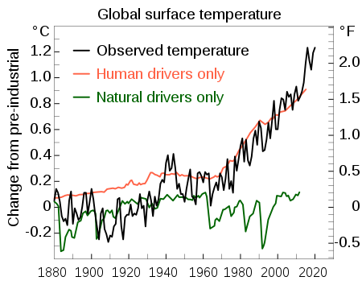

#### March 1, 2021

# 1 Background

Global warming is one of the most severe global climate problems nowadays, which also leads to the increasing occurrence of extreme climate, like the extremely heavy snow recently in Texas, USA.

Vancouver, Canada, is one of the most comfortable cities to live in around the world, and I exchanged to University of British, Columbia for several months, and experienced the wonderful climate there, which is quite cool at summer with the highest temperature about 26$^{\circ}$C. So I want to use the monthly mean temperature of Vancouver to do the time series analysis, to see whether and how Vancouver is affected by the global warming.

The dataset is acquired from https://www.kaggle.com/aturner374/eighty-years-of-canadian-climate-data, Kaggle puclic usage available dataset resource. This dataset contains the daily mean temperature from 1940/1/1 to 2020/1/1 of 13 Canadian centre cities, which no doubtly contains Vancouver, and I'll focus on it.

Besides, since the dataset has really large number of daily data, and fitting them with $SARIMA_{365}$ model will be a little difficult since (this seasonality can be predicted to some degree) there are 80 years' data, and there exist 20 leap years in it, which will cause the period of 365 has a bias of 20 days in the end of the dataset. Therefore, though I have all the daily data, I choose to compute the mean of monthly temperature, which could be appied to the $SARIMA_{12}$ model, and then do the time series analysis on it.

# 2 Data description

## 2.1 Load data

```{r,echo=FALSE}
x <- read.csv("Canadian_climate_history.csv", header = TRUE)
```

We can see that the format of time variable is not so formal, thus I choose to change it in Excel into a more formal one for R to read, and delete all the variables except the **MEAN_TEMPERATURE_VANCOUVER** and **LOCAL_DATE**.

```{r,echo=FALSE}
temp_Van = read.csv("Canadian_climate_history_changed.csv", header = TRUE)
date <- seq(from=1940,to=2020,by=1/365.25) # date for day
date2 <- seq(from=1940,to=2020,by=1/12) # date for month
summary(temp_Van$MEAN_TEMPERATURE_VANCOUVER)
```

Based on the summary, we could find that there exists 53 missing data in the daily temperature, and we choose to use the mean temperature of the day before the day with missing data and the day after that day to replace the missing data. 

```{r,echo=FALSE}
miss = which(is.na(temp_Van$MEAN_TEMPERATURE_VANCOUVER))
for (i in miss){
  temp_Van$MEAN_TEMPERATURE_VANCOUVER[i] = (temp_Van$MEAN_TEMPERATURE_VANCOUVER[i-1] + temp_Van$MEAN_TEMPERATURE_VANCOUVER[i+1])/2
}
summary(temp_Van$MEAN_TEMPERATURE_VANCOUVER)
```

However, when doing this, we find that there still exists 13 missing data, which means there exists some consecutive missing-data days, and we choose to use the mean temperature of the nearest day before them and after them to replace the missing data.

```{r,echo=FALSE}
for (i in miss){
  temp_Van$MEAN_TEMPERATURE_VANCOUVER[i] = (temp_Van$MEAN_TEMPERATURE_VANCOUVER[i-1] + temp_Van$MEAN_TEMPERATURE_VANCOUVER[i+1])/2
  if (is.na(temp_Van$MEAN_TEMPERATURE_VANCOUVER[i]) == TRUE) temp_Van$MEAN_TEMPERATURE_VANCOUVER[i] = (temp_Van$MEAN_TEMPERATURE_VANCOUVER[i-2] + temp_Van$MEAN_TEMPERATURE_VANCOUVER[i+1])/2
  if (is.na(temp_Van$MEAN_TEMPERATURE_VANCOUVER[i]) == TRUE) temp_Van$MEAN_TEMPERATURE_VANCOUVER[i] = (temp_Van$MEAN_TEMPERATURE_VANCOUVER[i-2] + temp_Van$MEAN_TEMPERATURE_VANCOUVER[i+2])/2
  if (is.na(temp_Van$MEAN_TEMPERATURE_VANCOUVER[i]) == TRUE) temp_Van$MEAN_TEMPERATURE_VANCOUVER[i] = (temp_Van$MEAN_TEMPERATURE_VANCOUVER[i-3] + temp_Van$MEAN_TEMPERATURE_VANCOUVER[i+2])/2
  if (is.na(temp_Van$MEAN_TEMPERATURE_VANCOUVER[i]) == TRUE) temp_Van$MEAN_TEMPERATURE_VANCOUVER[i] = (temp_Van$MEAN_TEMPERATURE_VANCOUVER[i-3] + temp_Van$MEAN_TEMPERATURE_VANCOUVER[i+3])/2
  if (is.na(temp_Van$MEAN_TEMPERATURE_VANCOUVER[i]) == TRUE) temp_Van$MEAN_TEMPERATURE_VANCOUVER[i] = (temp_Van$MEAN_TEMPERATURE_VANCOUVER[i-4] + temp_Van$MEAN_TEMPERATURE_VANCOUVER[i+3])/2
  if (is.na(temp_Van$MEAN_TEMPERATURE_VANCOUVER[i]) == TRUE) temp_Van$MEAN_TEMPERATURE_VANCOUVER[i] = (temp_Van$MEAN_TEMPERATURE_VANCOUVER[i-4] + temp_Van$MEAN_TEMPERATURE_VANCOUVER[i+4])/2
}
summary(temp_Van$MEAN_TEMPERATURE_VANCOUVER)
```

Now that all the missing data has been replaced, and we could use these daily data to compute the mean temperature of every month and plot it to get a first impression of it

```{r, echo=FALSE}
tem <- temp_Van$MEAN_TEMPERATURE_VANCOUVER
t <- as.Date(temp_Van$LOCAL_DATE, '%Y/%m/%d')
temp_Van$month <- format(t, '%Y/%m')
mon_tem <- data.frame(a = tapply(tem, temp_Van$month, mean))
plot(mon_tem$a~date2, xlab = "time", ylab = "Monthly Mean Temperature", main = "Vancouver Temperature", type = "l")
```

We cannot find the obvious trend from the plot above, so we could assume that the data is mean stationary.

## 2.2 Frequency domain analysis

```{r,echo=FALSE}
spectrum(mon_tem$a, main="Unsmoothed periodogram for Month")
sp = spectrum(mon_tem$a, spans=c(20, 20, 20), main="Smoothed periodogram for Month")
```

```{r}
sp$freq[which.max(sp$spec)]
```

Even in the unsmoothed periodogram, we can see two peaks, and it's more obvious in the smoothed periodogram. The spectrum reaches a peak around frequency $=0.08333$ cycle/month, which means a equivalent circle 12 months, exactly one-year period. Besides, the confidence interval indicated by the blue vertical bar on the upper-right corner is very small compared to the peak spectrum, so 0.08333 cycle/month is reliable.

Besides, we can see that, there is a smaller peak at almost twice the frequency, which leads to the half period of the period with the highest-peak frequency, which is about a half-year period. Usually, two different months with the half-year interval are in the opposite climate states, such as the July in summer and January in winter. Therefore, we choose to regard this smaller peak as the harmonic of the highest peak, and only focus on the highest peak, which is related to the one-year period.

To further examine the period conclusion, we draw the autocorrelation function plot below:

```{r}
acf(mon_tem, main = "Monthly Temperature")
```

From the ACF plot of monthly temperature, lag 12 is significant. It is consistent with the dominant frequency conclution from spectrum analysis that the circle is about 12 months. 

Therefore, we could say that the temperature shows a yearly period (12 months) pattern, which is a strong evidence that we could apply the $SARIMA_{12}$ model to this dataset.

## 2.3 Decomposition of Trend

To see the trend and cycle of the temperature more clearly, we do the decomposition by Loess:

```{r}
tem_low <- ts(loess(mon_tem$a~date2,span=0.5)$fitted,start = 1940, frequency = 12)
tem_hi<-ts(mon_tem$a - loess(mon_tem$a~date2,span=0.1)$fitted, start = 1940, frequency = 12)
tem_cycle<- mon_tem$a - tem_low - tem_hi
plot(ts.union(mon_tem$a,tem_low,tem_hi,tem_cycle),
     main='Decomposition of Vancouver Temperature \n as trend + noise + cycles',
     xlab='Years from 1940-January to 2020-January')
```

We model the data of Vancouver Monthly Mean Temperature as a combination of three processes: Low-frequency component represents the overall trend of the data; High-frequency component represents the noise; Mid-frequency component represents the business cycle irrespective of long-term trend and short-term random noise.

From the decomposition, first, in the plot of low-frequency, we can find a long decreasing trend from 1940 to about 1975, in which there exists a short, flat increasing trend around 1960. After that, from about 1975 until the end of data, about 2020, the trend is always increasing, especially from 1975 to about 1995. In these 20 years, the trend increases very fast, and that, the trend increasing quite slowly, which means the temperature these days may not have much difference with that in 25 years ago in Vancouver.

In short, the the temperature of Vancouver decreases from 1940 to about 1955, increases slowly to about 1960, and continues to decrease until 1975, later on, the temperature keeps increasing. 

Then, the plot of high-frequency shows the approximate consistency of noise, and we plot the frequency ratio to see further.

```{r,echo=FALSE}
s2 <- spectrum(ts.union(mon_tem$a,tem_cycle),plot=FALSE)
plot(s2$freq,s2$spec[,2]/s2$spec[,1],type="l",log="y",
     ylab="frequency ratio", xlab="frequency", xlim=c(0,1.5),
     main="frequency response")
rmax = max(s2$spec[,2]/s2$spec[,1])
abline(h=rmax,lty="dashed",col="blue")
abline(h=0.5,lty="dashed",col="blue")
abline(v=0.04,col="blue")
abline(v=0.15,col="blue")
```

The frequency range, region for ratio greater than 0.5 is from about 0.04 to 0.15, which means that we keep at least half the power for frequencies with cycle length between $1/0.15 \approx 6.67$ months and $1/0.04 \approx 25$ months.

The analysis above shows enough evidence to fit a seasonal SARIMA model with seasonal period of 12 months, which we'll focus on as below.

# 3 Fitting SARIMA model

We choose to fit the general SARIMA$(p, d, q) \times (P, D, Q)_{12}$ model, given by 

$\phi(B)\Phi(B^{12})((1-B)^d(1-B^{12})^DY_n - \mu) = \psi(B)\Psi(B^{12})\epsilon_n$

where $\{\epsilon_n\}$ is a white noise process and 

$\mu = E[Y_n]$,

$\phi(B) = 1 - \phi_1 B - \cdots - \phi_p B^p$,

$\psi(B) = 1 - \psi_1 B - \cdots - \psi_q B^q$,

$\Phi(B) = 1 - \Phi_1 B - \cdots - \Phi_P B^P$,

$\Psi(B) = 1 - \Psi_1 B - \cdots - \Psi_Q B^Q$.

## 3.1 Fitting ARIMA Model

We'll start with determining the value of $p$ and $q$ by AIC result.

However, when computing the AIC values, we first compute all the combinations between $ARMA (0,0,0)$ and $ARMA (4,0,4)$, but for the $AR(p)$ part with $p > 1$, it becomes non-stationary, which cannot be solved even we set the parameter $d = 1$, therefore we could only set $p = 0$ or $1$, which means we cannot use too complex $ARMA$ model.

Besides, if we set $d = 2$, the $AR$ part becomes stationary for larger $p$. However, it seems unreasonable to compute the second order difference for the temperature data, so we choose to not use this parameter.

```{r}
aic_table <- function(x, P, Q){
    table <- matrix(NA, (P+1), (Q+1))
    for (p in 0:P) {
      for (q in 0:Q) {
        table[p+1, q+1] = arima(x, order = c(p,0,q))$aic
      }
    }
    dimnames(table) <- list(paste("AR", 0:P, sep = ""), paste("MA", 0:Q, sep = ""))
    table
}
temp_aic_table <- aic_table(mon_tem$a,1,4)
require(knitr)
kable(temp_aic_table,digits=2)
```

$ARIMA(1,0,4)$ has the smallest AIC value, while the AIC value of $ARIMA(0,0,4)$ and $ARIMA(1,0,3)$ is a little larger than that, but these two models has relatively simpler structure. However, there is no huge difference of the complexity in struction between these three, so we still choose to use $ARIMA(1,0,4)$ model for further analysis, since we do not have any other evidence supporting the other two choices.

```{r}
arma104<-arima(mon_tem$a,order = c(1,0,4))
arma104
ar_roots<-polyroot(c(1,-coef(arma104)[c("ar1")]))
ma_roots<-polyroot(c(1,-coef(arma104)[c("ma1","ma2","ma3","ma4")]))
ar_roots
ma_roots
```

The $AR$ root is outside the unit circle, but some of the $MA$ roots are inside the circle, so the model could be unstable. However, it is not avoidable to pick $ARIMA(1,0,4)$ since we do not have other choices. Thus we still choose to use $ARIMA(1,0,4)$. 

Besides, the $\hat\sigma^2$ by the output is $4.842$, which means the white noise process could be expressed as $\epsilon_n \sim N(0, 4.842)$.

## 3.2 Fitting SARIMA Model

Then we begin to decide the value of $P, D,$ and $Q$ $SARIMA_{12}(P, D, Q)$.

Since the $ARIMA$ part has high rank parameters, we choose to use some simple $SARIMA$ part, in order to avoid overfitting. Therefore, we choose to compare the AIC value of $SARIMA(1,0,4) \times (1,0,0)_{12}, SARIMA(1,0,4) \times (0,0,1)_{12}, SARIMA(1,0,4) \times (1,0,1)_{12}, SARIMA(1,0,4) \times (0,1,0)_{12}$.

However, when fitting $SARIMA(1,0,4) \times (1,0,1)_{12}$, the $AR$ part becomes non-stationary, so we delete this choice, and still fits the other three models.

```{r}
sarma104100<-arima(mon_tem$a,order=c(1,0,4),seasonal = list(order=c(1,0,0),period=12))
sarma104001<-arima(mon_tem$a,order=c(1,0,4),seasonal = list(order=c(0,0,1),period=12))
sarma104010<-arima(mon_tem$a,order=c(1,0,4),seasonal = list(order=c(0,1,0),period=12))
sarma104100$aic
sarma104001$aic
sarma104010$aic
```

For the three AIC values above, $SARIMA(1,0,4) \times (0,1,0)_{12}$ has the smallest value. However, since $SARIMA(1,0,4) \times (1,0,0)_{12}$ has the close value to the smallest one, we choose to test one more model, which is $SARIMA(1,0,4) \times (1,1,0)_{12}$, to see if this model could bring smaller AIC value.

```{r}
sarma104110<-arima(mon_tem$a,order=c(1,0,4),seasonal = list(order=c(1,1,0),period=12))
sarma104110$aic
```

The $SARIMA(1,0,4) \times (1,1,0)_{12}$ model has much smaller AIC value, so we choose this model and set $\epsilon_n \sim N(0, 4.842)$ as fitted model and do the diagnostic analysis on it.

# 4 Diagnostic Analysis

First, we check about the consistency of the residuals to see if they are consistent with the assumption we made.

```{r}
res <- sarma104110$residuals
par(mfrow=c(1,2))
plot(res)
acf(res)
qqnorm(res)
qqline(res)
```

The first plot shows that the residuals are almost symmetricly distributed around zero, thus the assumption of expectation as zero seems reasonable. The second plot shows that the residuals are almost all uncorrelated to each other, except for the lag $h$ being equal to the multiple of $12$, which is the strong evidence for seasonality for $12$-month period. 

However, from the qq plot, it appears as a concave-convex pattern, which indicates heavier tails than a normal distribution. Therefore the assumption of white noise process may not be appropriate. Some distributions with heavy-tailed property may be better for residuals to fit with. While, on the other hand, this data has large number of points, and most of the points fall on the qqline, so the heavy-tailed degree is not so heavy here, which means it's not so bad to use the Gaussian assumption.

# 5 Conclusion

The temperature of Vancouver from 1940 to 2020 decreased firstly in total, from 1940 to about 1975, and then kept increasing until now. This trend is consistent with the global warming from the second half of last century, which can be obviously seen from the plot below, a total trend of global temperature from Wikipedia.



In the first half of our analysis, we focus on the frequency domain analysis, and found that the temperature has a 12-month cycle and this is compatible with the yearly temperature cyclic change, helping us to decide to fit $SARIMA(p, d, q) \times (P, D, Q)_{12}$ model.

In the second half of our analysis, we choose the $SARIMA(1, 0, 4) \times (1, 1, 0)_{12}$ model to be the best fitted model. The results of diagnostic show that the mean assumption of residuals is okay, and the uncorrelation assumption is also obeyed for lag being not equal to the multiple of 12, which is reasonable considering the seasonality of 12-month period. However, the Gaussian assumption is not so good as we expect, since the dataset has some heavy-tailed property. So, if we want to do further research of this dataset, we should try to use some other distributions to fit the residuals, which has the heavy-tail property.

# 6 Reference

[1] Data Resource

https://www.kaggle.com/aturner374/eighty-years-of-canadian-climate-data

[2] Figure in the end

https://en.wikipedia.org/wiki/Climate_change

[3] 

https://ionides.github.io/531w20/midterm_project/project36/STATS531_Midterm_Project.html

[4] 

https://ionides.github.io/531w20/midterm_project/project34/stats531midtermproject.html

[5]

https://ionides.github.io/531w20/midterm_project/project49/midtermproject_out.html#23_decomposition_of_trend
